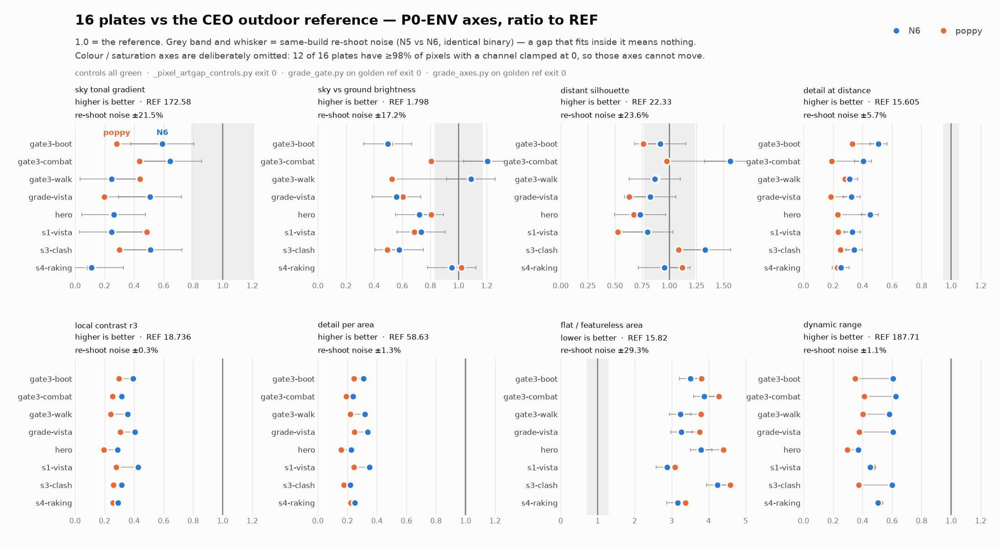

# VERDICT — control + baseline สำหรับเกรดภาพ "กลางแจ้ง" คืน 2026-08-20

ผู้เขียน: Flamingo · วันที่: 2026-08-20 · branch `poppy/native-only` · commit ที่เป็น deliverable: **`2dac572`**

งานคืนนี้มี 3 ชุดส่ง และ **เป็นกลางแจ้งทั้งหมด**: หญ้า/ใบไม้ ×2 (Poppy, Kevin) + ฟ้า/พื้น ×1 (Sun).
เอกสารนี้ตอบคำถามเดียว: **จะตัดสินมันด้วยอะไร และตัวเลขไหนที่เชื่อได้จริง**

---

## 0. สรุปหนึ่งย่อหน้า (ถ้าอ่านแค่ตรงนี้)

เกรดเดอร์ที่มีอำนาจ FAIL ทั้ง 3 ตัวรัน control ผ่านหมดแล้ว (exit 0 ทุกตัว) — กติกา rubric ข้อ 7
"ไม่มี control = ไม่มีคำตัดสิน" ตอนนี้ **ทำได้จริงเป็นครั้งแรก**. แต่ baseline 16 เพลตชี้ว่า
**เกณฑ์แบบ "เทียบค่าสัมบูรณ์กับ REF" ใช้ตัดสินงานคืนนี้ไม่ได้** — ทุกเพลตห่างจาก REF 2–10 เท่าอยู่แล้ว
บนแทบทุกแกน, และ **12 ใน 16 เพลตมีพิกเซล ≥98.2% ที่ช่องสีช่องหนึ่งถูกหนีบอยู่ที่ 0 พอดี**
(mean B = 0.4–2.2 เทียบ REF 68.7) ⇒ แกนสี/saturation ทั้งกลุ่ม **ติดเพดานอยู่แล้ว ขยับไม่ได้**
ไม่ว่าหญ้าหรือฟ้าจะสวยขึ้นแค่ไหน. ข้อเสนอคือใช้ **A/B เพลตเดียวกันแบบจับคู่** บนแกน 6 ตัวที่พิสูจน์แล้วว่า
แยกของดี-ของแย่ออกจากกันได้ และมี noise floor วัดจริงกำกับ (§5, §7).

---

## 1. Control ที่รันแล้ว (ครบทั้ง 3 ชั้น)

| ชั้น | เกรดเดอร์ | คำสั่ง control | ผล |
|---|---|---|---|
| P0 (ในร่ม/ทั่วไป) | `scripts/grade_axes.py` | `python scripts/grade_axes.py docs/assets/golden-beauty-shot-ref.png` | **ALL AXES PASS · exit 0** |
| A (Gate) | `scripts/grade_gate.py` | `python scripts/grade_gate.py docs/assets/golden-beauty-shot-ref.png` | **G3=P G5=P G6=P · exit 0** |
| P0-ENV (กลางแจ้ง) | `scripts/_pixel_artgap_grade.py` | `python scripts/_pixel_artgap_controls.py` | **0 control failure(s) · exit 0** |

### 1.1 P0-ENV — ผลเต็ม (นี่คือแกนที่จะตัดสินงานคืนนี้)

`_pixel_artgap_controls.py` ทำ 11 lesion บน `docs/refs/ceo_ref_sunset_valley.jpg` แล้วบังคับว่า
แกนที่ชื่อตรงกับความเสียหายต้อง **COLLAPSE** และแกนข้างเคียงที่ระบุไว้ต้อง **survive**:

```
C0 identity      -> reference grades itself 22/22 axes at gate 60%
C1 desaturate    -> sat/palette COLLAPSE, detail survive
C2 blur r=4      -> micro/detail COLLAPSE, colour survive
C3 black sky     -> sky axes COLLAPSE, SILHOUETTE REFUSES, terrain survive
C4 flat fill     -> ทุกแกนตาย (sanity: แกนตกได้จริง)
C5 crush+clip    -> dynamic range ตาย, hue อยู่  (hue_bins 15->17 1.13x survive)
C6 hue collapse  -> hue_bins 15->3 0.20x COLLAPSE, range 0.99x survive
C7 far-band blur -> far_micro 15.61->2.83 0.18x COLLAPSE, near_micro 1.00x survive
C8 near desat    -> depth_sat_ratio 1.13->0.07 0.06x COLLAPSE, far_micro 1.00x survive
C9 blown sky     -> sky_blown 5.09->100.00 COLLAPSE, far_edge_contrast REFUSES, terrain survive
C10 near blur    -> depth_micro_ratio 0.81->0.13 COLLAPSE, far_micro 1.00x survive

0 control failure(s)        exit 0
```

**อ่านผลนี้ว่า:** แกนกลางแจ้งไม่ได้พัง และไม่ใช่ metric ที่ตายพร้อมกันหมด (C1/C2/C7/C8/C10 พิสูจน์ความจำเพาะ),
และมันยัง **ปฏิเสธที่จะให้คะแนน** เมื่อฟ้าเสื่อมสภาพทั้งดำสนิทและขาวโพลน (C3/C9) แทนที่จะแจกเลขลวง.

### 1.2 หมายเหตุสำคัญเรื่องชั้น A

`grade_gate.py` อยู่ในทะเบียน `GUARDED` ⇒ ก่อน commit `2dac572` คำสั่ง control ของมันคืน
`REFUSED ... exit 2` เหมือนกัน (ลองยิง `--help` ยังโดนกินเลย). **control ชั้น A เพิ่งรันได้เพราะแพตช์เดียวกัน** —
ไม่ใช่แค่ `grade_axes.py` อย่างที่รายงานรอบก่อนบอก. ผมพูดผิดตรงนี้ในรายงานก่อน แก้แล้วในย่อหน้านี้.

---

## 2. Deliverable ที่ commit แล้ว

```
2dac572  fix(gate): let the rubric's own controls run — REFERENCE_ARTWORK allowlist
         scripts/nohud2_guard.py | 70 +++++++++
```

ยืนยันความไม่หลวมซ้ำ (reviewer รันเองแล้วด้วย): ไม่มี env / flag / argument · resolve เป็น absolute path
ใต้ repo นี้เท่านั้น (ก็อปไฟล์ชื่อเดิมไปวางที่อื่น → ยัง REFUSED exit 2) · ไฟล์ต้องมีอยู่จริง · ที่เหลือ fail-closed เท่าเดิม.

---

## 3. Baseline — 16 เพลต บนแกนกลางแจ้ง + ด่าน G3/G5/G6

รันแบบ read-only (ไม่มี `--oneshot`/`--scoreboard`/`--history`/`--mask-dir`) ⇒
`docs/aaa-scoreboard-live.md` และ `docs/assets/artgap/*` **ไม่ถูกแตะ** (ยืนยันด้วย `git status` หลังรัน).

| plate                |    sky% | skyGrad |  skyHue | sky/gnd |    silh |  farDet |  micro3 |   edge% |   flat% |  hueBin |  coolCh |     sat |   range | G3 | G5 | G6 |
|----------------------|---------|---------|---------|---------|---------|---------|---------|---------|---------|---------|---------|---------|---------|----|----|----|
| REF ceo_sunset       |   21.85 |  172.58 |   60.00 |    1.80 |   22.33 |   15.61 |   18.74 |   58.63 |   15.82 |   15.00 |    2.96 |   57.56 |  187.71 |  - |  - |  - |
| N6/gate3-boot        |   30.37 |  102.12 |   30.00 |    0.89 |   20.50 |    7.94 |    7.37 |   18.14 |   55.47 |    8.00 |    0.20 |   99.83 |  114.00 |  P |  P |  P |
| N6/gate3-combat      |   25.88 |  111.14 |   30.00 |    2.17 |   34.92 |    6.31 |    5.91 |   14.00 |   61.43 |    5.00 |    0.02 |   99.71 |  117.21 |  P |  P |  P |
| N6/gate3-walk        |   11.90 |   42.76 |   20.00 |    1.96 |   19.33 |    4.87 |    6.64 |   18.61 |   51.13 |    4.00 |    0.60 |   99.47 |  108.92 |  P |  P |  P |
| N6/grade-vista       |   15.12 |   87.72 |   20.00 |    1.01 |   18.40 |    5.08 |    7.58 |   19.82 |   51.68 |    7.00 |    0.00 |   99.57 |  113.60 |  P |  P |  P |
| N6/hero              |   42.27 |   45.23 |   30.00 |    1.30 |   16.39 |    7.03 |    5.38 |   13.18 |   60.05 |    6.00 |    0.05 |   99.85 |   69.74 |  P |  F |  P |
| N6/s1-vista          |   37.20 |   42.60 |  180.00 |    1.32 |   17.84 |    5.17 |    7.99 |   20.52 |   45.44 |    8.00 |   14.15 |   83.22 |   84.74 |  P |  F |  P |
| N6/s3-clash          |   11.99 |   88.20 |   30.00 |    1.04 |   29.66 |    5.35 |    5.89 |   12.84 |   67.07 |    5.00 |    0.00 |   99.50 |  112.57 |  P |  P |  P |
| N6/s4-raking         |   19.66 |   19.37 |   10.00 |    1.71 |   21.29 |    3.94 |    5.46 |   14.64 |   49.97 |    9.00 |   18.38 |   85.22 |   94.71 |  P |  P |  F |
| poppy/gate3-boot     |   34.01 |   48.75 |   20.00 |    0.93 |   17.02 |    5.17 |    5.57 |   14.25 |   60.14 |    7.00 |    0.25 |   99.79 |   65.70 |  P |  P |  P |
| poppy/gate3-combat   |   28.06 |   75.48 |   20.00 |    1.45 |   21.78 |    2.97 |    4.78 |   11.29 |   67.53 |    4.00 |    0.03 |   99.72 |   77.28 |  P |  P |  P |
| poppy/gate3-walk     |   32.92 |   76.08 |   10.00 |    0.95 |   19.67 |    4.39 |    4.53 |   12.84 |   60.02 |    4.00 |    0.74 |   99.57 |   75.36 |  P |  F |  F |
| poppy/grade-vista    |   22.40 |   33.98 |   20.00 |    1.09 |   14.12 |    2.90 |    5.76 |   14.46 |   59.45 |    6.00 |    0.00 |   99.59 |   70.88 |  P |  P |  P |
| poppy/hero           |   33.72 |   44.36 |   20.00 |    1.45 |   15.00 |    3.61 |    3.65 |    9.25 |   69.61 |    6.00 |    0.07 |   99.81 |   55.46 |  P |  F |  P |
| poppy/s1-vista       |   48.11 |   83.94 |  180.00 |    1.23 |   11.79 |    3.67 |    5.19 |   14.40 |   48.81 |    7.00 |   15.92 |   84.03 |   88.29 |  P |  F |  P |
| poppy/s3-clash       |   17.07 |   51.98 |   20.00 |    0.89 |   24.28 |    3.92 |    4.87 |   10.28 |   72.60 |    5.00 |    0.00 |   99.54 |   70.53 |  P |  P |  P |
| poppy/s4-raking      |   19.98 |   16.40 |   10.00 |    1.84 |   24.96 |    3.59 |    4.83 |   13.13 |   53.27 |    9.00 |   19.53 |   84.14 |   97.49 |  P |  P |  F |



> รูปข้างบน: 8 แกนที่เกตได้, แกน x = อัตราส่วนต่อ REF (1.0 = ref), จุดน้ำเงิน = N6 จุดส้ม = poppy,
> แถบเทา/หนวด = **noise floor แบบระวังที่สุด** = `max |N6−N5|` ข้ามทั้ง 8 เพลต (คอลัมน์ซ้ายของ §6)
> ไม่ใช่ค่าที่ตัด `hero`/`gate3-walk` ออก. ⇒ ธรณีในรูปกว้างกว่าธรณีที่ผมใช้ตั้งเกตใน §7 เสมอ.
> แกนสี/saturation ไม่ได้อยู่ในรูปโดยตั้งใจ — เหตุผลใน §5.

หน่วย: `skyGrad`=`sky_L_range` · `skyHue`=`sky_hue_span_deg` · `silh`=`far_edge_contrast` ·
`farDet`=`far_micro` · `micro3`=`micro_r3` · `edge%`=`edge_density` · `range`=`range_p5_p95`.
`flat%` ต่ำ = ดี, ที่เหลือสูง = ดี.

**ชั้น A บนชุดเดียวกัน:** G3 **16/16 PASS** · G5 **11/16 PASS (ตก 5)** · G6 **13/16 PASS (ตก 3)**
⇒ ในชุดนี้ **G3 ไม่ discriminate เลย**, G5/G6 ยัง discriminate อยู่.

---

## 4. สิ่งที่ baseline นี้บอกและตารางเก่า (clip/micro/p95/warmth) มองไม่เห็น

1. **N6 ชนะ poppy บนเกือบทุกเพลตที่จับคู่กันได้** — `micro_r3` (7.37 vs 5.57 · 5.91 vs 4.78 · 7.58 vs 5.76 ·
   5.38 vs 3.65), `edge_density` (18.14 vs 14.25 · 14.00 vs 11.29 · 13.18 vs 9.25), `far_micro`
   (7.94 vs 5.17 · 6.31 vs 2.97 · 7.03 vs 3.61), `range_p5_p95` (114.00 vs 65.70). สอดคล้องกับข้อสรุปเดิม
   แต่คราวนี้มีแกนที่ **ชื่อตรงกับสิ่งที่ตาเห็น** (รายละเอียด/ขอบ/ระยะไกล) ไม่ใช่แค่ p95.
2. **ช่องว่างที่ใหญ่ที่สุดไม่ใช่ exposure แต่คือ "รายละเอียด" กับ "ฟ้า"** — `edge_density` ของเราอยู่ที่
   9–21 เทียบ REF 58.63 (0.16–0.35x) และ `far_micro` 2.90–7.94 เทียบ 15.61 (0.19–0.51x).
   `sky_L_range` 16.40–111.14 เทียบ 172.58.
3. **`sky_hue_span_deg = 180.0` บน s1-vista ทั้งสองชุด ไม่ใช่ชัยชนะ** — เป็นค่า circular span ที่กระจาย
   ครึ่งวงกลม = ฟ้าไม่มีทิศทางสีที่ชัด, เกรดเดอร์เองตีเป็น "over-advisory" ไม่ใช่ PASS. **ห้ามอ่านค่าสูงตรงนี้ว่าดี**.

---

## 5. เพดานที่ทำให้แกนสีตัดสินอะไรไม่ได้ (ต้องรู้ก่อนอ่านตัวเลขคืนนี้)

`sat_mean` ของเราอยู่ที่ 99.47–99.85 (REF 57.56) — ไม่ใช่ "อิ่มสีกว่า ref" แต่คือ **ช่องสีถูกหนีบที่ 0**:

| plate | พิกเซลที่ min-channel == 0 | mean B |
|---|---|---|
| REF ceo_sunset | **8.38 %** | 68.7 |
| N6 / poppy · gate3-boot, gate3-combat, gate3-walk, grade-vista, hero, s3-clash (12 ใบ) | **98.21 – 99.65 %** | **0.4 – 2.2** |
| N6 / poppy · s1-vista, s4-raking (4 ใบ) | 51.04 – 58.37 % | 58.6 – 62.5 |

⇒ **12 ใน 16 เพลต มีพิกเซลเกือบทั้งภาพที่ B ตายสนิท**. ผลตามมา: `hue_bins` ตกที่ 4–8 (REF 15),
`cool_chroma_pct` = 0.00–0.74 (REF 2.96), `sky_hue_span` ติดที่ 10–30° (REF 60°).
**แกนกลุ่มนี้ขยับไม่ได้ด้วยงานหญ้าหรือฟ้า** — มันจะอยู่ที่เพดานเดิมไม่ว่าคืนนี้จะทำอะไร.
นี่คือกับดักเดียวกับที่ทำให้เกต `clip ≤ 35` ตก 16/16 ใบ.

---

## 6. Noise floor — วัดจริง ไม่ได้เดา

คู่ที่ใช้: `_pixel_shotset_N5/after/*` กับ `_pixel_shotset_N6/after/*` — 8 เพลตชื่อเดียวกัน, binary
เดียวกัน (ต่างกัน 30 จาก 80.7M ไบต์ = link stamp เท่านั้น, บันทึกไว้แล้วก่อนหน้านี้), md5 **0/8 เหมือนกัน**
⇒ เป็นคู่ re-shoot จริง. ค่าคือ `max |N6 − N5|` ข้าม 8 เพลต:

| แกน | max ทั้ง 8 | max เมื่อตัด `hero` + `gate3-walk` ออก |
|---|---|---|
| `micro_r3` | 0.049 | **0.04** |
| `edge_density` | 0.738 | **0.09** |
| `far_micro` | 0.884 | **0.38** |
| `flat_pct` | 4.640 | **0.60** |
| `far_edge_contrast` | 5.270 | **0.92** |
| `sky_L_range` | 37.030 | **1.83** |
| `sky_ground_ratio` | 0.309 | **0.22** |
| `sky_frac_pct` | 32.620 | **9.74** |
| `range_p5_p95` | 1.990 | **0.93** |

⚠️ **`hero` และ `gate3-walk` มี drift ของ "ฟ้า" ใหญ่มากระหว่างสองการถ่ายที่ binary เดียวกัน**
(`sky_frac_pct` ขยับ 32.62 จุด = 338% บน `hero`, `sky_L_range` ขยับ 37.03 บน `gate3-walk`)
⇒ **สองเพลตนี้ห้ามใช้ตัดสินแกนฟ้า** ให้รายงานเป็น UNMEASURABLE ไปเลย ไม่ใช่ให้คะแนน.
ส่วน `sky_frac_pct` โดยรวม floor สูงเกิน (9.74 จุด) จนใช้เป็นเกตไม่ได้บนเพลตไหนเลย — ใช้เป็น context เท่านั้น.

---

## 7. เกณฑ์ที่ผมเสนอสำหรับภาพคืนนี้ (ท่อนที่หายไปจากรายงานรอบก่อน)

**หลักการ: จับคู่เพลตเดียวกัน before/after ห้ามเทียบค่าสัมบูรณ์กับ REF.**
เหตุผล: ทุกเพลตปัจจุบันห่าง REF 2–10 เท่า ⇒ เกตสัมบูรณ์จะ FAIL ทุกใบเหมือนที่ `clip` เพิ่งทำ
(16/16) ซึ่งไม่ได้บอกอะไรเลยว่าคืนนี้ดีขึ้นหรือแย่ลง.

### 7.0 ⚠️ เงื่อนไขก่อนทุกอย่าง — เฟรมต้องเป็น `*-nohud2.png` และ **P0-ENV จะไม่เช็คให้**

ผมเจอตอนทำ baseline: **`scripts/_pixel_artgap_grade.py` ไม่อยู่ในทะเบียน `GUARDED`** ของ
`scripts/nohud2_guard.py` (มันโผล่อยู่ในรายชื่อ 70 สคริปต์ที่ `scripts/tests/test_nohud2_guard.py`
บอกว่า "ยังไม่ถูกจัดประเภท"). ⇒ **มันจะเกรดเฟรมที่มี HUD ให้อย่างเงียบๆ**. เทียบกับ `grade_gate.py`
ที่ guarded อยู่และปฏิเสธทันที.

ผลกับคืนนี้: ถ้า Poppy/Kevin/Sun ส่ง capture ดิบมา ตัวเลข P0-ENV จะรวม glyph `[E]` เข้าไปใน
`edge_density` / `micro_r3` / `flat_pct` — ซึ่งเป็น 3 ใน 4 แกนที่ผมเสนอใช้ตัดสินชุดหญ้า.

**ผมยังไม่แก้ และตั้งใจไม่แก้คืนนี้** — การเติม `_pixel_artgap_grade.py` เข้า `GUARDED` เป็นการ
เปลี่ยนพฤติกรรมเครื่องมือกลางระหว่างที่อีก 3 เลนกำลังรันงานอยู่ (และต้องเติม
`docs/refs/ceo_ref_sunset_valley.jpg` เข้า `REFERENCE_ARTWORK` พร้อมกัน ไม่งั้น control ของมันเองพัง
ด้วยบั๊กเดิมเป๊ะๆ). **ขอ CEO ตัดสิน** ว่าจะให้แก้ก่อนหรือหลังรับงานคืนนี้.
ระหว่างนี้: **บังคับด้วยมือ — เฟรมที่ส่งมาเกรดต้องลงท้าย `-nohud2.png` เท่านั้น**.

**คำสั่งที่ต้องรันต่อ build ใหม่ 1 ตัว (บังคับ control ด้วยโค้ด):**
```
python scripts/_pixel_artgap_grade.py <frame-nohud2.png> --oneshot --label "<ใครส่ง / commit>"
python scripts/grade_gate.py <frame-nohud2.png>
```
`--oneshot` จะรัน control ก่อน และ **exit 3 โดยไม่พิมพ์เลขให้เชื่อ** ถ้า control ตก.
(ถ้าไม่อยากให้ทับ `docs/aaa-scoreboard-live.md` ให้ใช้ `--json <path>` เดี่ยวๆ แทน — read-only)

### 7.1 ชุดหญ้า/ใบไม้ (Poppy ×1, Kevin ×1)

เกตบนเพลตเดียวกัน before→after. Δ ต้อง **มากกว่า 3× noise floor** ของแกนนั้น:

| แกน | ต้องขยับอย่างน้อย | ทิศ | เหตุผลที่ใช้แกนนี้ |
|---|---|---|---|
| `micro_r3` | **+0.15** | สูงขึ้น | control C2/C10 พิสูจน์ว่ามันตายเมื่อเบลอ = มันวัด "รายละเอียดใกล้" จริง |
| `edge_density` | **+0.30** | สูงขึ้น | ใบหญ้าที่อ่านออกต้องเพิ่มขอบ; floor แค่ 0.09 |
| `far_micro` | **+1.20** | สูงขึ้น | control C7 พิสูจน์ว่ามันตายเมื่อเบลอเฉพาะแถบไกล = หญ้าระยะกลาง-ไกล |
| `flat_pct` | **−1.80** | ต่ำลง | เราอยู่ที่ 45–73% เทียบ REF 15.82 — พื้นที่เรียบคือช่องว่างที่ใหญ่ที่สุด |
| `depth_micro_ratio` | รายงานอย่างเดียว | — | floor 0.31 สูงเกินจะเกต |

**ผ่าน** = ขยับถูกทางเกินธรณีทั้ง 4 แกน · **ผ่านบางส่วน** = ขยับ ≥2 แกน ไม่มีแกนไหนถอยหลังเกินธรณี ·
**ไม่ผ่าน** = มีแกนถอยหลังเกินธรณี หรือไม่มีแกนไหนขยับเกิน noise.

**ห้ามใช้ตัดสินชุดนี้:** `sat_mean`, `hue_bins`, `cool_chroma_pct`, `clip_pct` — ติดเพดาน B=0 (§5).

### 7.2 ชุดฟ้า/พื้น (Sun ×1)

| แกน | ต้องขยับอย่างน้อย | ทิศ | หมายเหตุ |
|---|---|---|---|
| `sky_L_range` | **+5.50** | สูงขึ้น | แกนหลัก. ปัจจุบัน 16–111 เทียบ REF 172.58 |
| `sky_ground_ratio` | **+0.66** เข้าหา 1.80 | เข้าหา REF | 12/16 เพลตอยู่ต่ำกว่า 1.5 = ฟ้ายังไม่สว่างกว่าพื้นพอ |
| `far_edge_contrast` | **+2.80** | สูงขึ้น | silhouette; control C3/C9 พิสูจน์ว่ามันปฏิเสธเมื่อฟ้าเสื่อม |
| `sky_void_pct` / `sky_blown_pct` | ต้องคง **0.00** | ห้ามขึ้น | ตอนนี้ 0.00 ทั้ง 16 ใบ = เป็น guard ไม่ใช่คะแนน |
| `sky_hue_span_deg` | รายงานอย่างเดียว | — | ติดเพดาน B=0; และ >120° = degenerate (§4 ข้อ 3) ห้ามอ่านว่าดี |
| `sky_frac_pct` | รายงานอย่างเดียว | — | floor 9.74 จุด สูงเกินจะเกต |

**เพลตที่ห้ามใช้ตัดสินแกนฟ้า:** `hero`, `gate3-walk` (§6). ใช้ `grade-vista`, `s1-vista`, `s3-clash`,
`gate3-boot`, `gate3-combat` แทน.

### 7.3 ชั้น A ต้องไม่ถอยหลัง

ทั้ง 3 ชุดต้องผ่าน `grade_gate.py` **ไม่แย่ลงกว่า baseline ของเพลตตัวเอง** (ตาราง §3 คอลัมน์ G3/G5/G6).
G3 ตอนนี้ 16/16 PASS ⇒ ถ้าคืนนี้ G3 ตกแม้ใบเดียว = regression ชัดเจน.
G5/G6 ที่ตกอยู่แล้วบนเพลตไหน ให้ถือว่าเป็นสถานะเดิม ไม่นับเป็นความผิดของงานคืนนี้.

---

## 8. สิ่งที่ยังทำไม่ได้ / รอ CEO

- **ยังไม่มีภาพจาก Poppy / Kevin / Sun** — เอกสารนี้เป็นเกณฑ์กับ baseline ล้วน ยังไม่มีคำตัดสินใคร.
- **เกต `clip ≤ 35` ต้อง re-calibrate** — ตก 16/16 ใบเพราะการหนีบ B=0 (§5) ไม่ใช่เพราะเฟรมแย่ลง.
  ผมยังไม่แตะ รอ CEO สั่ง.
- **การหนีบ B ที่ 0 บน 12/16 เพลต เป็นบั๊ก look ที่ใหญ่กว่างานคืนนี้** — ผมไม่ได้แก้ในรอบนี้
  และไม่ได้กล่าวหาว่าใครทำ. แต่ตราบใดที่มันยังอยู่ แกนสีทั้งกลุ่มจะตัดสินอะไรไม่ได้เลย.
- **`scripts/tests/test_nohud2_guard.py` ยังแดง** จาก lane drift (สคริปต์ใหม่ ~70 ตัวยังไม่ถูกจัดประเภท)
  — แดงมาก่อนแพตช์นี้ และ output byte-identical ก่อน/หลัง ⇒ ไม่ใช่ของ `2dac572`.

---

## ภาคผนวก — ทำซ้ำได้ทั้งหมด

```
scripts/p0env_baseline.py                             ตัวรัน (tracked)
docs/assets/look/p0env-baseline-16plates-2026-08-20.json   ผลดิบ 16 เพลต (tracked)
docs/assets/look/p0env-baseline-16plates-2026-08-20.png    รูป §3 (tracked)
```

สั่งซ้ำจากศูนย์:
```
python scripts/_pixel_artgap_controls.py                              # ต้อง exit 0
python scripts/grade_gate.py docs/assets/golden-beauty-shot-ref.png   # ต้อง exit 0
python scripts/grade_axes.py docs/assets/golden-beauty-shot-ref.png   # ต้อง exit 0
python scripts/p0env_baseline.py <out-dir> \
    N6=_pixel_shotset_N6/after poppy=_poppy_shotset/after
# noise floor: รันซ้ำด้วย N5=_pixel_shotset_N5/after แล้วเทียบ max|N6-N5| ต่อแกน
```

ยืนยันว่า `scripts/p0env_baseline.py` ให้ผลตรงกับที่ใช้เขียนเอกสารนี้: รันใหม่จากไฟล์ที่ commit แล้ว
เทียบทั้ง 16 เพลต × ทุก metric × G3/G5/G6 → **mismatched 0**.

ไม่มีการ build, ไม่แตะ `target/`, ไม่แตะ `docs/aaa-scoreboard-live.md` และ `docs/assets/artgap/*`
(ยืนยันด้วย `git status` หลังรันทุกครั้ง).
