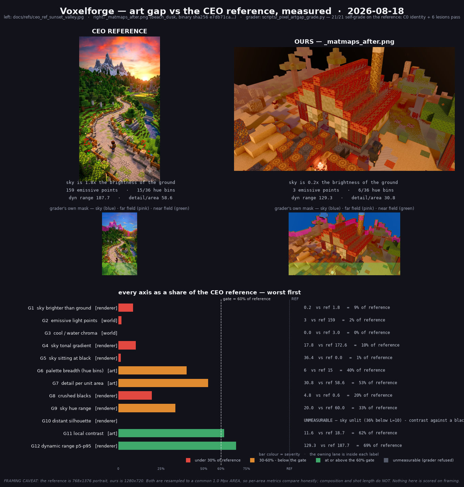

# ช่องว่างระหว่างเกมเรากับภาพอ้างอิงของ CEO — วัดเป็นตัวเลข · 2026-08-18

**เลน:** Flamingo (measurement only) · **branch:** `poppy/native-only`
**เขียนอะไรบ้าง:** `docs/**` + `scripts/_pixel_*` เท่านั้น — ไม่แตะ `.rs`, `assets/`, `maps/`
**ไม่ได้ build อะไรเลย** (ไม่มี cargo, ไม่มีการยิงเฟรมใหม่ — ทั้งหมดวัดจากไฟล์ที่มีอยู่)



> เพลตเดียวจบ: `docs/assets/artgap/art-gap-vs-ceo-ref-2026-08-18.png`

---

## Inputs — pin ไว้ให้รันซ้ำได้

| label | ไฟล์ | px (ไฟล์จริงบนดิสก์) | px ที่วัดจริง (หลัง normalise) | หมายเหตุ |
|---|---|---|---|---|
| **REF** | `docs/refs/ceo_ref_sunset_valley.jpg` | 768×1376 | **747×1339** | ภาพที่ CEO สั่ง · md5 ตรวจแล้วเป็น **แผงเดียว** (ดู §caveat) |
| **OURS** | `_matmaps_after.png` | 1280×720 | **1333×750** | ฉาก `maps/beach_dusk.json`, ไบนารี sha256 `e7db71ca…` (Director ยืนยันเองแล้ว) |
| OURS (ตัวเทียบที่ 2) | `docs/assets/look/outdoor-noon_after.png` | 1280×720 | **1333×750** | เฟรมกลางแจ้งกลางวัน — ใส่มาเพื่อพิสูจน์ว่า gap ไหน "เป็นของเฟรมนี้" กับ gap ไหน "เป็นของทั้งเกม" |

> **อ่านคอลัมน์ `px` ให้ถูก** — `load()` ใน `scripts/_pixel_artgap_grade.py` **resample ทุกเฟรมด้วย
> LANCZOS ลงพื้นที่ร่วม 1.0 Mpx ก่อนวัดเสมอ** ⇒ ตัวเลขทุกแกนในเอกสารนี้เกิดบนคอลัมน์ **"px ที่วัดจริง"**
> ไม่ใช่คอลัมน์ซ้าย. ผลคือ **เทียบข้ามเพลตได้ตรง ๆ** (ทุกใบมีจำนวนพิกเซลเท่ากัน แกน "ต่อพื้นที่"
> จึงไม่ถูกความละเอียดที่ต่างกันบิด) แต่ **ห้ามอ่านเลขนั้นเป็นความละเอียดของ asset หรือของเฟรมที่เรนเดอร์**
> — เฟรมเรายิงที่ 1280×720 จริง ไม่ใช่ 1333×750. ตรวจซ้ำได้ด้วย
> `python -c "import importlib.util;s=importlib.util.spec_from_file_location('g','scripts/_pixel_artgap_grade.py');g=importlib.util.module_from_spec(s);s.loader.exec_module(g);print(g.load('_matmaps_after.png').shape)"`
> → `(750, 1333, 3)` · เพิ่มคำกำกับ 2026-08-20 (Flamingo)

**เครื่องมือ (เขียนใหม่ในงานนี้ ทั้งหมดอยู่ในเลนผม):**

```bash
python scripts/_pixel_artgap_controls.py                       # ต้อง exit 0 ก่อนเชื่อเลขใด ๆ
python scripts/_pixel_artgap_grade.py _matmaps_after.png \
       docs/assets/look/outdoor-noon_after.png \
       --mask-dir docs/assets/artgap/masks --json docs/assets/artgap/artgap.json
python scripts/_pixel_artgap_plate.py                          # เพลตให้ CEO
```

---

## ⚠️ อ่านก่อน: metric ชุดนี้ calibrate กับภาพของ CEO เป็น control แล้ว

กติกาข้อ 7 ของ `docs/look-acceptance-rubric.md` คือ **"metric ที่ให้คะแนนภาพอ้างอิงต่ำ = metric พัง
ไม่ใช่ภาพพัง"** และมันกัดจริงในงานนี้ **สามครั้ง** ก่อนตัวเลขข้างล่างจะเชื่อได้:

1. **sky detector v1 ให้ REF ได้ฟ้า 7.34% ทั้งที่ตาอ่าน ~28%** — มันหยุดที่ *เนื้อเมฆ* แล้วเรียกเมฆว่า
   พื้นดิน และยัง **เรียกผนังในร่มที่เบลอว่าเป็นฟ้า 14.49%**. ทิ้ง เขียนใหม่เป็น flood-fill จากขอบบน
   ข้าม hard edge (Sobel > 22) → REF ได้ **21.85%** ตรงกับตา. **mask ทุกใบเขียนออกมาให้ค้านได้** —
   ดูในเพลตแถวกลาง.
2. **`binary_closing` กัดขอบบนทิ้ง** ⇒ horizon เป็น 0 ทุกคอลัมน์ ⇒ แกน silhouette/aerial
   **SKIP แม้กระทั่งบน REF**. แกนที่ปฏิเสธจะวัดภาพอ้างอิง = แกนพัง. แก้ด้วย `border_value=1`.
3. **แกน silhouette v1 ให้เฟรมเราได้ "ดีกว่า REF 2.20 เท่า"** (49.04 vs 22.33) — เพราะฟ้าดับสนิท
   ⇒ `|L_sky − L_terrain|` พุ่งสูงสุดด้วยเหตุผลที่แย่ที่สุดที่เป็นไปได้. **contrast เทียบกับความว่างเปล่า
   ไม่ใช่ silhouette.** ใส่ degeneracy guard → ตอนนี้คืน **UNMEASURABLE** ไม่ใช่ PASS.
   *(ภายหลังพบว่า guard นี้เองก็หยาบเกินไปและถูกผ่าเป็น 2 ตัว — ดู §UPDATE ท้ายตารางผล)*

**สถานะ control ปัจจุบัน: `_pixel_artgap_controls.py` exit 0**
- **positive:** REF เกรดตัวเอง **21/21 แกน** ผ่านเกต 60% ⇒ เส้นตัดเอื้อมถึงจริง ไม่ใช่ phantom target
- **negative:** 6 lesion (C1–C6) ทำลาย REF ทีละคุณสมบัติ — แกนที่ชื่อตรงกันต้องพัง **และแกนข้างเคียงต้องรอด**
  (กัน metric ที่ตกทุกอย่างเท่ากัน). ตารางเต็มอยู่ใน rubric §P0-ENV control log.

---

## ตารางผล — REF vs OURS

ทุกแกนวัดบน resample เป็น **พื้นที่เท่ากัน 1.0 Mpx** (คงสัดส่วนภาพ) ⇒ "รายละเอียดต่อพื้นที่จอ" เทียบกันตรง ๆ ได้

| แกน | เจ้าของ | REF | `_matmaps_after` | %ของ REF | `outdoor-noon_after` | %ของ REF |
|---|---|---|---|---|---|---|
| sky brighter than ground | renderer | **1.80** | **0.16** | **9%** ❌ | 1.05 | 59% ❌ |
| emissive light points | world | **159** | **3** | **2%** ❌ | 8 | 5% ❌ |
| cool / water chroma % | world | **2.96** | **0.00** | **0%** ❌ | 0.00 | 0% ❌ |
| sky tonal gradient (p95−p5) | renderer | **172.6** | **17.8** | **10%** ❌ | 103.8 | 60% ✅ |
| sky sitting at black (L<10) % | renderer | **0.00** | **36.4** | **1%** ❌ | 3.84 | 12% ❌ |
| palette breadth (hue bins /36) | art | **15** | **6** | **40%** ❌ | 7 | 47% ❌ |
| detail per area (Sobel mean) | art | **58.6** | **30.8** | **53%** ❌ | 38.8 | 66% ✅ |
| crushed blacks % | renderer | 0.55 | **4.84** | **20%** ❌ | 0.16 | 159% ✅ |
| sky hue range (deg) | renderer | **60.0** | **20.0** | **33%** ❌ | 10.0 | 17% ❌ |
| distant silhouette | renderer | 22.33 | **UNMEASURABLE** | — | 28.76 | 129% ✅ |
| detail surviving at distance | art | ~~14.06~~ → **15.61** | ~~UNMEASURABLE~~ → **8.07** | **52%** ❌ | 6.34 | 41% ❌ |
| local contrast (hi-pass r3) | art | 18.74 | 11.59 | 62% ✅ | 11.44 | 61% ✅ |
| dynamic range p5−p95 | renderer | 187.7 | 129.3 | 69% ✅ | 106.1 | 57% ❌ |
| hue diversity (entropy, bits) | art | 3.90 | 2.16 | 55% ❌ | 2.14 | 55% ❌ |
| saturation (mean S%) | renderer | 57.6 | 77.0 | 134% ✅ | 71.1 | 124% ✅ |
| aerial perspective (sat) | renderer | ~~1.28~~ → **1.13** | ~~UNMEASURABLE~~ → **1.02** | **91%** ✅ | 1.46 | 129% ✅ |
| aerial perspective (detail) 📎 | renderer | ~~0.90~~ → **0.81** | ~~UNMEASURABLE~~ → **1.08** | 📎 advisory | 1.23 | 📎 advisory |
| sky blown to white (L>245) % 🆕 | renderer | 5.09 | **0.00** | 0% ✅ | 0.00 | 0% ✅ |

**สรุปหยาบ (นับเป็นช่อง = แกน × เฟรม, 2 เฟรม): ~~20 axis-GAP · 4 unmeasurable~~ → 21 axis-GAP · 1 unmeasurable**
· และ 1 แกน (`depth_micro_ratio`) ถูกปลดเป็น **advisory** ไม่นับตัดสินอีกต่อไป

> ### 🔄 UPDATE (2026-08-18 บ่าย) — แถวที่ขีดฆ่าข้างบนคือเลขที่ *เอกสารใบนี้เคยพิมพ์ผิด*
>
> **หน้าที่เป็นแหล่งความจริงตอนนี้คือ [`docs/aaa-scoreboard-live.md`](aaa-scoreboard-live.md)**
> ซึ่งเครื่องสร้างใหม่ทุกครั้งที่รัน grader — ใบนี้เป็นสแนปช็อตของวันที่เขียน ไม่ใช่สถานะปัจจุบัน.
>
> เกิดอะไรขึ้น: guard ที่ทำให้ 4 แกนขึ้น `UNMEASURABLE` **หยาบเกินไป**. มันใช้ธง `sky_ok` ตัวเดียว
> คุมทั้ง 4 แกน ทั้งที่มีแค่ `far_edge_contrast` ตัวเดียวที่อ่านพิกเซลฟ้าจริง ๆ — อีก 3 แกนอ่าน
> **แถบพื้นดินล้วน**. ผ่า guard เป็น `sky_lit` (คุม silhouette) กับ `horizon_ok` (คุมอีก 3 แกน) แล้ว
> **3 แกนกลับมาวัดได้ทันทีโดยไม่ต้องรอใครแก้ฟ้า**. รายละเอียด + control ที่รองรับอยู่ใน
> rubric §P0-ENV.
>
> **และการวัดได้มากขึ้นไม่ได้แปลว่าคะแนนดีขึ้น** — `detail surviving at distance` ที่เคยซ่อนอยู่
> หลังคำว่า UNMEASURABLE โผล่ออกมาเป็น **GAP ที่ 52% ของ REF** ⇒ ยอดรวมขยับจาก 20 GAP เป็น 21.
>
> เลข REF ของ 3 แกนนี้ก็ขยับด้วย (`far_micro` 14.06→15.61 ฯลฯ) เพราะแถบวัดถูกบังคับให้
> **เว้นระยะ 10 px จากฟ้า** หลัง control C3 จับได้ว่า kernel ของ hi-pass σ=3 ยื่นข้ามเส้นขอบฟ้า
> ไปดูดความสว่างของฟ้าเข้ามา (21.4% ของแถบ far ในภาพอ้างอิงอยู่ในระยะนั้น). เลขชุดใหม่จึงเป็น
> **เลขที่พิสูจน์แล้วว่าไม่ขึ้นกับฟ้า** ส่วนชุดเดิมไม่ใช่.

### เลขที่ตัดสินทุกอย่าง — วัดที่ความละเอียดต้นฉบับ ไม่ผ่าน resample เลย

| | ฟ้า median L | พื้น median L | **ฟ้า/พื้น** |
|---|---|---|---|
| REF | 149.8 | 83.1 | **1.80** |
| `_matmaps_after` | 12.5 | 80.4 | **0.16** |
| `outdoor-noon_after` | 97.0 | 91.8 | 1.06 |

golden hour ในโลกจริง **ฟ้าคือสิ่งที่สว่างที่สุดในเฟรม เสมอ**. ของเราฟ้ามืดกว่าพื้นที่มันควรจะส่องสว่าง
**6 เท่า** — ผิดทิศ ไม่ใช่แค่ผิดปริมาณ. แกนนี้ **ไม่ขึ้นกับ framing/สเกล** จึงเป็นแกนเดียวที่เทียบภาพ
portrait กับ 16:9 ได้โดยไม่ต้องเถียงเรื่อง resample เลย

**และฟ้าเราไม่ได้ "ดำ"** — ที่ความละเอียดต้นฉบับ พิกเซลที่ดำสนิทมี **0.0%**, ค่าเฉลี่ย RGB = **(24.8, 13.9, 7.1)**
คือ **น้ำตาลอุ่นจาง ๆ ไม่ใช่ฟ้า**. R > G > B และ hue span แค่ 20° ⇒ **สิ่งที่วาดอยู่บนท้องฟ้าคือ "หมอก"
ไม่ใช่ "ฟ้า"**. นี่เปลี่ยนคำวินิจฉัยจาก "sky dome ไม่ spawn" เป็น **"ฟ้าถูกระบายด้วยสีหมอกที่ gain ต่ำมาก"**

---

## ช่องว่าง เรียงตาม "ความสวยที่ได้ ต่อ แรงที่ลง"

> เรียงด้วย impact (ระยะห่างจาก REF × สัดส่วนพื้นที่ที่มันครอง) หารด้วย effort (จำนวนไฟล์/ระบบที่ต้องแตะ).
> **G1–G3 คือของที่ควรทำสัปดาห์นี้** — สองในสามไม่ต้องแตะ shader เลยแม้แต่บรรทัดเดียว

### G1 · ฟ้ามืดกว่าพื้น 6 เท่า — `0.16x` vs REF `1.80x` 🔴
**เจ้าของ: renderer** · **effort: เล็ก (ค่าคงที่ ไม่ใช่ระบบใหม่)** · **impact: ใหญ่สุด (ฟ้ากิน 18% ของเฟรม)**

ไฟล์: **`client/src/look.rs`** — `atmos_mode()` (~3394), `sky_grad_enabled()` (~3519), `distance_fog()` (~2356), `haze_falloff()` (~2270)

โค้ดบอกว่า default คือ **atmosphere ON (`AtmosphereMode::LookupTexture`) ⇒ dome OFF โดยเจตนา**
(`look.rs:3518` "Default: atmosphere on, dome off"). แต่สิ่งที่ออกมาบนฟ้าคือ **สีอุ่น (24.8,13.9,7.1)
hue span 20°** ซึ่งเป็นลายเซ็นของ **haze/fog gain** ไม่ใช่ของ atmosphere LUT (ที่ควรให้ฟ้าฟ้า/ม่วงไล่ส้ม).

สองสมมติฐานที่เหลือ — **แยกได้ด้วย env lever ตัวเดียว ไม่ต้อง build:**
- (ก) atmosphere LUT คืนค่า ~0 ที่มุมดวงอาทิตย์ของ `beach_dusk` (ดวงอาทิตย์ต่ำ/ใต้ขอบฟ้า) แต่ directional light ยังส่องพื้นเป็น golden hour อยู่ ⇒ **ฟ้ากับพื้นไม่ได้มาจากดวงอาทิตย์ดวงเดียวกัน**
- (ข) haze เขียนทับก่อนแล้วฟ้าไม่เคยไปถึง target

**ยิงพิสูจน์ได้ในรอบเดียว ไม่ต้อง build ใหม่:** `VOXELFORGE_LOOK_ATMOS=off` (ปลด dome กลับมาตาม
`look.rs:3523`) เทียบกับ default บนกล้องเดิม — ถ้า `sky_ground_ratio` กระโดด = (ก), ถ้าไม่ขยับ = (ข).
**นี่เป็นงานของเลน renderer ไม่ใช่ผม** — ผมส่งเลข + คำสั่ง + หลักฐานว่าไบนารีรองรับ ให้ครบ

#### ✅ ตัดตัวเลือก "นี่คือบั๊ก V4-default ที่ปิดไปแล้ว" ออกไปแล้ว

โน้ตบนกระดานออฟฟิศ (Director, 02:50) บอกว่าต้นเหตุ "ฟ้าหายทั้งใบ" คือ default ใน `client/src/look.rs`
ชี้ `LookGen::V4` และปิดไปแล้วที่ **`0fa2922` (02:47) "put the repo default back on V3"**.
**เฟรมนี้ไม่ใช่เคสนั้น** — string-scan ไบนารีจริง (ไม่ใช่ดู mtime อย่างเดียว):

```
target-poppy/release/voxelforge.exe
  sha256   e7db71ca89d5…      ← ตรงกับที่ Director ยืนยัน
  size     82,094,080
  built    2026-08-18 09:04:35     (= 6 ชม. 17 นาที หลัง 0fa2922)
  frame    2026-08-18 09:10:52     (= 6 นาทีหลัง link เสร็จ)
  levers   VOXELFORGE_LOOK_GEN ✓  _MAT_MAPS ✓  _LOOK_ATMOS ✓  _LOOK_SKYGRAD ✓
```

⇒ ไบนารีนี้ **สร้างหลังการแก้ V3-default** และ **มี `_LOOK_ATMOS` กับ `_LOOK_SKYGRAD` อยู่ในตัว** ⇒
A/B ข้างบนรันได้บน exe ตัวนี้เลย ไม่ต้องคอมไพล์อะไรเพิ่ม.
เกี่ยวข้อง: `69ab0e0` (02:46) "the dome is off BY DESIGN, and **the dark is mine**" — เลน renderer
รับข้อนี้ไว้แล้ว เอกสารนี้แค่ **ติดตัวเลขให้มัน** (0.16 vs 1.80) ไม่ได้เปิดประเด็นใหม่

---

### G2 · ในแมพมีโคมไฟ 5 ก้อน จาก 5,380 — `3` จุดไฟ vs REF `159` 🔴
**เจ้าของ: world-building** · **effort: เล็กที่สุดในลิสต์ (แก้ JSON)** · **impact: ใหญ่**

ไฟล์: **`maps/beach_dusk.json`** (⛔ ไม่ใช่เลนผม — ไม่ได้แตะ)

นับบล็อกจริงในแมพ:

```
grass 1429 · sand 1202 · wood 421 · dirt 387 · leaves 358 · stone 307 · gravel 244
limestone 204 · clay 191 · cobblestone 182 · moss 161 · brick 144 · red_sand 74
snow 44 · glass 16 · obsidian 11 · lamp 5          ← 5 ก้อน จาก 5,380
```

**renderer ทำถูกแล้ว** — `client/src/voxel.rs:440-445` ให้ `LAMP` มี `emissive: LinearRgba::rgb(9.0, 4.6, 1.5)`
ซึ่งเกิน 1.0 = bloom เก็บได้จริง. grader เจอ 3 blob เพราะในเฟรมนี้เห็นโคมแค่ 3 ก้อน.
**ภาพ CEO มีโคมไฟเรียงตลอดทางเดิน ~40 ดวง** และนั่นคือสิ่งที่ทำให้ภาพนั้น "อบอุ่น" ไม่ใช่ shader

> **นี่คือ gap ที่คุ้มที่สุดในเอกสารทั้งใบ:** วางโคมเพิ่มในไฟล์ JSON = 0 บรรทัดของ Rust, 0 บรรทัดของ shader, 0 asset ใหม่

---

### G3 · ในแมพไม่มีน้ำเลยสักก้อน — `cool chroma 0.00%` vs REF `2.96%` 🔴
**เจ้าของ: world-building** · **effort: เล็ก (แก้ JSON)** · **impact: กลาง-ใหญ่ (เป็นสีเย็นเดียวในภาพ CEO)**

ไฟล์: **`maps/beach_dusk.json`** · engine-side พร้อมแล้วที่ **`client/src/voxel.rs`** (`BlockId::WATER` — surface ที่ :421, `WATER_TOP_OFFSET` :1006, shadow exemption :867, มี unit test :2393)

**น้ำ implement เสร็จแล้วแต่ไม่มีใครวางลงแมพ.** แมพชื่อ `beach-dusk` ที่ไม่มีน้ำ.
`cool_chroma_pct = 0.00` ไม่ได้แปลว่า shader ทำสีเย็นไม่ได้ — แปลว่า **ในโลกไม่มีอะไรที่เป็นสีเย็น**
นี่คือครึ่งหนึ่งของสาเหตุที่ G6 (palette breadth) ตก

---

### G4 · ฟ้าแบนไม่มีไล่โทน — `17.8` vs REF `172.6` (10%) 🔴
**เจ้าของ: renderer** · **effort: เล็ก-กลาง** · **impact: ใหญ่**

ไฟล์: **`client/src/look.rs`** — `build_sky_dome_mesh()` (:3565), `sky_dome()` (:3659), `struct SkyDome` (:3502), ลงทะเบียนใน schedule ที่ :2186 (`sky_dome.run_if(sky_grad_enabled)`)

REF ไล่จากม่วงเข้มยอดฟ้า → ส้ม → ทองที่ขอบฟ้า = ช่วง 172.6 ระดับความสว่าง.
ของเราทั้งผืนอยู่ในช่วง 17.8 = **สีเดียวทาทั้งผืน**. แก้พร้อม G1 เพราะเป็นระบบเดียวกัน —
ถ้า G1 พิสูจน์ว่าเป็นเคส (ข) (dome ไม่เคยได้เขียน) G4 จะหายไปเองพร้อม G1

---

### G5 · 36% ของพิกเซลฟ้าอยู่ใต้ L=10 — vs REF `0.00%` 🔴
**เจ้าของ: renderer** · **effort: ผูกกับ G1** · **impact: กลาง**

ไฟล์เดียวกับ G1. แยกเป็นข้อของตัวเองเพราะมันคือสิ่งที่ทำให้ **แกน silhouette วัดไม่ได้** —
ตราบใดที่ยังไม่แก้ เราจะ **พิสูจน์ไม่ได้เลยว่า silhouette ระยะไกลของเราดีหรือแย่**

---

### G6 · คลังบล็อกไม่มีสีที่ไม่ใช่โทนดิน — `6/36` hue bins vs REF `15/36` 🟠
**เจ้าของ: art (+ world-building)** · **effort: กลาง-ใหญ่ (ต้องวาด asset ใหม่)** · **impact: ใหญ่**

ไฟล์: **`assets/textures/blocks*`** (⛔ ไม่ใช่เลนผม), ทะเบียนบล็อกที่ **`client/src/voxel.rs`** (`block_surface`, ~:360-510) + **`client/src/block_atlas.rs`**

17 ชนิดบล็อกที่มีในแมพ **ทุกชนิดเป็นโทนดิน/อุ่น** (หญ้า·ทราย·ไม้·ดิน·ใบไม้·หิน·กรวด·หินปูน·ดินเหนียว·
หินกรวด·มอส·อิฐ·ทรายแดง·หิมะ·แก้ว·obsidian·โคม). ภาพ CEO ได้ 15 bin จาก **ดอกไม้แดง · ดอกไม้ขาว ·
ดอกบานชมพู · ทุ่งพืชเหลือง · น้ำน้ำเงิน · หินเทา · ใบไม้เขียวเข้ม-อ่อน 3 ระดับ**

**หมายเหตุที่ต้องพูดตรง ๆ:** `saturation` ของเราอยู่ที่ **134% ของ REF** — เรา**ไม่ได้จืด เราสีจัดเกินด้วยซ้ำ**
แต่จัดอยู่ในเฉดเดียว. ปัญหาคือ **ความกว้างของ hue ไม่ใช่ความอิ่มของสี** — ถ้าไปดันค่า saturation
เพิ่มอีกจะยิ่งแย่ลง

---

### G7 · รายละเอียดต่อพื้นที่ได้ครึ่งเดียว — `30.8` vs REF `58.6` (53%) 🟠
**เจ้าของ: art** · **effort: กลาง** · **impact: กลาง**

ไฟล์: **`assets/textures/blocks*`** (64px set ที่ authored ไว้แล้ว), pipeline ที่ **`client/src/block_atlas.rs`** + **`client/src/voxel.rs`**

⚠️ **ข้อควรระวังที่ผมเจอตอนดูภาพจริง:** `outdoor-noon_after.png` ได้ edge density **38.8 (66%, ผ่านเกต)**
แต่ส่วนสำคัญของค่านั้นมาจาก **จุดรบกวนสีแดงบนผิวหิน** ไม่ใช่รายละเอียดที่อ่านออก.
**edge density สูงไม่ได้แปลว่าสวยเสมอไป** — ห้ามไล่แกนนี้เดี่ยว ๆ โดยไม่ดูภาพ

---

### G8 · เงาถูกบดเป็นดำ — `crush 4.84%` vs REF `0.55%` 🔴
**เจ้าของ: renderer** · **effort: เล็ก (tone curve)** · **impact: กลาง**

ไฟล์: **`client/src/look.rs`** — knob อยู่บน **`pub struct Hour` (:1491)**: `ev100`, `ambient`, `ambient_lux`, `sky_gain` (ไม่มี `LookConfig` — ผมเช็คแล้ว โครงสร้างที่ถือค่าพวกนี้คือ `Hour`)

REF แทบไม่มีพิกเซลที่ข้อมูลตาย (0.55%). ของเรา 4.84% = **8.8 เท่า**.
สังเกตว่า `outdoor-noon_after` ได้ 0.16% (ดีกว่า REF) ⇒ **นี่เป็นปัญหาของ grade ฉากมืด ไม่ใช่ของทั้งเกม**

---

### G9 · ช่วงสีฟ้าแคบ — `20°` vs REF `60°` 🟠
**เจ้าของ: renderer** · **effort: ผูกกับ G1/G4** · **impact: กลาง**

ไฟล์เดียวกับ G1/G4. sunset ที่สวยคือฟ้าที่ **เปลี่ยนเฉด**ข้ามผืน ไม่ใช่แค่เปลี่ยนความสว่าง

---

### G10 · silhouette ระยะไกล — **วัดไม่ได้** ⬛
**เจ้าของ: renderer** · **ปลดล็อกเมื่อ G1/G5 เสร็จ**

grader **ปฏิเสธที่จะให้คะแนน** ไม่ใช่ให้คะแนนต่ำ — และนี่คือคำตอบที่ถูกต้อง.
เวอร์ชันแรกให้เราได้ 2.20× ของ REF เพราะฟ้าดับ. **ต้องแก้ G1 ก่อน ถึงจะรู้ว่าข้อนี้ดีหรือแย่**

---

### G11 · local contrast — `11.6` vs REF `18.7` (62%) 🟢 ผ่านเกตแบบเฉียด
**เจ้าของ: art** · **effort: กลาง** · **impact: เล็ก-กลาง** — ไฟล์: `assets/textures/blocks*`, `client/src/voxel.rs`

---

### G12 · dynamic range — `129.3` vs REF `187.7` (69%) 🟢 ผ่านเกต
**เจ้าของ: renderer** · **impact: เล็ก** — ไฟล์: `client/src/look.rs`.
ส่วนใหญ่ของ gap นี้จะปิดเองเมื่อ G1 (ฟ้าสว่างขึ้น = p95 ขึ้น) และ G8 (เลิกบดดำ = p5 ขึ้น) เสร็จ

---

## สรุปให้ผู้บริหารอ่านบรรทัดเดียวต่อเลน

| เลน | ต้องทำอะไร | ไฟล์ | ได้อะไรกลับมา |
|---|---|---|---|
| 🔵 **renderer** | ทำให้ฟ้าสว่างกว่าพื้น + มีไล่โทน + เลิกบดเงาเป็นดำ | `client/src/look.rs` | G1 G4 G5 G8 G9 G12 → **6 ใน 12 ข้อ จากไฟล์เดียว** |
| 🟢 **world-building** | วางโคมไฟเพิ่ม + วางน้ำลงในแมพ | `maps/beach_dusk.json` | G2 G3 → **0 บรรทัด Rust, 0 asset ใหม่** = คุ้มที่สุด |
| 🟠 **art** | เพิ่มบล็อกที่ไม่ใช่โทนดิน (ดอกไม้/พืช/พืชไร่) + ดันรายละเอียดต่อพื้นที่ | `assets/textures/blocks*`, `client/src/voxel.rs`, `client/src/block_atlas.rs` | G6 G7 G11 |

**อย่าไปแตะ:** `saturation` (เราอยู่ที่ 134% ของ REF แล้ว) และ `clipped highlights` (เราคลิปน้อยกว่า REF 16 เท่า —
REF คลิป 10.3% เพราะมีดวงอาทิตย์อยู่ในเฟรม ซึ่งเราไม่มี)

---

## FRAMING CAVEAT — สิ่งที่เอกสารนี้ **ไม่ได้** วัด

REF เป็น **768×1376 portrait**, ของเราเป็น **1280×720**. ทั้งคู่ถูก resample ให้มี **พื้นที่เท่ากัน 1.0 Mpx**
ก่อนวัด ⇒ แกนแบบ "ต่อพื้นที่" (detail density, micro-contrast, %ของเฟรม) เทียบกันได้ตรงไปตรงมา
และ `sky_ground_ratio` เป็น scale-free จึงไม่มีข้อโต้แย้งเลย

**แต่ไม่มีอะไรในเอกสารนี้ให้คะแนน composition, framing, shot length หรือ camera** —
REF เป็น hero shot แนวตั้งที่จัดองค์ประกอบมาแล้ว (ทางเดินนำสายตา · ตัวละครวางที่ 1/3 ล่าง ·
ภูเขาเป็น focal point) ส่วนของเราเป็น orbit-cam ทั่วไป **นั่นเป็น gap จริงและใหญ่ แต่วัดด้วยตัวเลข
ในเลนนี้ไม่ได้** — ต้องเป็น art-direction call ไม่ใช่ grader

**REF ไม่ใช่ภาพถ่าย** — จากพิกเซลอ่านได้ว่าเป็น **block-geometry render สไตล์ Minecraft + shader**
(หน้าบล็อกเป็นระนาบ 90°, AO ที่มุมบล็อก, texel grid สม่ำเสมอ) ⇒ ตัวเลขทุกตัวในคอลัมน์ REF
**เอื้อมถึงได้ด้วย renderer + art** ไม่ใช่ noise ของ sensor ที่ไล่ตามไม่ได้ —
สำคัญเพราะรายงาน 2026-08-17 เคยตั้ง caveat ผิดไว้ว่า "edge density ไม่มีวันเท่า sensor" แล้วแก้เองภายหลัง

**REF ใบนี้เป็นแผงเดียว ไม่ใช่ stack 3 แผง** — `docs/art-gap-vs-reference-2026-08-17.md` (Kevin) วัด
upload **คนละใบ** (`uploads\1786952280558_…_n.jpg`, ฉาก "บ้านไม้ริมทะเล") ที่บังเอิญเป็น 768×1376
เหมือนกัน. ตรวจไฟล์นี้แล้ว: **แถวที่ `std < 8` = 0 แถว**; ที่แถว 459/460 และ 916/917 (ตำแหน่งเส้นคั่น
ของใบนั้น) วัดได้ std **28.2 / 28.5** และ **49.8 / 50.7** ⇒ ห้ามเอา logic ตัดแผงของรายงานใบนั้นมาใช้

---

## ของที่ส่งมอบ

| ไฟล์ | คืออะไร |
|---|---|
| `docs/assets/artgap/art-gap-vs-ceo-ref-2026-08-18.png` | **เพลตให้ CEO ดูแวบเดียว** |
| `docs/assets/artgap/artgap.json` | ตัวเลขดิบทุกแกน ทุกเฟรม |
| `docs/assets/artgap/masks/*.png` | sky/far/near mask ที่ grader ใช้จริง — เอาไว้ค้าน |
| `scripts/_pixel_artgap_grade.py` | grader (21 แกน · 3 สถานะ ok/GAP/SKIP · exit 0/1/2) |
| `scripts/_pixel_artgap_controls.py` | harness calibrate — **exit 0** |
| `scripts/_pixel_artgap_plate.py` | ตัวสร้างเพลต |
| `docs/look-acceptance-rubric.md` §P0-ENV | rubric ที่เพิ่มฟ้า/น้ำ/environment เข้าไปแล้ว |
