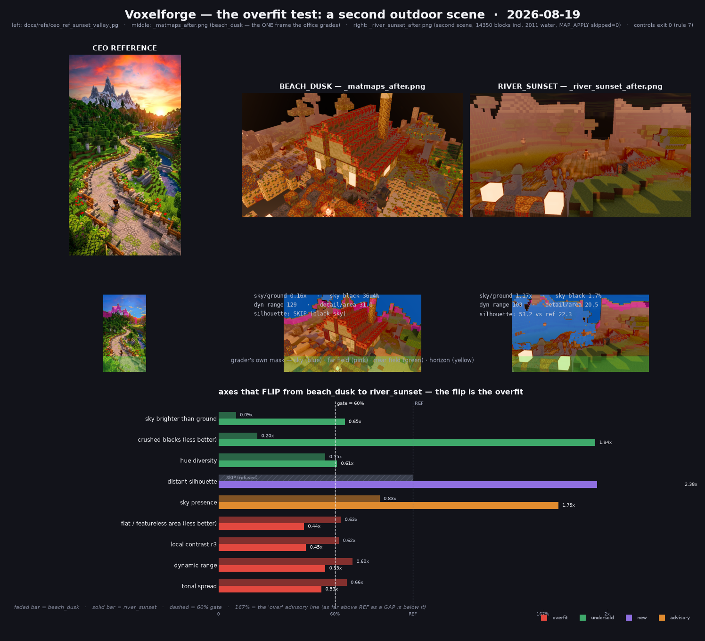

# 🏞 ฉากที่สองกลางแจ้ง — `river_sunset` vs `beach_dusk` (เลนกันโอเวอร์ฟิต)

**วันที่:** 2026-08-19 · **ผู้รัน:** BagIdea (เลนกันโอเวอร์ฟิต) · **commit ณ เวลารัน:** `f60b669` (HEAD)
**เกรดเดอร์:** `scripts/_pixel_artgap_grade.py` · **ref:** `docs/refs/ceo_ref_sunset_valley.jpg`
**สถานะ control (กติกาข้อ 7):** `python scripts/_pixel_artgap_controls.py` → **exit 0** ✅ (0 failure, 22/22 ผ่าน self-grade)

---

## TL;DR

ทั้งออฟฟิศตัดสินความสวยจากเฟรมเดียว `_matmaps_after.png` (ฉาก `maps/beach_dusk.json`) —
เฟรมนั้น**ฟ้ามืดสนิท** (36% ของฟ้าอยู่ต่ำกว่า L=10) เลยทำให้เครื่องวัด**ปฏิเสธที่จะวัด**แกน
`distant silhouette` และดันให้แกนกลุ่ม "ฟ้าสว่างกว่าพื้น" ดูพังเกินจริง พอยิงฉากที่สอง
(`maps/river_sunset.json` — ฟ้ามีโทนจริง) แกนที่ beach_dusk "ผ่าน" **4 แกนกลับตก** และแกนที่
beach_dusk "ตก" **3 แกนกลับผ่าน**:

| ทิศทาง | แกน |
|---|---|
| 🔴 **ผ่าน beach_dusk แต่ตก river_sunset** (= ที่ที่เราโอเวอร์ฟิต) | dynamic range · tonal spread · local contrast r3 · flat/featureless area |
| 🟢 **ตก beach_dusk แต่ผ่าน river_sunset** (= beach หลอกเราว่าแย่) | crushed blacks · hue diversity · sky brighter than ground |
| 🟣 **beach วัดไม่ได้ → river วัดได้** (สัญญาณที่เราไม่เคยเห็น) | distant silhouette = **2.38× (over)** — skyline contrast สูงกว่า ref 2.4 เท่า |
| 🟠 **beach ok → river กลายเป็น over (advisory)** | sky presence = 1.75× (ฟ้าเยอะเกิน ref) |

**ข้อค้นพบหลัก:** การโอเวอร์ฟิตไม่ใช่ "beach_dusk สวยแล้ว river_sunset เละ" — ทั้งคู่ผ่าน 9 แกนเท่ากัน
แต่**คนละ 9 แกน** เฟรมเดียวมืด ๆ ของ beach_dusk ปกปิดปัญหาฟ้า (วัดไม่ได้) พร้อมกับซ่อนปัญหาความเรียบ
(น้ำผิวกว้างทำ `flat_pct` พุ่ง 25.4→36.9) การตัดสินจากเฟรมเดียวจึงอ่าน look ผิดทั้งสองทิศทาง

---

## 1. บริบท — ทำไมต้องยิงฉากที่สอง

`docs/assets/artgap/artgap.json` ที่ทั้งออฟฟิศอ้าง มีเฟรมกลางแจ้งแค่เฟรมเดียวคือ `_matmaps_after.png`
(beach_dusk) + `docs/assets/look/outdoor-noon_after.png` (ตัวทดสอบซินธิติก) เฟรมจริงที่ใช้ตัดสินคือ
beach_dusk เพียงเฟรมเดียว งานนี้ยิงฉากที่สองแบบกลางแจ้งจริง (`river_sunset`) มาวัดด้วยเกรดเดอร์ตัวเดิม
เทียบ ref ตัวเดิม แล้วถามคำถามเดียว: **แกนไหนที่ beach_dusk บอกว่าผ่าน แต่ river_sunset บอกว่าตก** —
นั่นคือจุดที่ความมั่นใจจากเฟรมเดียวไม่ส่งต่อ

## 2. วิธี — ยิงด้วย binary ตัวไหน (และการแก้คู่มือที่ต้องบันทึก)

คำสั่งงานระบุให้ยิงด้วย `target/release/voxelforge_shot.exe` (18 ส.ค. 08:00) **แต่ binary ตัวนั้น
ยิงฉากโลกไม่ได้** — สแกน string ใน binary แล้ว:

| binary | mtime | `VOXELFORGE_PLAY` | `VOXELFORGE_CINE` | `VOXELFORGE_MAP_LOAD` | `VOXELFORGE_SHOT` |
|---|---:|---:|---:|---:|---:|
| `target/release/voxelforge_shot.exe` | 18 ส.ค. 08:00 | **0** | **0** | **0** | 1 |
| `target/release/voxelforge.exe` | 18 ส.ค. 08:01 | 1 | 1 | 1 | 1 |
| `target-rose/release/voxelforge.exe` | 18 ส.ค. 15:53 | 1 | 1 | 1 | 1 |

`voxelforge_shot.exe` เป็น hero-only (มีแค่ `VOXELFORGE_SHOT` ไม่มี `PLAY`/`CINE`/`MAP_LOAD`) →
ไม่สามารถโหลด map หรือรันกล้อง CINE ได้เลย (ยืนยันตามหน่วยความจำ `shot-exe-cannot-render-world`)

**จำเป็นต้องเบี่ยง:** ใช้ **`target-rose/release/voxelforge.exe`** (15:53) ซึ่งเป็น binary โลก
ตัวเดียวที่มีอยู่แล้วที่**บรรจุเลนน้ำ** (commit `2b64299` — `BlockId::WATER`) และ**ห้าม build ใหม่**
(Poppy ถือสิทธิ์ build รอบนี้) binary เก่ากว่านี้ (`target/release` 08:01) โหลด `river_sunset.json`
แล้ว **skip บล็อกน้ำทั้ง 2011 บล็อกแบบเงียบ ๆ** → แม่น้ำไม่โผล่

ยิงทั้งหมด **3 เฟรม** ด้วย binary เดียวกัน (15:53) + env เดียวกัน (default look, ไม่ override
sun/light/exposure) ต่างกันแค่ map + กล้อง:

```
VOXELFORGE_PLAY=1 VOXELFORGE_NOHUD=1 VOXELFORGE_LOOK_QUALITY=ultra VOXELFORGE_CINE_START=1.0 \
VOXELFORGE_MAP_LOAD=maps/river_sunset.json \
VOXELFORGE_CINE="34,15,60, 34,15,60, 30,4,18, 1" \
VOXELFORGE_SHOT=_river_sunset_after.png  ./target-rose/release/voxelforge.exe --play
```

- `_river_sunset_after.png` — **ฉากที่สอง (deliverable)**
- `_beach_dusk_samebin.png` — beach_dusk ยิงด้วย binary เดียวกัน (control แยกตัวแปร scene ออกจาก binary)
- `_matmaps_after.png` — เฟรมเดิมที่ออฟฟิศใช้ (binary 09:04) เพื่อเทียบกับ "สิ่งที่ทุกคนเชื่อ"

**ประตู runtime น้ำ:** `MAP_APPLY set=14350 skipped=0` (river ต้องมี `set=14350 skipped=0`;
binary ที่เก่ากว่าน้ำจะโผล่ `skipped=2011`) → **ผ่าน** น้ำทั้ง 2011 บล็อกถูก stamp จริง

## 3. กติกาข้อ 7 — control ผ่านก่อนเชื่อเลข

```
python scripts/_pixel_artgap_controls.py   →   exit 0
0 control failure(s)   ·   C0 positive control: reference grades itself 22/22 axes
```

C0 identity + C1–C10 lesions ผ่านหมด (lesion แต่ละตัวยุบแกนที่ตั้งใจยุบ, แกนอื่น survive)
⇒ เส้นตัดที่ใช้เชื่อได้ ตัวเกรดเองรัน control ซ้ำอีกรอบตอน `--check-controls` (exit 0)

## 4. ตารางเต็ม — 22 แกน (21 ด่าน + 1 advisory) เทียบ ref ตัวเดียวกัน

`↓` = แกน "น้อยกว่าดีกว่า" (ratio คำนวณเป็น `(ref+0.5)/(cur+0.5)`) · `[adv]` = วัดแล้วแต่ไม่ตัดสิน ·
`over` = ไกลจาก ref เกิน 167% (advisory) · `SKIP` = เครื่องปฏิเสธที่จะวัด (ไม่ใช่ศูนย์)

| แกน | owner | REF | beach_dusk<br>`_matmaps_after` | สถานะ | river_sunset<br>`_river_sunset_after` | สถานะ |
|---|---:|---:|---:|---:|---:|---:|
| dynamic range | renderer | 187.71 | 129.05 (0.69×) | ✅ ok | 102.82 (0.55×) | ❌ GAP |
| crushed blacks ↓ | renderer | 0.55 | 4.80 (0.20×) | ❌ GAP | 0.04 (1.94×) | ✅ ok |
| clipped highlights ↓ | renderer | 10.30 | 0.16 (16.36×) | ✅ ok | 2.70 (3.38×) | ✅ ok |
| tonal spread | renderer | 32 | 21 (0.66×) | ✅ ok | 17 (0.53×) | ❌ GAP |
| saturation | renderer | 57.56 | 76.61 (1.33×) | ✅ ok | 65.34 (1.14×) | ✅ ok |
| palette breadth | art | 15 | 6 (0.40×) | ❌ GAP | 7 (0.47×) | ❌ GAP |
| hue diversity | art | 3.90 | 2.15 (0.55×) | ❌ GAP | 2.37 (0.61×) | ✅ ok |
| cool/water chroma | world | 2.96 | 0.00 (0.00×) | ❌ GAP | 0.00 (0.00×) | ❌ GAP |
| local contrast r3 | art | 18.74 | 11.61 (0.62×) | ✅ ok | 8.45 (0.45×) | ❌ GAP |
| detail per area | art | 58.63 | 31.03 (0.53×) | ❌ GAP | 20.48 (0.35×) | ❌ GAP |
| flat/featureless area ↓ | art | 15.82 | 25.37 (0.63×) | ✅ ok | 36.86 (0.44×) | ❌ GAP |
| sky presence | world | 21.85 | 18.24 (0.83×) | ✅ ok | 38.17 (1.75×) | 🟠 over |
| sky brighter than ground | renderer | 1.80 | 0.16 (0.09×) | ❌ GAP | 1.17 (0.65×) | ✅ ok |
| sky sitting at black ↓ | renderer | 0.00 | 36.38 (0.01×) | ❌ GAP | 1.71 (0.23×) | ❌ GAP |
| sky blown to white ↓ | renderer | 5.09 | 0.00 (11.18×) | ✅ ok | 0.00 (11.18×) | ✅ ok |
| sky tonal gradient | renderer | 172.58 | 17.76 (0.10×) | ❌ GAP | 94.84 (0.55×) | ❌ GAP |
| sky hue range | renderer | 60.00 | 20.00 (0.33×) | ❌ GAP | 30.00 (0.50×) | ❌ GAP |
| distant silhouette | renderer | 22.33 | **— SKIP** | ⏸ SKIP | 53.25 (2.38×) | 🟠 over |
| detail surviving at distance | art | 15.61 | 8.05 (0.52×) | ❌ GAP | 5.00 (0.32×) | ❌ GAP |
| atmospheric perspective (sat) | renderer | 1.13 | 1.02 (0.91×) | ✅ ok | 1.24 (1.10×) | ✅ ok |
| atmospheric perspective (detail) [adv] | renderer | 0.81 | 1.09 (1.35×) | 📎 adv | 1.68 (2.07×) | 📎 adv |
| emissive light points | world | 159 | 2 (0.01×) | ❌ GAP | 0 (0.00×) | ❌ GAP |

**สรุป:** beach_dusk = 9 ผ่าน / 11 GAP / 1 SKIP · river_sunset = 9 ผ่าน (7 ok + 2 over) / 12 GAP / 0 SKIP
— ผ่านเท่ากัน แต่**คนละชุด**

## 5. 🔴 แกนที่ "ผ่าน beach_dusk แต่ตก river_sunset" = ที่ที่เราโอเวอร์ฟิต

แกน 4 ตัวนี้ beach_dusk (เฟรมที่ทั้งออฟฟิศเชื่อ) บอกว่าผ่าน แต่ river_sunset บอกว่าตก — ความมั่นใจจาก
เฟรมเดียวไม่ส่งต่อไปฉากที่สอง:

| แกน | beach_dusk | river_sunset | แปลผล |
|---|---:|---:|---|
| **dynamic range** | 129.05 (0.69×) ✅ | 102.82 (0.55×) ❌ | river ช่วงโทนแคบลง (ฟ้าสว่าง + น้ำเรียบกด p5–p95) |
| **tonal spread** | 21 bins (0.66×) ✅ | 17 bins (0.53×) ❌ | โทนถูกรวมเป็นก้อนน้อยลง |
| **local contrast r3** | 11.61 (0.62×) ✅ | 8.45 (0.45×) ❌ | ผิวน้ำเรียบ + ฟ้าไล่เฉดทำให้ contrast ท้องถิ่นยุบ |
| **flat/featureless area ↓** | 25.37% (0.63×) ✅ | 36.86% (0.44×) ❌ | พื้นที่แบนพุ่ง +46% — ตัวการหลักคือผิวน้ำ |

**ตัวการร่วม:** น้ำทั้ง 2011 บล็อก + ฟ้าที่มีโทนจริง สร้าง "พื้นผิวเรียบกว้าง ๆ" ที่ beach_dusk (มืด,
ไม่มีน้ำ) ไม่มี — เฟรมเดียวจึงมองไม่เห็นว่า **look ปัจจุบันไม่ได้ถูกปรับให้รับพื้นผิวเรียบกว้างแบบนี้**
(control ยืนยัน: `_beach_dusk_samebin.png` ยิงด้วย binary เดียวกันได้ local contrast 11.63 ≈ ตัวเดิม
11.61 → ความต่างคือ**ตัวฉาก** ไม่ใช่ binary)

## 6. 🟢 แกนที่ "ตก beach_dusk แต่ผ่าน river_sunset" = beach หลอกเราว่าแย่

| แกน | beach_dusk | river_sunset | แปลผล |
|---|---:|---:|---|
| **crushed blacks ↓** | 4.80% (0.20×) ❌ | 0.04% (1.94×) ✅ | เงามืดที่ beach พัง 128 เท่า แทบหายบน river (ฟ้ามีแสงส่องถึง) |
| **hue diversity** | 2.15 (0.55×) ❌ | 2.37 (0.61×) ✅ | เฉดหลากขึ้นเล็กน้อย (น้ำ/หญ้า/ฟ้า) |
| **sky brighter than ground** | 0.16 (0.09×) ❌ | 1.17 (0.65×) ✅ | **ฟ้าสว่างกว่าพื้น**กลับมา 7.5 เท่า — beach ฟ้ามืดเลยวัดได้ 0.09 |

beach_dusk มืดจน `sky_void_pct = 36%` → แกน "ฟ้าสว่างกว่าพื้น" ตกหนักและ "crushed blacks" ตกหนัก
**ไม่ใช่เพราะ look พัง แต่เพราะฉากมืด** river_sunset พิสูจน์ว่า look ตัวเดียวกันได้ `sky_ground_ratio`
1.17 (ref 1.80) และ crush 0.04% (ref 0.55)

## 7. 🟣 แกนที่ beach วัดไม่ได้ → river วัดได้ (สัญญาณที่เราไม่เคยเห็น)

`distant silhouette` (far_edge_contrast) เป็น**แกนเดียว**ที่ beach_dusk วัดไม่ได้ แล้ว river_sunset
กลับมา**วัดได้ — และกลายเป็น over 2.38×**:

- beach_dusk: `SKIP` (เหตุผลด้านล่าง §10) — ไม่มีตัวเลขให้เทียบเลย
- river_sunset: **53.25 vs ref 22.33 = 2.38×** → `over` (ไกลจาก ref เกิน 167%, advisory)

ฟ้าที่มีโทนจริงของ river ทำให้ขอบฟ้าวัดได้ และผลคือ **skyline contrast สูงกว่า ref 2.4 เท่า** — ตรงกับ
หน่วยความจำ `black-sky-wins-silhouette`: ฟ้ามืดเคยปกปิดแกนนี้ไว้ พอฟ้าสว่าง ปัญหา "ขอบฟ้าคมเกิน"
ก็โผล่ เรื่องนี้**ทั้งออฟฟิศยังไม่เคยเห็น** เพราะ beach_dusk ไม่เคยมีเลข

## 8. สิ่งที่ตกทั้งคู่ (และที่สำคัญ: water chroma ยังเป็นศูนย์)

- **cool/water chroma = 0.00 ในทั้ง 3 เฟรม รวม river ที่มีน้ำจริง 2011 บล็อก** — แกนนี้ชื่อว่า
  "cool/water" แต่วัดความ chroma โทน **เย็น (cyan/blue)**; น้ำในฉาก sunset สะท้อนฟ้าอมส้ม → ไม่อมเย็น
  เลยวัดได้ 0 แปลว่า **เครื่องมือชุดนี้ยังมองไม่เห็นน้ำที่มันตั้งใจจะวัด** (มีแม่น้ำจริงในเฟรม แต่ gate
  "cool/water" ไม่ขยับ) เป็นข้อจำกัดของ metric-vs-scene ต้องบันทึกไว้ ไม่ใช่ความผิดของ look
- **emissive light points:** river มี `lamp` 2 บล็อกใน map แต่ grader นับ emissive blob = **0**
  (beach_samebin = 8) → หลอดไฟของ river ไม่โผล่เป็นจุดส่องสว่างที่มุมกล้องนี้
- **detail per area** (0.53→0.35) และ **detail surviving at distance** (0.52→0.32) ตกทั้งคู่และ
  **แย่ลงบน river** — ย้ำทิศทางเดียวกับ flat_pct: ฉากแม่น้ำเรียบกว่าฉากหาด
- **sky sitting at black:** ตกทั้งคู่ แต่ river ดีขึ้นมาก (36.38% → 1.71%) — ยังไม่ถึง 0% ของ ref
  (gate ของแกนนี้แทบจะ = "ฟ้าต้องไม่ดำเลยแม้แต่ 1%")
- **sky tonal gradient / sky hue range:** ตกทั้งคู่ แต่ river ดีกว่า (gradient 17.76→94.84,
  hue 20°→30°) — ดู §9 เรื่อง confound

## 9. ⚠️ confound ที่ต้องเปิดเผย — binary ไม่ใช่ตัวเดียว

เฟรมที่ออฟฟิศเชื่อ `_matmaps_after.png` ยิงด้วย `_matmaps_ab_exe.exe` (09:04) ส่วนทั้งสองเฟรมใหม่ยิงด้วย
`target-rose` (15:53) — ระหว่างนั้น commit `2b64299` (น้ำ) + `13419e6` (checkpoint look) ลงมา
ผลคือ **แกนฟ้าบางแกนต่างกันเพราะ binary ไม่ใช่เพราะฉาก**:

| แกน | beach_dusk (binary 09:04) | beach_dusk (binary 15:53) | river_sunset (15:53) |
|---|---:|---:|---:|
| sky tonal gradient | 17.76 (0.10×) | 95.33 (0.55×) | 94.84 (0.55×) |
| sky_L_mean | 15.71 | 31.20 | 75.86 |
| sky_void_pct | 36.38% | 27.71% | 1.71% |
| emissive_blobs | 2 | 8 | 0 |

sky gradient กระโดดจาก 0.10× → 0.55× **ทั้ง ๆ ที่เป็นฉากเดียวกัน** ⇒ ส่วนหนึ่งของ "beach_dusk ฟ้ามืด"
คือ look เก่า (09:04) ไม่ใช่ตัวฉากล้วน ๆ **ข้อสรุป §5–§7 จึงใช้ `_beach_dusk_samebin.png` (binary
เดียวกับ river) เป็นหลัก** และทุกแกนในนั้นยังถือหลังตัด confound (ดู control ใน §5)

## 10. เหตุผลที่ grader ปฏิเสธจะวัด (คำต่อคำ — ไม่แปลงเป็นศูนย์)

แกนเดียวที่ถูกปฏิเสธคือ `distant silhouette` บนสองเฟรม beach (river วัดได้ครบ 22 แกน ไม่มีปฏิเสธ):

| เฟรม | เหตุผล (คำต่อคำจาก grader) |
|---|---|
| `_matmaps_after.png` (beach_dusk 09:04) | `sky unlit (36% below L=10) - contrast against a black void is degenerate` |
| `_beach_dusk_samebin.png` (beach_dusk 15:53) | `sky unlit (28% below L=10) - contrast against a black void is degenerate` |

เงื่อนไขปลดล็อก (จาก grader): `distant silhouette` ต้องการฟ้าที่มีโทน — `sky_void_pct ≤ 20` และ
`sky_blown_pct ≤ 20` beach_dusk ทั้งคู่มี `sky_void_pct` 36.4% / 27.7% → เกิน → ปฏิเสธ
river_sunset มี `sky_void_pct` 1.71% → วัดได้ (และผลคือ over 2.38× ตาม §7)

## 11. เพลตประกอบ



- แถวบน: CEO ref | beach_dusk (เฟรมที่ออฟฟิศเชื่อ) | river_sunset (ฉากที่สอง)
- แถวกลาง: mask ที่ grader วัดจริง (ฟ้า=sky · ชมพู=far · เขียว=near · เหลือง=เส้นขอบฟ้า)
- แถวล่าง: **แกนที่ flip ระหว่างสองฉาก** — faded bar = beach_dusk, solid bar = river_sunset,
  เส้นประ 60% = gate, 167% = เส้น over-advisory

mask ต้นฉบับเต็ม: `docs/assets/artgap/river_sunset/masks/` (4 ไฟล์) ·
เพลตดิบ (untracked, ตาม convention `_matmaps_after.png`):
`_river_sunset_after.png`, `_beach_dusk_samebin.png`

## 12. รันซ้ำ + sha256

```bash
python scripts/_pixel_artgap_controls.py   # ต้อง exit 0 (กติกาข้อ 7)

python scripts/_pixel_artgap_grade.py _matmaps_after.png _beach_dusk_samebin.png _river_sunset_after.png \
  --check-controls --gate \
  --json docs/assets/artgap/river_sunset/artgap.json \
  --mask-dir docs/assets/artgap/river_sunset/masks \
  --scoreboard docs/assets/artgap/river_sunset/scoreboard.md \
  --history docs/assets/artgap/river_sunset/history.jsonl \
  --label "river_sunset second-scene 2026-08-19 (target-rose 15:53)"
# exit 0 ผ่านหมด · 1 มี GAP · 2 วัดครบแต่มีแกนปฏิเสธ · 3 control ตก   (รอบนี้ exit 1: มี GAP จริง)
```

| ไฟล์ | sha256 |
|---|---|
| `docs/refs/ceo_ref_sunset_valley.jpg` (REF) | `d4491a12e14e5188d875b5933bb6d6358aedb53451533d1b4d906ad40e9528a1` |
| `_matmaps_after.png` (beach_dusk, binary 09:04) | `eca2d49358aa76cf8ea5012d09b0e70618b19c5da63ba7d026663cd045c678e5` |
| `_beach_dusk_samebin.png` (beach_dusk, binary 15:53) | `cd501f85b5926b3f76961da051747053b4a461bb1049a15cc51e4e27cb5b17ac` |
| `_river_sunset_after.png` (river_sunset, binary 15:53) | `bf52016afcf59326d218eeeea82ffc04ac8e9107cc781fa505fd1243868fb2a2` |

**binary ที่ยิง:** `target-rose/release/voxelforge.exe` (18 ส.ค. 15:53, 82,148,864 bytes, บรรจุเลนน้ำ)
— ไม่ใช่ `voxelforge_shot.exe` ที่ระบุในคำสั่ง (ตัวนั้นยิงโลกไม่ได้ ดู §2) · ไม่มีการ `cargo build`
รอบนี้ (Poppy ถือสิทธิ์ build)
