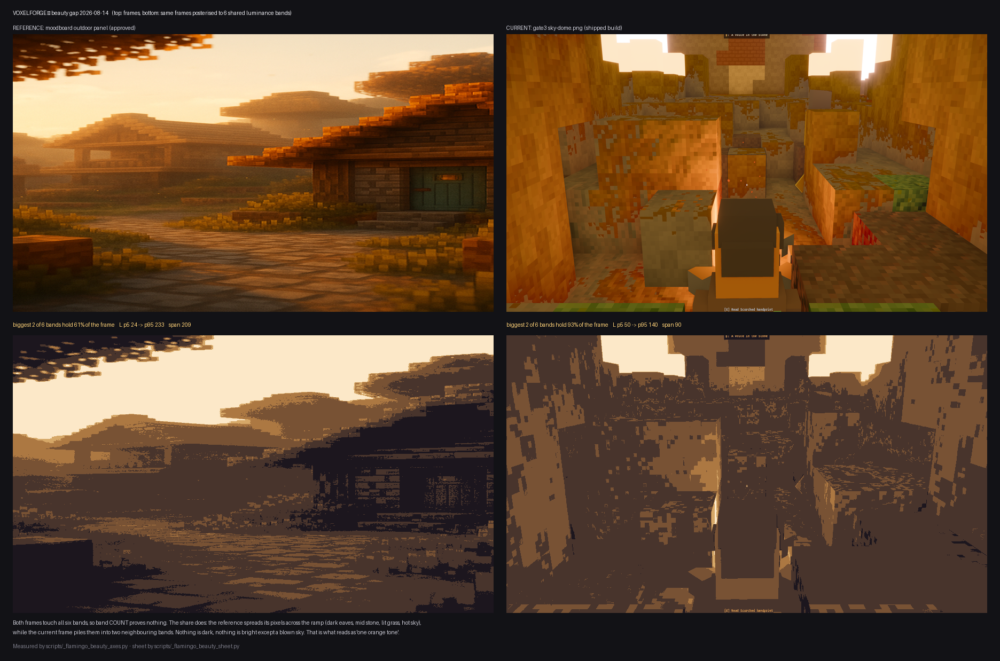

# ความสวยยังไม่มา — วัดเป็นแกน แล้วชี้ knob (2026-08-14)

**Lane:** Flamingo (designer) · **Branch:** `poppy/native-only` · **สถานะ:** วัดจบ ยังไม่ได้เรนเดอร์ทดสอบ
**โจทย์จาก CEO:** ท้องฟ้าขาวไหม้ล้วน · ทั้งเฟรมส้มทรายโทนเดียว · ไม่แยกระยะใกล้-ไกล



> อ่านแถวล่างของภาพก่อน: เฟรมเดียวกัน โพสเตอไรซ์เป็น 6 ระดับความสว่างด้วย **ramp เดียวกันทั้งคู่**
> เฟรมอ้างอิงกระจายพิกเซลทั่ว ramp — **2 แถบใหญ่สุดกิน 60.9%**; เฟรมปัจจุบัน **93.5%**
> กองอยู่ใน 2 แถบที่ติดกัน. นั่นคือหน้าตาของคำว่า "ส้มโทนเดียว" — และมันเป็นปัญหา **ค่าน้ำหนัก (value)
> ไม่ใช่ปัญหาเฉดสี**.

---

## 0. ก่อนอื่น: reference ที่ใช้เกรดอยู่ ใช้ตัดสิน 3 ข้อนี้ไม่ได้

> เรื่องนี้ **ไม่ใช่ของใหม่** — `docs/art-order-2026-08-09-composition.md` §1 บันทึกไว้แล้วว่าเฟรมที่อนุมัติ
> ทั้งสองใบ (`golden-beauty-shot-ref.png`, `wide-hero-final.png`) เป็นห้องในร่มทั้งคู่ sky pixel = 0
> และปิดท้ายว่า *"ได้ ref กลางแจ้งเมื่อไหร่ค่อยเติม"*. เอกสารนี้คือการเติมนั้น: หา ref กลางแจ้ง
> ที่ใช้ได้จริง แล้ววัดเป้าออกมาเป็นตัวเลขต่อแกน. ที่วัดซ้ำด้านล่างเพื่อให้เอกสารนี้ยืนได้ด้วยตัวเอง.

`docs/assets/golden-beauty-shot-ref.png` คือ **ครัวในร่ม**. วัดจริง:

| | sky mask | โทนอุ่น | พิกเซลใน ±15° ของ hue เด่น |
|---|---|---|---|
| `golden-beauty-shot-ref.png` (ครัว) | **0 px** | 98.9% | 93.3% |

- **sky 0 px** ⇒ แกน "ฟ้าไหม้" เอาไปเทียบไม่ได้เลย ไม่ใช่เทียบแล้วแพ้ — มันไม่มีอะไรให้เทียบ
  (scar ของออฟฟิศ: อย่าให้ด่านผ่าน/ตกบนภูมิภาคที่ว่างเปล่า)
- แย่กว่านั้น: ครัวเองก็ **98.9% โทนอุ่น / 93.3% อยู่ใน ±15°** ⇒ ถ้าเอามาเกรดวิสต้ากลางแจ้ง
  มัน **รับรอง** ข้อบกพร่องที่ CEO บ่นพอดี
- ครัวยังเป็นเจ้าของแกน "ในร่ม" ต่อไป **ไม่ได้ปลด** — แค่ไม่ใช่ ref ของฉากกลางแจ้ง

**ref ที่ใช้แทนสำหรับ 3 แกนนี้:** ครึ่งขวาของ `docs/assets/moodboard.png` (หมู่บ้าน golden hour)
— มีฟ้า มีระยะใกล้-ไกล มีหมอกระยะ ครบทั้งสามอย่างที่กำลังตัดสิน.

> **สถานะของ ref ใบนี้ พูดให้ตรง:** มันคือ **mood board** ที่ `look-bible.md:7` อ้างเป็นเอกสารประกอบ
> และเลนหมอกใช้เป็น ref พืชพรรณอยู่ก่อนแล้ว (`docs/haze-sweep-g7b.md:193`) — **ไม่ใช่ approved target
> frame ระดับเดียวกับ golden ref**. ผมใช้มันเพราะมันเป็นของกลางแจ้งชิ้นเดียวในโปรเจกต์ที่มีสถานะ
> อ้างอิงอยู่แล้ว ไม่ใช่เพราะมีใครอนุมัติให้เป็นเป้า. **ถ้า CEO อยากได้เป้ากลางแจ้งที่ผูกมัดจริง
> ต้องอนุมัติเฟรมกลางแจ้งสักใบเป็น golden ref ใบที่สอง** — จนกว่าจะถึงตอนนั้น เลขในตารางข้างล่าง
> คือ "ทิศทางที่ต้องขยับ" ไม่ใช่ "เส้นที่ทำให้ตกด่าน" และผมจะยังไม่ยัดมันเข้ารูบริค.

เรขาคณิตคนละฉาก ⇒ ทุกแกนวัดแบบ **directional ต่อโซน** (ฟ้า / ไกล / ใกล้) ไม่ใช่ pixel-to-pixel,
และ micro-contrast/horizon ใช้บล็อกที่เป็น **สัดส่วนของความสูงเฟรม** ไม่ใช่จำนวนพิกเซลตายตัว
(ref 1024 สูง vs เพลต 2560 กว้าง จะเทียบกันไม่ได้ถ้าไม่ normalize).

---

## 1. ตารางแกน — REF / CURRENT / TARGET / knob

วัดด้วย `scripts/_flamingo_beauty_axes.py`. CURRENT อ่านจากเพลตจริง **3 ใบ ต่างการถ่าย ต่าง class**
(ไม่ใช่ใบเดียวแล้วสรุป — และแต่ละใบพินด้วย sha เพราะใบแรกมีสองเวอร์ชัน ดูกล่องเตือนใต้ตาราง):

- **A** `docs/assets/gate3/sky-dome.png` — **สำเนาใน working tree** `sha256 adbd7f8d…` · 2560×1440 · 08-11 · ตัด HUD
- **A′** เวอร์ชันเดียวกันแต่ **ที่ commit ไว้ที่ HEAD** `sha256 feedd7e7…` — คนละช็อตกันจริงๆ
- **B** `gate3-a6-teal-2026-08-14/gate3-after-boot-nohud2.png` `sha256 ce411031…` — ตรงกับ HEAD (1280×640)

| # | แกน | REF | CUR A | CUR A′ | CUR B | TARGET | knob (มีจริงในโค้ด) |
|---|---|---|---|---|---|---|---|
| 1 | horizon step (ต่างเฉลี่ยต่อแชนแนล ตรงรอยฟ้าเจอพื้น) | **53.4** | 97.0 | 112.1³ | 94.6 | **≤ 62** | `HAZE_START`/`HAZE_FULL` · env `VOXELFORGE_LOOK_FOG=start,end` |
| 2 | value span L(p95−p5) | **209.5** | 89.4 | 122.1 | 114.0 | **≥ 150** (ยืด 180) | `Hour::ambient_lux` = 2200 · env `VOXELFORGE_LOOK_AMBIENT` |
| 3 | พื้นเงา L p5 | **23.7** (9.3% ของขาว) | 49.5 (19.4%) | 50.6 (19.8%) | 53.4 (20.9%) | **20–28** (8–11%; 8% คือพื้น G3 ห้ามต่ำกว่า) | `ambient_lux` |
| 4 | 2 แถบใหญ่สุดกินเฟรมกี่ % | **60.9%** | 93.5% | — | — | **≤ 75%** | ผลพลอยได้ของ #1–#3 |
| 5 | chroma span sat(p95−p5) | **0.776** | 0.417 | 0.502 | 0.481 | **≥ 0.62** | หมอกคลุมพื้นที่ (#1) + `grade::POST_SATURATION` |
| 6 | sat p5 (เดไซล์จืดที่สุด) | **0.224** | 0.583 | 0.498 | 0.519 | **≤ 0.32** | เหมือน #5 |
| 7 | ฟ้าคลิป (แชนแนลใด ≥250) | **68.1%** | 99.5% | ¹ | **99.0%** | **≤ 70%** | `exp_comp` ใน `build_sky_dome_mesh` · `sky_gain` 2.4 · env `VOXELFORGE_LOOK_SKYGAIN` |
| 8 | ฟ้า saturation | **0.244** | 0.161 | ¹ | 0.238² | **≥ 0.22** | เหมือน #7 |
| 9 | ฟ้า zenith↔horizon แยกกันไหม | top `[244,224,192]`, dL +7.1 | top `[254,244,231]`, dL **−7.7** | ¹ | ² | ต่างกัน **≥ 20 ระดับในอย่างน้อย 1 แชนแนล** — ทิศตาม look-bible (บนฟ้า ล่างอุ่น) | `sky_gradient()` / `exp_comp` |
| 10 | aerial dL (ไกล−ใกล้) | **+16.9** | +12.8 | +4.0 | +33.4⁴ | **≥ +15** | #1 |

¹ A′ มี sky mask **208 px (0.01%)** — ใช้ตัดสินแกนฟ้าไม่ได้เลย ปล่อยว่างดีกว่าเติมตัวเลขที่ไม่มีของจริงรองรับ.
² B มี sky mask 8,118 px (0.99%) — พอให้ยืนยัน "คลิป 99%" ได้ แต่บางเกินกว่าจะตัดสิน gradient ข้อ 9.
³ A′ วัด horizon ได้จากแค่ 67 คอลัมน์ (A ได้ 968, B ได้ 366) — ทิศทางตรงกัน แต่ให้น้ำหนักน้อยกว่า.
⁴ B เป็น framing ใกล้ (ตัวละครเต็มเฟรม) โซน "ใกล้" เหลือ 14,080 px — เลขนี้เป็นของ composition ไม่ใช่ของหมอก.

> ⚠️ **`docs/assets/gate3/sky-dome.png` มีสองเวอร์ชันบนเครื่องนี้**: ที่ commit ไว้ (A′) กับที่ค้างใน
> working tree ยังไม่ commit (A) — และมัน **คนละช็อต** ไม่ใช่ re-encode: A′ แทบไม่มีฟ้าในเฟรม (208 px)
> ส่วน A มี 131,506 px. ใครวัดซ้ำแล้วได้เลขไม่ตรงตารางนี้ ให้เช็ค sha ก่อนสรุปว่าใครผิด.
> **แกนที่ยืนบนเพลตที่ commit แล้วล้วนๆ:** #2, #3, #5, #6 (ยืนทั้ง A′ และ B) และ #7 (ยืนบน B).

**สิ่งที่ตารางนี้บอกและสำคัญมาก:** hue ไม่ใช่ปัญหา. ref = **100.0% โทนอุ่น**, ปัจจุบัน = 99.5%.
เกือบเท่ากัน. **ห้าม "แก้" ด้วยการเติมสีอื่นเข้าเฟรม** — ที่ต่างกันคือ value กับ chroma range.

---

## 2. ต้นเหตุ เรียงตามผลที่ได้ต่อการแก้

### #1 — หมอกระยะ (aerial perspective) ถูกตั้งไว้สำหรับแผนที่ที่ใหญ่กว่านี้ 2 เท่า

ค่า shipped: `FogFalloff::Linear { start: HAZE_START = 20, end: HAZE_FULL = 150 }` (บล็อก).
แผนที่ที่ใช้ shoot: `maps/edhari.json` = **x 0..63, y 0..30, z 0..63**.

| ระยะ (บล็อก) | 20 | 25 | 30 | 40 | 50 | 64 (สุดแกนเดียว) | 89.1 (ทแยงแนวราบ x–z) | 94.0 (ทแยงเต็มใบ รวมความสูง) |
|---|---|---|---|---|---|---|---|---|
| หมอกทึบ | 0% | 3.8% | 7.7% | **15.4%** | 23.1% | 33.8% | 53.2% | 56.9% |

สูตร: `(d − 20) / (150 − 20)`. ทแยงมาจากขนาดแผนที่ตรงๆ — √(63²+63²) = 89.1 และ √(63²+63²+30²) = 94.0.

กล้องอยู่ "ใน" หมู่บ้าน ⇒ ผนังหุบที่เห็นในเฟรมอยู่ราว 15–40 บล็อก (**ประมาณจากสเกลของ
หมู่บ้านในเฟรม ยังไม่ได้วัด depth จริง** — ตัวเลขนี้เป็นข้อสันนิษฐาน ไม่ใช่ผลวัด) ⇒ **หมอก 0–15%**.
เพดานที่วัดได้จริงจากขนาดแผนที่: เล็งสุดแกนเดียว = **33.8%**, เล็งทแยงข้ามทั้งใบ = **53–57%**
(อย่าเอา 33.8% ไปพูดว่า "ข้ามทั้งแผนที่" — มันเป็นเลขของแกนเดียว).
ไม่ว่าจะเอาเพดานไหน ramp ก็ยังไปไม่ถึงจุดที่หมอกทำงาน: ระบบ aerial perspective **มีอยู่จริง
และเขียนไว้ดี แต่มันไม่เคยติดในเฟรมนี้เลย** เพราะ ramp ถูก fit กับวิสต้า 150 บล็อกที่แผนที่นี้ใส่ไม่ลง.
นี่คือคำอธิบายเชิงตัวเลขของ horizon step 97 vs 53 และของ "ไม่แยกใกล้-ไกล".

### #2 — พื้นเงาสูงเกินไป เฟรมเลยไม่มีที่ให้ค่าน้ำหนักวิ่ง

`ambient_lux: 2200.0` (ขึ้นมาจาก 1100 เมื่อ 08-06 เพราะตอนนั้น p05-L ตก 2.2–3.8% ต่ำกว่าพื้น G3 ที่ 8%).
วัดตอนนี้: **p5 = 19.4–20.9% ของขาว** — เลยพื้น G3 ไปเท่าตัวกว่า. ref อยู่ที่ **9.3%** พอดีปริ่มพื้น.
ผลคือ p5..p95 ของทั้งเฟรมกว้างแค่ 89–114 ระดับ เทียบ ref 209.5 → ไม่มีอะไรมืด ไม่มีอะไรสว่าง.

### #3 — ฟ้าไหม้ (**แก้ที่ซอร์สแล้ว** `5eba1e8` — แต่ยังไม่มีเพลตหลังแก้)

`client/src/look.rs`: `exp_comp = 1/exposure()` → `1.0` (commit `5eba1e8`, หลักฐานก่อนแก้ `0df0558`).
ที่ ev100 10.3 ตัวคูณเดิม = **~1513×** ⇒ zenith `[0.256, 0.765, 1.890]` → `[387, 1157, 2859]` linear
⇒ ทุกอย่างเลยไหล่ tonemapper ไปกองที่ขาวเดียวกัน = ฟ้าคลิป **99.5%** และ gradient กลับทิศ (−7.7).
โดม **วาดถูกอยู่แล้ว** (7299237 — zenith = `sky [0.36,0.60,0.90] × 2.4` สีฟ้า, horizon = `haze_color()` อุ่น,
mid ลากไปทางล่าง 55%) — มันแค่โดนค่าแสงกลบ ตรงตามที่ CEO ว่าไว้.

⚠️ **แก้ที่ซอร์สแล้ว ≠ พิสูจน์แล้วว่าฟ้าหายไหม้.** เพลตทุกใบในตารางข้อ 1 ถ่าย**ก่อน** `5eba1e8`
และ `_poppy_sky_overexposed_2026-08-14.png` ที่ commit มาคู่กันคือหลักฐาน **ก่อน**แก้ ไม่ใช่หลัง.
งานถัดไปที่ชัดเจนที่สุดของเลนนี้: **shoot เพลตวิสต้าใบใหม่บน binary หลัง `5eba1e8`** แล้ววัดข้อ 7–9 ซ้ำ
(ต้องเป็นเฟรมที่ sky mask ≥ ~3% ของเฟรม ไม่งั้นแกนฟ้ายืนไม่ได้ — ดูเชิงอรรถ ¹/²).

---

## 3. แผนไต่บันได — ทำได้บน binary เดียว ไม่ต้อง rebuild ต่อขั้น

ทุก knob ข้างล่างอ่านจาก env ตอน spawn (ยืนยันในซอร์สแล้ว ไม่ใช่ของที่จำมา):

```bash
# R0  baseline (ไม่ใส่อะไร) — ต้องมีไว้เทียบเสมอ
# R1  หมอกให้พอดีสเกลแผนที่ 64 บล็อก
VOXELFORGE_LOOK_FOG=8,45
VOXELFORGE_LOOK_FOG=6,55      # ตัวที่ผมเดาว่าจะชนะ
VOXELFORGE_LOOK_FOG=5,70
# R2  ลดพื้นเงา (คุมไม่ให้ p5 หลุดต่ำกว่า 8% ของขาว = L 20)
VOXELFORGE_LOOK_AMBIENT=1700
VOXELFORGE_LOOK_AMBIENT=1400
VOXELFORGE_LOOK_AMBIENT=1100
# R3  ตัวที่ชนะจาก R1 + ตัวที่ชนะจาก R2 พร้อมกัน (คู่กันเสมอ ห้ามสรุปจากขั้นเดี่ยว)
```

วัดผลทุกขั้นด้วยคำสั่งเดียวกัน:

```bash
python scripts/_flamingo_beauty_axes.py \
  docs/assets/moodboard.png <PLATE>.png \
  --ref-crop 514,0,1024,1024 --cur-hud-bottom 130
```

**กฎของตารางผล (บทเรียนของผมเอง 08-09):** ผลบันไดต้องออกเป็น **per-plate × per-axis เต็มกริด**
หัวตารางบอกชื่อเพลต — ห้ามยุบเป็นค่าเดียวต่อแถว และก่อนเสนอเลขใด ต้องเช็คว่า **ทุกเพลตพร้อมกัน**
ผ่านหรือไม่. เอกสารนี้จึงยังไม่มีตารางผล — เพราะยังไม่ได้เรนเดอร์ มีแต่แผนกับเป้า.

---

## 4. ใครทำอะไร

| งาน | เจ้าของ | สถานะ |
|---|---|---|
| `exp_comp` → 1.0 (ฟ้าเลิกไหม้) | lane ที่ถือ `look.rs` | ✅ landed `5eba1e8` — **ยังไม่มีเพลตหลังแก้** |
| บันได `VOXELFORGE_LOOK_FOG` + `_AMBIENT` แล้วส่งกริดผลกลับมา | Rose (เจ้าของ sky dome 7299237) | รอเริ่ม |
| เกณฑ์/เป้าต่อแกน + ตัดสินว่า "สวยพอ" | Flamingo (ผม) | เอกสารนี้ |
| ย้ายเกณฑ์ที่ผ่านแล้วเข้า `look-acceptance-rubric.md` | Flamingo | หลังบันไดจบ |

**ข้อจำกัดที่ต้องพูดตรงๆ:**

1. ตัวเลข CURRENT ทั้งหมดมาจากเพลตที่ shoot ไว้ก่อนหน้านี้ (08-11 / 08-14) ซึ่งถ่าย **ก่อน** `5eba1e8`
   ⇒ แกนฟ้า (#7–#9) เป็นสภาพ *ก่อน* แก้ ต้องยิงเพลตใหม่แล้ววัดซ้ำ
2. ต้นเหตุ #1 (หมอก) กับ #2 (พื้นเงา) เป็น **การคำนวณจากค่าคงที่ที่ shipped + ขนาดแผนที่จริง**
   ไม่ได้อ่านจากรูป จึงไม่ขึ้นกับว่าใช้เพลตใบไหน — แต่ "แก้แล้วสวยขึ้นจริงไหม" ยังไม่ได้พิสูจน์
   เพราะยังไม่ได้เรนเดอร์สักขั้น. ผมไม่ build เองรอบนี้: `look.rs` / `import.rs` / `quest.rs`
   มีคนถือแก้อยู่ในนาทีที่ผมวัด การ build จะได้ binary ที่ไม่ตรงกับ HEAD และไม่ตรงกับใครเลย
3. `VOXELFORGE_LOOK_FOG=6,55` เป็น **ค่าที่ผมเดา** ไม่ใช่ค่าที่วัดมา — มันคือขั้นแรกของบันได
   ไม่ใช่ข้อเสนอให้ commit
4. เพดานหมอกจากขนาดแผนที่ (33.8% / 53–57%) วัดจากค่าคงที่ + extents จริง แต่ "ผนังหุบ 15–40 บล็อก"
   เป็นการประมาณ ไม่ใช่ผลวัด depth — ถ้าจะ quote ตัวเลข 0–15% ต้องติดคำว่าประมาณไปด้วยเสมอ

---

## 5. ขอบเขตของการ push (อ่านก่อนอนุมัติ)

`poppy/native-only` ตอนนี้ **นำ `origin` อยู่ 13 commit** ไม่ใช่แค่ใบเอกสารของผม —
ของผมกองอยู่ **บนสุด** ของอีก 6 lane ⇒ `git push` ธรรมดา = ส่งขึ้นทั้ง 13 ใบ แยกไม่ได้.
(เช็คสดเสมอ: `git rev-list --count origin/poppy/native-only..HEAD` — ตัวเลขขยับทุกครั้งที่มีใคร commit)

| commit | แตะอะไร | ระดับ |
|---|---|---|
| 7 ใบบนสุด `9343336` `1547ed5` `311ac62` `2518734` `157d671` + 2 ใบแก้ตามรีวิว (Flamingo) | `docs/flamingo-beauty-axes-2026-08-14.md`, `look-acceptance-rubric.md`, `scripts/_flamingo_a62_synth_control.py` | เอกสาร/สคริปต์ตรวจ |
| **`5eba1e8`** | **`client/src/look.rs`** (+ probe script) | **ซอร์ส — เปลี่ยนภาพจริง (ฟ้า)** |
| **`83cc877`** | **`client/src/import.rs`** (+ doc, control script) | **ซอร์ส** |
| `20dc430` | `scripts/verify_edhari_village.py` | สคริปต์ตรวจ |
| `0df0558` `e6586fd` `e922134` | เอกสาร + เพลตหลักฐาน | เอกสาร |

⇒ อนุมัติ push = อนุมัติให้ `5eba1e8` (แก้ exposure ฟ้า) ขึ้น origin ด้วย ทั้งที่ **ยังไม่มีเพลตหลังแก้**.
ถ้าอยากส่งเฉพาะเอกสาร ต้องให้ lane เจ้าของซอร์สยืนยันก่อน หรือ cherry-pick ขึ้น branch แยก.
