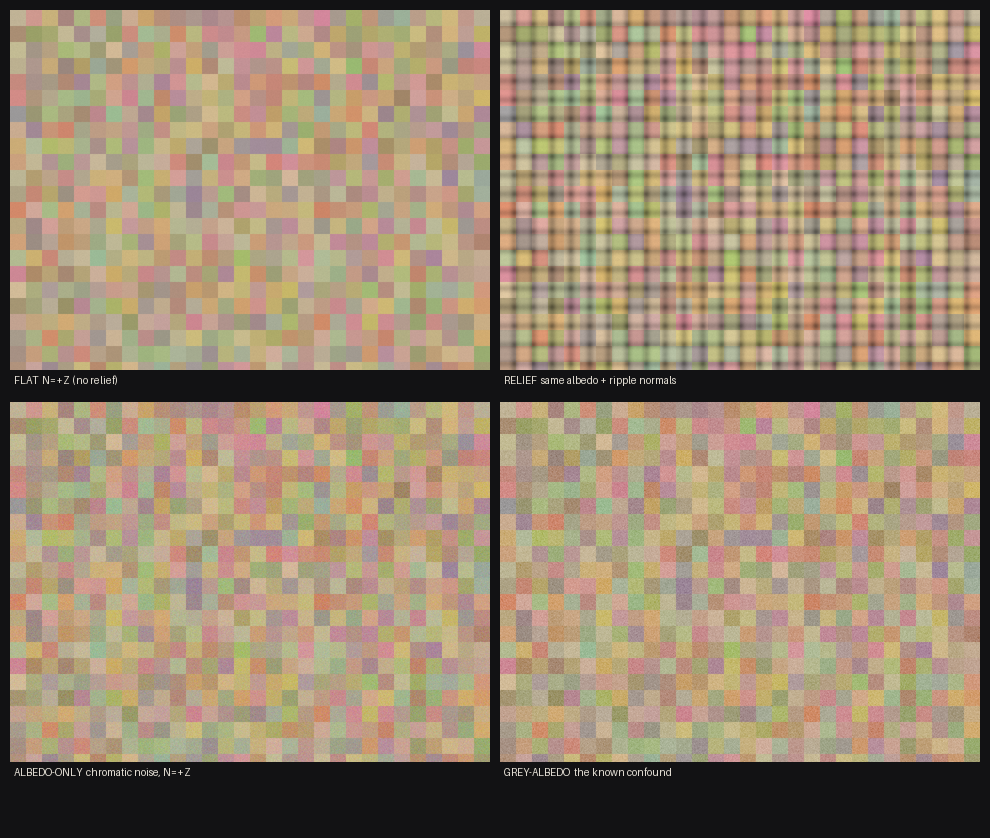

# ตัวตัดสิน matmaps on-vs-off — calibrate เสร็จ พร้อมรับรูปของ Poppy

**Flamingo · 2026-08-18** · สคริปต์: `scripts/_fl_matmaps_judge.py` · control log ดิบทั้งใบอยู่ใน[ภาคผนวก](#ภาคผนวก--control-log-ดิบ-ทั้งใบ)ท้ายเอกสาร

> เขียนไว้ก่อนรูปจะออก เพื่อไม่ให้ "ตั้งเส้นหลังเห็นผล" ซึ่งเป็นวิธีที่เอกสาร
> [`look-acceptance-rubric.md`](look-acceptance-rubric.md) ข้อ 7 ห้ามไว้ตรง ๆ และเคยทำโปรเจกต์นี้เสียรอบ
> engineering มาแล้วสามครั้ง.

---

## 0. สรุปสามบรรทัด

| | |
|---|---|
| **สคริปต์** | `scripts/_fl_matmaps_judge.py` — `control` (calibrate ตัวเอง) และ `judge BEFORE.png AFTER.png` |
| **control** | **PASS ทั้งชุด (C0–C5) · exit 0** — ทวนเลขที่ `grade_axes.py` เผยแพร่ไว้ได้ตรง, ให้คะแนนเฟรมที่อนุมัติแล้วเป็นเลขปกติ, ขยับเมื่อปลูก relief จริง, ไม่ขยับเมื่อเปลี่ยนแค่ albedo |
| **ติดอยู่ 1 อย่าง** | **ยังตัดสินไม่ได้จนกว่าจะมี null pair** — ต้องยิง `after` ซ้ำอีกใบใต้ env เดิม (เพิ่ม 1 บรรทัดใน `_poppy_matmaps/shoot_ab.sh`) ไม่มีพื้นเสียง ก็แยก "+0.4% เพราะ normal map" กับ "+0.4% เพราะ renderer หายใจ" ไม่ออก. สคริปต์จะ **exit 2 = REFUSED TO GATE** ไม่แอบให้ผ่าน |

---

## 1. วัดอะไร และทำไมนิยามแบบนี้

| # | เมตริก | นิยาม | ทำไม |
|---|---|---|---|
| 1 | **`lum_spread`** | `L(p95) − L(p5)` บน resample 1024² (L = Rec.709) | histogram spread ที่โจทย์ขอ. ใช้ L และ resample ชุดเดียวกับ `grade_axes.py` → ครึ่ง `p95` ของมันเอาไปทาบเลขที่เผยแพร่แล้วได้ |
| 2 | **`micro_rms`** | `std(L − GaussianBlur(L, r=3))` บน 1024² luminance | นี่คือแกน `micro-contrast` ของ `grade_axes.py` **สูตรต่อสูตร** ไม่ใช่ของใหม่ — rubric ระบุว่าไฟล์นั้นเป็น single source of truth ของเลขนี้ ถ้าผมนิยาม local contrast ตัวที่สอง มันจะไปเถียงกับ gate ที่ทุกคนใช้อยู่ |
| 3 | **`spec_cov`** | % ของพิกเซล non-sky ที่ **ทั้ง** โด่งเฉพาะที่ (top-hat `L − blur(r=6) ≥ 12`) **และ** สว่าง (`L ≥ p80` ของ non-sky) | เงื่อนไขคู่: ถ้าใช้ "สว่าง" อย่างเดียว ท้องฟ้ากับผนังโดนแดดจะนับเป็น specular หมด. พิมพ์ `spec_amp` + `clip_hi` คู่กันเสมอ เพราะ coverage ที่โตจากภาพคลิป 255 ไม่ใช่ specular (บทเรียน 2026-08-09) |
| 4 | **`shade_resid`** | ต่อ tile 48px ที่ผ่านคุณสมบัติ "หน้าบล็อกเดียว": fit `log(L+1) ~ a + b·r + c·g` (r,g = chromaticity) แล้วเอา **std ของ residual** — รายงานเป็น median ของประชากร tile | normal map แบบ Lambert คูณ RGB ทั้งสามช่องเท่ากัน → ไม่ขยับ chromaticity แต่ขยับ luminance ⇒ ตกลงใน residual. ส่วนการเปลี่ยน albedo ที่มีสี จะโดน chromaticity ดูดไปก่อน |

### จุดที่ต้องอ่านก่อนเอา `shade_resid` ไปอ้างว่า "normal-driven"

albedo ที่เป็น **โทนเทา** ก็ achromatic เหมือนกัน ⇒ ในเฟรมเดียว **แยกจากแสงเงาไม่ได้ทางคณิตศาสตร์**
ผมไม่เขียนเป็นหมายเหตุลอย ๆ แต่**วัดออกมาเป็นเลข** ใน control C5: albedo เทาหลอกเมตริกได้ **36%** ของ relief จริง

สิ่งที่ทำให้ตัวเลขนี้ attribute ได้ในงาน matmaps คือ **ตัวคู่ภาพ ไม่ใช่ตัวเมตริก** — สองเพลตยิงจาก binary
เดียว ใช้ tile albedo ชุดเดียวกัน ต่างกันที่ env lever ตัวเดียว ⇒ **delta** มาจาก albedo ไม่ได้
และ `chroma_std` คือยามที่เฝ้าข้ออ้างนั้น: ถ้ามันขยับ แปลว่าคู่ภาพต่างกันมากกว่าหนึ่งอย่าง สคริปต์จะตัด **FAIL (M2)** ไม่ใช่ให้ผ่าน

**หมายเหตุ resolution:** เมตริก 1–2 วัดบน resample 1024² (เพื่อให้ทาบเลขของ `grade_axes` ได้) ส่วนเมตริก
3–4 วัดบน **native pixel** — LANCZOS ลง 1024² เขียนโครงสร้าง 1–3px ที่เป็นเนื้อของ highlight/relief ใหม่หมด
และคู่ภาพ matmaps ล็อกกล้องนิ่ง (`eye_a == eye_b`) จึงเทียบ native ได้ตรงพิกเซล

---

## 2. Calibration — รันจริง ผลจริง (`python scripts/_fl_matmaps_judge.py control` → **exit 0**)

### C0 · ทวนเลขที่เครื่องมืออื่นเผยแพร่ไว้แล้ว

ก่อนจะเชื่อเมตริกใหม่ มันต้องผลิต **เลขเก่าที่มีคนเผยแพร่ไปแล้ว** ได้ก่อน

| ค่า | ที่ผมวัดได้ | `grade_axes.py` ประกาศไว้ | ผล |
|---|---|---|---|
| `micro_rms` | **5.245** | 5.24 | ✅ PASS (tol 0.02) |
| `p95` | **165.826** | 165.83 | ✅ PASS |

(เฟรม: `_fl_v4_20260818/golden-beauty-shot-ref-nohud2.png`)
⇒ local contrast ของผม **คือ** แกน micro-contrast ตัวเดียวกับที่ rubric ใช้ ไม่ใช่ตัวที่สองที่จะไปเถียงกันทีหลัง

### C1 · เฟรมที่อนุมัติแล้วต้องได้คะแนนที่ "อ่านออก"

| metric | golden-beauty-ref | wide-hero-final | outdoor-noon_after | evening-raking_after | night-firelit_after | beauty-board |
|---|---|---|---|---|---|---|
| lum spread L(p95−p5) | 143.97 | 140.24 | 105.34 | 101.17 | 139.39 | 113.88 |
| local contrast (hi-pass RMS) | 5.24 | 5.89 | 10.90 | 8.81 | 7.36 | 16.53 |
| specular coverage % | 2.882 | 2.959 | 8.281 | 4.368 | 4.330 | 4.894 |
| **shading resid (median tile)** | **0.0271** | **0.0122** | **0.0392** | **0.0641** | **0.0165** | 0.0297 |
| chroma std (albedo guard) | 0.0178 | 0.0079 | 0.0257 | 0.0299 | 0.0047 | 0.0122 |
| clipped-bright % | 0.00 | 0.00 | 0.00 | 0.00 | 0.05 | 0.01 |
| qualifying tiles | 55 | 144 | 93 | 128 | 242 | 1383 |
| w × h | 1024×1024 | 1280×720 | 1280×720 | 1280×720 | 1280×720 | 1322×11500 |

**ผ่านครบ 6/6** — ทุกใบให้เลข finite, tile ผ่านเกณฑ์ ≥ 30, specular coverage อยู่ในช่วง 0–25%, micro > 0.5
ถ้าใบใดใบหนึ่ง "ตก" แปลว่าเมตริกพัง ไม่ใช่รูปพัง (rubric ข้อ 7) และผมจะต้องกลับไปแก้เมตริก ไม่ใช่ขยับเส้น

> ⚠️ **`docs/assets/beauty-board.png` ไม่ใช่ control ที่ใช้ได้ และผมต้องบอกตรงนี้.**
> เปิดดูแล้วมันคือ **contact board 1322×11500** — before/after หลายสิบคู่ + chrome สีเข้ม + caption
> ไม่ใช่เฟรมเรนเดอร์ใบเดียว. lum_spread ของมันคือการผสมสี่สิบฉาก, tile 1383 ใบส่วนมากคือพื้นหลัง
> panel กับตัวหนังสือ. ผมวัดให้ตามที่สั่งและมันได้เลขที่ "ไม่พัง" แต่ **ห้ามใช้เป็นที่มาของเส้นตัด**
> ตัว calibration ref จริงคือ `golden-beauty-shot-ref` (interior) และ `wide-hero-final` (framing baseline, CEO-approved)
> ตาม rubric §"เฟรมอ้างอิง 2 ตัว" — สองใบนี้คือที่ผมใช้จริง

### C2–C5 · control สังเคราะห์ (เพลตอยู่ที่ `_fl_matmaps_control/`)

สร้างหน้าบล็อกแบบ Lambert จริง แล้วเปลี่ยนทีละอย่าง — ทุกใบ palette อุ่น (R>G>B) เพราะ `_sky()`
เป็น heuristic ที่ตัดสินจาก "ฟ้ากว่าแดง + สว่างกว่า median" ถ้าใช้สีสุ่มแบน ๆ patch สีน้ำเงินจะโดนอ่านเป็นท้องฟ้า
แล้ว control จะไปวัดข้อบกพร่องของเพลตทดสอบผม แทนที่จะวัดเมตริก

| control | ทำอะไร | ผล | เกณฑ์ |
|---|---|---|---|
| **C2 NULL** | วัดรูปเดิมสองครั้ง | max\|Δ\| = **0** เป๊ะ | ✅ deterministic |
| **C3 POSITIVE** | albedo เดิม + ripple normal map | paired median **+0.1038** บน 295 tile, ขึ้น **100%** ของ tile · per-plate 0.0227 → 0.1281 (**5.6×**) | ✅ ปลูก relief แล้วเมตริกเห็น |
| **C4 SPECIFICITY** | ใส่ albedo noise **มีสี**, N ไม่ขยับ | Δ **+0.0272** (เทียบ relief +0.1038 = ต่ำกว่าครึ่ง) · `chroma_std` **+0.01065** | ✅ ไม่อ่านสีเป็น relief และยามจับได้ |
| **C5 CONFOUND** | albedo noise **โทนเทา**, N ไม่ขยับ | Δ **+0.0369** = **36%** ของ relief จริง | 📢 เปิดเผยเป็นตัวเลข ไม่ใช่ gate |

**C3 ถามคำถามเดียว**: relief ปลูกแล้วเห็นไหม — จงใจ**ไม่**เอาผลของ C4 มาเป็นเงื่อนไข
(เวอร์ชันแรกผมเผลอใส่ `relief > 5× albedo` เข้าไป แล้ว control **FAIL** — พอไล่ดูพบว่าอัตราส่วนนั้นขึ้นกับ
amplitude ของ noise ที่ **ผมเลือกเอง** ⇒ กลายเป็น positive control ที่ไปเกรดเพลตทดสอบผมแทนที่จะเกรดเมตริก
ย้ายไปให้ C4 ถือเกณฑ์ specificity ของมันเอง)



*(เพลตสังเคราะห์ 4 ใบของ control — ไฟล์ทำงานอยู่ที่ `_fl_matmaps_control/` ซึ่ง `.gitignore:166 _*/` กินทั้งโฟลเดอร์ จึงคัดสำเนามาไว้ที่ `docs/assets/look/` ให้ตามรอยได้จาก clone เปล่า)*

---

## 3. ซ้อมกลไกตัดสิน 5 รอบ — ทุกทางออกยิงจริงแล้ว

ไม่ได้แค่เขียนเกณฑ์ไว้ ผมป้อนเคสที่**ควรตก**เข้าไปด้วย

| # | ป้อนอะไร | ควรได้ | ได้จริง |
|---|---|---|---|
| A | relief จริง แต่**ไม่ส่ง** null pair | ปฏิเสธ | `REFUSED TO GATE -- no null pair` · **exit 2** ✅ |
| B | relief จริง + null pair | PASS | M1–M5 PASS ครบ · **exit 0** ✅ |
| C | คู่ที่**ไม่มีอะไรเปลี่ยน** (noise draw สองใบเท่ากัน) | FAIL | `M1 relief registers` **FAIL** — Δ +0.0000, tile ที่ขึ้น 47.6% (ประมาณโยนหัวก้อย) · **exit 1** ✅ |
| D | คู่ที่ **albedo เปลี่ยนด้วย** (ไม่ใช่ one-lever) | FAIL | M1 ผ่านสวย (+0.0325, 100% ของ tile) แต่ **M2 FAIL** ตามที่ต้องการ · **exit 1** ✅ |
| E | สองเพลตคนละขนาด | ปฏิเสธ | `REFUSED: 960x720 vs 640x480` · **exit 2** ✅ |

> **รอบ D คือรอบที่สำคัญที่สุด** — คู่ภาพที่เปลี่ยน albedo อย่างเดียวจะทำให้ M1 "ผ่านสวย" และถ้าไม่มี M2
> ผมจะรายงานว่า "normal map ทำงาน" ทั้งที่ normal map ไม่ได้แตะอะไรเลย. ยามตัวนี้จำเป็น

**รอบ C ยังสอนอีกเรื่อง**: `shade_resid` เป็นสถิติแบบ variance ⇒ **noise ใด ๆ ก็ดันมันขึ้น** รวมทั้ง noise
ของตัว capture เอง. นั่นคือเหตุผลที่ floor ต้องมาจาก null pair **ที่เรนเดอร์จริงสองครั้ง** (ทั้งสองฝั่งมี noise
แบบเดียวกัน) จะเอา "ภาพเดิม + noise สังเคราะห์" มาแทนไม่ได้

---

## 4. เกณฑ์ผ่าน/ไม่ผ่าน ที่จะใช้ตัดสิน matmaps on-vs-off

### 4.1 ทำไมต้องเป็น differential ไม่ใช่ absolute

`docs/look-acceptance-rubric.md` §"กติกาการเลือกโหมดเกรด" บอกไว้ชัด: **เฟรมที่ framing ต่างจาก golden ref
ให้เกรดแบบ differential เทียบ baseline ห้ามเอา P0 target มาทาบตรง ๆ**. เพลต matmaps คือ
`maps/beach_dusk.json` หน้าใต้ของกระท่อม กลางแจ้ง ตอนโพล้เพล้ — ไม่ใช่ tight interior hero (calibration ref)
และไม่ใช่ tilt-down wide (framing baseline) ⇒ **ไม่มี absolute target ที่สุจริตสำหรับเพลตนี้**
คู่นี้จึงตัดสินเทียบ **before-plate ของตัวเอง** โดยมี null pair เป็นหน่วยวัด

### 4.2 ตาราง gate

| # | ชั้น | เกณฑ์ | ผูกกับ rubric ข้อไหน |
|---|---|---|---|
| **M1** | ⛔ HARD | `shade_resid` (median tile) เพิ่มขึ้น **> 3× noise floor** **และ** tile ที่เพิ่มขึ้น **≥ 60%** ของ tile ที่ผ่านคุณสมบัติทั้งสองใบ | **Pass 7a** — "3 วัสดุตอบแสงต่างกันเห็นชัด". นี่คือข้ออ้างหลักของ matmaps: normal map ที่ผูกจริงต้องเปลี่ยนแสงเงาบนหน้าบล็อก |
| **M2** | ⛔ HARD | \|Δ`chroma_std`\| ≤ **max(3× null, 2% ของ before)** | ยาม one-lever. ไม่ใช่คุณภาพลุค แต่เป็นความสุจริตของคู่ภาพ — Δ ที่ albedo ขยับด้วย จะ attribute ให้ normal map ไม่ได้ |
| **M3** | ⛔ HARD | `micro_rms` ต้องไม่ลดต่ำกว่า `before − floor` | **G1 voxel hard-edge** — normal map ที่ไปลบรายละเอียด/ทำภาพเนียนขึ้น คือการแลก identity ไม่ใช่การได้ |
| **M4** | ⛔ HARD | `lum_spread` ต้องไม่ลดเกิน floor | **Pass 6 tone-map** — relief ต้องไม่กินช่วงค่า |
| **M5** | ⛔ HARD | Δ`clip_hi` ≤ **+1.0 pt** | **G5 ไม่ blow-out** — specular ที่โตเพราะภาพเริ่มคลิป 255 ไม่นับเป็นชนะ |
| **A6** | 🔻 ADVISORY | `spec_cov` เพิ่ม > 3× floor | **Pass 7b** specular streak. **ไม่ใช่ hard** เพราะ `_r.png` ที่ทำให้ผิวหยาบขึ้น **มีสิทธิ์ลด** highlight ได้อย่างถูกต้อง — เอามาตัด FAIL คือไล่ตาม phantom target |

**ผลลัพธ์:** ตก HARD ข้อใดข้อหนึ่ง = **FAIL (exit 1)** · ผ่านครบ = **PASS (exit 0)** · ไม่มี null pair
หรือ tile ที่ผ่านทั้งสองใบ < 30 = **exit 2 ปฏิเสธ ไม่ใช่ผ่าน**

**ทำไมนับ tile เป็นประชากร ไม่เลือกหน้าบล็อกเอง** — site ที่เลือกบนเพลตเดียวย่อมได้ N/N บนเพลตนั้นโดยโครงสร้าง
tile qualification คำนวณจาก **เพลตแต่ละใบแยกกัน** (ไม่ใช่จาก \|A−B\|) แล้วค่อยเอา intersection —
mask ที่ derive จากผลต่างทำให้ "การเปลี่ยนแปลงอยู่บนเป้า" เป็นจริงโดยอัตโนมัติ พิสูจน์ผิดไม่ได้

---

## 5. สิ่งเดียวที่ยังขาด (ฝากถึงเลนที่ยิงรูป)

`_poppy_matmaps/shoot_ab.sh` ยิง `before` (`MAT_MAPS=off`) กับ `after` (`on`) — **ขอเพิ่มอีกหนึ่งบรรทัด**:

```bash
shoot after2 VOXELFORGE_MAT_MAPS=on     # null pair: env เดิมเป๊ะ, lever เดิมเป๊ะ
```

แล้วเรียก:

```bash
python scripts/_fl_matmaps_judge.py judge \
    _poppy_matmaps/before.png _poppy_matmaps/after.png \
    --null _poppy_matmaps/after.png _poppy_matmaps/after2.png \
    --out _fl_matmaps_verdict
```

สคริปต์เช็คให้ด้วยว่า null pair ไม่ใช่ไฟล์เดียวกันสองครั้ง (byte-identical → ปฏิเสธ)

---

## 6. ข้อจำกัดที่รู้อยู่ — จดไว้ก่อนมีใครถาม

1. **albedo โทนเทา ปลอมเป็น relief ได้ 36%** (C5). กันด้วย provenance ของคู่ภาพ + M2 เท่านั้น ไม่ได้กันด้วยเมตริก
2. **`_sky()` เป็น heuristic** (ฟ้ากว่าแดง + สว่างกว่า median) — บนเพลต beach_dusk ที่ฟ้าโพล้เพล้เป็นสีส้ม
   มันอาจตัดฟ้าไม่หมด. `n_terrain` กับจำนวน tile พิมพ์ทุกครั้ง ถ้าตัวเลขดูแปลกให้สงสัยข้อนี้ก่อน
3. **`TILE=48`, `SPEC_TOPHAT=12`, `SPEC_BRIGHT_P=80` ผูกกับ 1280×720** — เปลี่ยนความกว้างเพลตต้อง
   re-calibrate ก่อนใช้ตัด FAIL (memory: px threshold ผูกกับ plate class)
4. **water/metal ไม่อยู่ในเฟรมนี้และใส่ไม่ได้** — `sim/src/block.rs` ไม่มี BlockId ทั้งสอง (Poppy จดไว้ใน
   `shoot_ab.sh` แล้ว) ⇒ Pass 7b ที่พูดถึง "สแตนเลสมี specular streak" **จะทดสอบไม่ได้บนเพลตนี้**
   A6 จึงเป็น advisory ด้วยเหตุผลนี้อีกชั้น
5. **ยังไม่เคยรันกับรูป matmaps จริงสักใบ** — ทุกเลขในเอกสารนี้คือ control กับเพลตที่อนุมัติแล้ว
   ไม่มีคำตัดสินเรื่อง matmaps อยู่ในนี้เลย

---

## ภาคผนวก — control log ดิบ ทั้งใบ

`python scripts/_fl_matmaps_judge.py control` · 2026-08-18 · **exit 0**
(ตัวไฟล์ `_fl_matmaps_control/control.log` โดน `.gitignore:26 *.log` กิน จึงฝังไว้ที่นี่แทน เพื่อให้ทุกเลขในเอกสารนี้ตามรอยกลับไปหาผลรันจริงได้)

```
==============================================================================
MATMAPS JUDGE -- INSTRUMENT CONTROL
==============================================================================

C0  reproduce grade_axes' own published values on the golden ref
  [PASS] micro_rms    got    5.245  grade_axes says    5.240  (tol 0.02)
  [PASS] p95          got  165.826  grade_axes says  165.830  (tol 0.02)

C1  approved / signed-off frames -- the metric must return a real
    number on work that was already accepted

metric                         golden-beauty-ref  wide-hero-final  outdoor-noon_after  evening-raking_after  night-firelit_after  beauty-board
------------------------------------------------------------------------------------------------------------
lum spread L(p95-p5)               143.97      140.24      105.34      101.17      139.39      113.88
local contrast (hi-pass RMS)         5.24        5.89       10.90        8.81        7.36       16.53
specular coverage %                 2.882       2.959       8.281       4.368       4.330       4.894
shading resid (median tile)        0.0271      0.0122      0.0392      0.0641      0.0165      0.0297
  shading resid p90                0.0857      0.0680      0.6211      0.3031      0.0972      0.3050
  raw logL std                     0.0866      0.0385      0.1271      0.1455      0.0297      0.1033
  chroma std (albedo guard)        0.0178      0.0079      0.0257      0.0299      0.0047      0.0122
  specular amplitude                26.26       32.68       22.41       24.39       29.00       30.01
  clipped-bright %                   0.00        0.00        0.00        0.00        0.05        0.01
  L p95                            165.83      177.36      142.02      122.94      163.85      113.88
  qualifying tiles                     55         144          93         128         242        1383
  w x h                         1024x1024    1280x720    1280x720    1280x720    1280x720  1322x11500

  assertions (a signed-off frame that scores 'broken' means the
  METRIC is broken -- rubric rule 7):
  [PASS] golden-beauty-ref      ok
  [PASS] wide-hero-final        ok
  [PASS] outdoor-noon_after     ok
  [PASS] evening-raking_after   ok
  [PASS] night-firelit_after    ok
  [PASS] beauty-board           ok

  synthetic plates written to E:\Projects\bagidea-ai-agents-office\workspace\projects\Voxelforge\_fl_matmaps_control
metric                               flat      relief      albedo        grey
----------------------------------------------------------------------------------
lum spread L(p95-p5)                38.78       76.22       45.84       50.16
local contrast (hi-pass RMS)         3.46        4.22        6.99        9.74
specular coverage %                 2.294       9.240       7.221      10.473
shading resid (median tile)        0.0227      0.1281      0.0552      0.0658
  shading resid p90                0.0451      0.1453      0.0733      0.0852
  raw logL std                     0.0582      0.1453      0.0773      0.0879
  chroma std (albedo guard)        0.0305      0.0305      0.0412      0.0335
  specular amplitude                15.17       16.60       16.89       18.47
  clipped-bright %                   0.00        0.00        0.00        0.00
  L p95                            183.37      187.69      185.78      187.74
  qualifying tiles                    295         296         274         292
  w x h                           960x720     960x720     960x720     960x720

  paired (tile-intersection) shade_resid deltas vs flat -- the same
  reduction judge() gates on:
    relief   n=295  median +0.1038   rose on 100.0% of tiles
    albedo   n=274  median +0.0272   rose on 100.0% of tiles
    grey     n=292  median +0.0369   rose on 100.0% of tiles

C2  NULL (negative): the same plate measured twice must not move
  [PASS] max |delta| over the four metrics = 0 (want exactly 0)

C3  POSITIVE (planted): same albedo, ripple normal map added
  [PASS] paired median +0.1038 on 295 tiles, rose on 100.0% of them; per-plate 0.0227 -> 0.1281 (5.6x)

C4  SPECIFICITY (negative): chromatic albedo noise, N unchanged
  [PASS] shade_resid delta +0.0272  (vs relief +0.1038)   chroma_std delta +0.01065
       chroma_std is the guard: albedo moved it, so a pair whose
       chroma_std moves is not a clean one-lever pair.

C5  KNOWN CONFOUND (disclosure, not a gate): greyscale albedo noise
       shade_resid delta +0.0369  -- 36% of the planted relief.
       A greyscale albedo change IS achromatic, so one frame cannot
       separate it from shading. The matmaps A/B is safe from this
       only because both plates use the SAME albedo tiles -- which is
       what chroma_std + one-lever provenance are there to prove.

==============================================================================
CONTROL PASSED -- the instrument reproduces a published number, scores
approved frames as sane, is deterministic, moves on planted relief and
does not move on a coloured albedo change.
wrote E:\Projects\bagidea-ai-agents-office\workspace\projects\Voxelforge\_fl_matmaps_control\control.json
```
