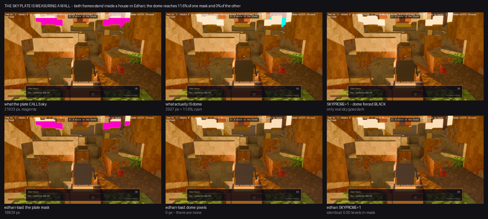

# The sky plate measures a wall — audit of the after-plate, 2026-08-14

Three questions were put to the 06:18 after-plate: why does its own angle guard
read 28.60 / 13.93 against a 3.0 threshold and still write the file, why did one
frame's sky move while the other did not, and which binary shot the frames. All
three are answered below with numbers anyone can re-run, and the answer to the
second one turned out to be bigger than the question.

Nothing in `client/src/look.rs` was touched. Every measurement here comes out of
env levers the engine already ships.



Magenta is every pixel `sky_mask` publishes as sky; cyan is the subset that
actually goes dark when the dome is forced black. Top row is the A/B frame
(2,507 of 21,633), bottom row is `edhari-load` (0 of 18,829).

## Short version

* The 06:18 frames were shot with `target/release/voxelforge.exe` (06:15), not
  the stale debug default. Proven, not assumed.
* On `edhari-load` the camera did **not** move. The 13.93 is a real scene
  change, so the angle guard is not a camera-move detector.
* Neither of the plate's frames contains sky worth measuring. `sky_mask`
  selects **88.4%–100% interior masonry**. Both frames stand inside a house.
* Measured on the dome pixels alone, the fix works **better** than the plate
  reported: `R>=250` goes 100% → **0.0%** (not 88.1%), pure white 32.95% →
  0.000%. The "88% still pinned, so 1513x was one bug not the whole story" line
  is an artefact of the contaminated mask.
* The plate now refuses to write on drift, on a missing dome probe, and on an
  impure mask. Both new refusals are shown to be *reachable*, not just loud.

## 1. Which binary shot the 06:18 frames

`prove_playable.sh:36` defaults to `./target/debug/voxelforge.exe`, whose mtime
is `2026-08-11 01:05` — three days older than the fix (5eba1e8, 05:53). The
release exe is `2026-08-14 06:15`.

Two full runs of `BIN=./target/release/voxelforge.exe bash scripts/prove_playable.sh`
give the run-to-run floor; the 06:18 frames are then compared to them with the
plate's own angle guard:

| frame | R1 vs R2 (same exe, noise floor) | 06:18 vs R1 |
|---|---|---|
| `playable-boot.png` | 0.10 | 0.17 |
| `playable-walk-before.png` | 0.18 | 0.19 |
| `edhari-load.png` | 0.15 | 0.17 |
| `playable-walk-after.png` | 10.91 | 10.70 |

Every frame sits inside its own noise floor, so 06:18 came off the release exe.
The negative control closes it: the stale debug exe shot `edhari-load` today and
lands **14.05** levels away from the release frame — and **0.38** levels from
the 05:35 "before" frame, which is what makes that before frame a faithful
pre-fix control.

`prove_playable.sh` now stamps `BIN <path> <bytes> <mtime>` into stdout and into
every per-shot log, and says `! STALE` when the newest `client/src/*.rs` is newer
than the binary. Run today with the default it fires; with the release exe it
stays quiet.

## 2. The angle guard is not a camera-move detector

On `edhari-load`, with the same camera (`--play`, no input), the drift is
reproducible and is not the camera:

* run-to-run with one binary: **0.15** levels.
* best integer shift that minimises the pre/post difference: **dx=0, dy=0**
  (13.83 at zero shift, 13.83 at the best of ±6 in both axes). A moved camera
  has a better shift; this one does not.
* the difference is 94% one-signed — the post-fix frame is *brighter* by 13.3
  levels on average. That is a repaint, not a parallax.

The cause is not the sky fix: 72408ad ("one source of truth per block colour",
05:14) and 3262c6e (05:30) repainted every voxel. Their commit clocks sit
*before* the 05:35 capture, so the clock alone does not place them between the
builds — the binaries do. The 08-11 debug exe, which cannot contain either,
reproduces the 05:35 before frame to 0.38 levels; so the 05:35 build behaves
like a pre-repaint one and the repaint really does fall between the two
captures. Poppy reached the same conclusion independently in b620d0d, and their
one-binary reconstruction is the right response to it.

`playable-walk-after` is different, and there the camera really does move — but
between *runs of the same binary*. `main.rs::screenshot_once` fires on
`time.elapsed_secs() > 3.2`, wall clock, and `--play-demo` integrates the driven
walk against real dt. The engine prints the drift itself:

```
run 1  PLAY_WALK from=(32.50,2.62,32.50) to=(32.81,3.62,22.50) moved=10.00
run 2  PLAY_WALK from=(32.50,2.62,32.50) to=(32.82,3.62,22.60) moved=9.91
run 3  PLAY_WALK from=(32.50,2.62,32.50) to=(32.89,3.62,22.58) moved=9.93
```

So `drift < 3.0` on that frame is unreachable from the capture side: its floor
is 10.91. Getting it under 3.0 needs a fixed timestep or a frame-counted
screenshot in the engine — engine lane, not a plate change.

## 3. Neither frame contains sky

`sky_mask` is `R>=250 & B>=170` in the top 45% of the frame. It cannot tell a
dome from sunlit sandstone, and every frame here stands **inside a house** in
Edhari — spawn `(32.5, 2.6, 32.5)`, campfire at `(32.5, 1.0, 29.5)`, Elder Maren
mid-dialogue in shot. Even the `--play-demo` walk, 10 blocks north, never leaves
the room.

Settled against the renderer instead of against a colour range.
`VOXELFORGE_LOOK_SKYPROBE=1` (look.rs:1988) swaps the dome material for
`base_color: BLACK, unlit: true` — and it is the black that does the work, not
the `emissive` beside it, because an unlit fragment writes `base_color` verbatim
(`pbr.wgsl:80-84`, the very bug 5eba1e8 fixed). Any dome pixel on screen goes
near-black; nothing else moves.

On the two `prove_playable` frames, with the shipped fog:

| lever | in-mask mean change | px changed >100 | verdict |
|---|---|---|---|
| `SKYPROBE=1` (dome → black) | **0.00** | 0 | no dome pixel in the mask |
| `SKYHOR=1,0,1` (dome → magenta) | **0.00** | 0 | ditto, and 0 magenta px |
| run-to-run noise, same exe | 0.15 | 37 | the floor for comparison |

The dome is not in those frames at all. `edhari-load`'s "sky" — 18,829 px whose
`R>=250` stayed at 100.0% — is lit masonry, which cannot unpin no matter what
the sky does. That is the whole answer to "why did one frame move and the other
not", and it means the frame that *did* move moved for the other reason: its
camera is elsewhere between the two shots.

`VOXELFORGE_LOOK_SKYGAIN` must not be used for this test. `haze_color()` folds
`sky_gain` in and is also the geometry fog colour, so on `edhari-load` a
3632.16 gain moves 30,944 pixels by more than 100 levels while moving the masked
pixels by 1.22 — it looks like a sky lever and is a fog lever.

## 4. The A/B pair: 88.4% of the published sky is masonry

Poppy's `_poppy_sky_gain_ab.sh` neutralises the fog (`VOXELFORGE_LOOK_FOG=100000,200000`,
`VFOG=off`), and with the haze pushed past the world a little dome does reach the
frame through the openings. So the A/B pair is *not* measuring nothing — but it
is measuring mostly wall. Same camera, same env, plus `SKYPROBE=1`:

```
plate mask                 21633 px
dome pixels in the frame    8711 px  (0.95% of frame)
mask that IS dome           2507 px  -> purity 11.6%
mask that is NOT           19126 px  -> 88.4% geometry
```

Split the plate's own published numbers along that line:

| measured on | n | R>=250 | pure white | mean R |
|---|---|---|---|---|
| the mask as published | 21633 | 100.0% → **88.1%** | 3.818% → 0.000% | 253.6 → 250.0 |
| **only the dome pixels** | 2507 | 100.0% → **0.0%** | 32.948% → 0.000% | 254.7 → 224.0 |
| only the rest | 19126 | 100.0% → 99.7% | 0.000% → 0.000% | 253.4 → 253.4 |

The 88.1% that "stayed pinned" is the 88.4% that was never sky. Every dome pixel
unpinned. The doc's "still open — 88% of those pixels are still at R>=250, so
1513x was one bug, not the whole story" should be restated: on this frame, at
this camera, 1513x accounts for all of it.

## 5. What changed

* `scripts/_poppy_sky_after_plate.py` — two new refusals beside the existing
  byte-identical one, both blocking the write and exiting 2:
  `DRIFT_MAX = 3.0` (the angle guard now stops the write instead of colouring a
  caption red) and `PURITY_MIN = 0.90` against a `SKYPROBE` frame. Refusals are
  collected across frames so one run reports all of them. Both sets refuse
  today: `ab` on purity 11.6%, `proof` on drift **and** purity, `edhari-load` at
  0.0% pure.
* `scripts/_flamingo_sky_gate_control.py` — the gate has to be reachable or it
  is a brick. Feeds `main()` a synthetic 100%-pure probe in a temp dir → plate
  written, exit 0; then a 50% one → exit 2, nothing written.
* `scripts/_poppy_sky_gain_ab.sh` — shoots the `ab-probe` frame the gate needs.
* `scripts/prove_playable.sh` — binary provenance stamp + stale-binary warning.
* `scripts/_flamingo_sky_presence.py` — the audit above, re-runnable, exits 1
  while any mask is mostly geometry.
* `docs/assets/_poppy_sky_probe_*.png`, `_poppy_sky_ab_probe.png` — the probe
  captures.

## 6. Still open

* **There is no sky shot.** Everything `prove_playable.sh` produces is an
  interior. Until a capture exists that stands outdoors and looks up, the sky
  can only be graded at 11.6% purity through a doorway. That is the next piece
  of work and it belongs to whoever owns the shot list, not to the plate.
* `playable-walk-after` cannot meet any drift gate while the screenshot is taken
  on wall-clock time — engine lane.
* The `playable-walk-after` purity figure (15.6%) is itself soft: its probe was
  shot through `--play-demo`, so probe and frame are different cameras. The two
  same-camera numbers, 0.0% (`edhari-load`) and 11.6% (`ab`), are the reliable
  ones.
* Everything above is one camera in one map at one hour. It says the mask is
  wrong here; it does not say what the sky looks like where the sky is visible.
