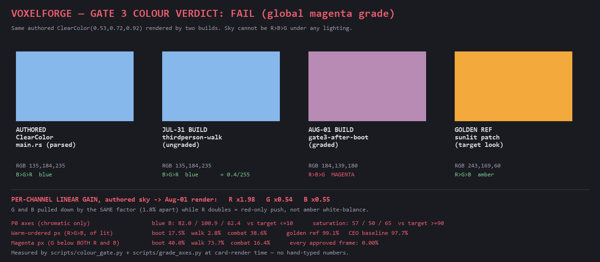

# Gate 3 colour review — 2026-08-01 (Flamingo, Designer)

> **VERDICT: FAIL — all 3 shots. Do not ship to the Steam store page.**
> The magenta cast is a **bug in the render/grade path**, not a Look-Bible look.
> Frames reviewed: `docs/assets/gate3/gate3-after-boot.png`, `-walk.png`, `-combat.png` (1280×720, 11:33).



**Reproducing every number in this document.** All chroma percentages and the sky/gain evidence come from
`scripts/colour_gate.py`; the P0 axes come from the pre-existing `scripts/grade_axes.py`. The card above is
rendered by `scripts/make_gate3_verdict_card.py`, which measures at render time and parses the authored sky
out of `client/src/main.rs` — no number on it is typed by hand.

```
python scripts/colour_gate.py docs/assets/gate3/gate3-after-*.png    # gates A / B / C per frame
python scripts/colour_gate.py --tsv docs/assets/*.png                # the percentage tables below
python scripts/grade_axes.py docs/assets/gate3/gate3-after-*.png     # P0 axes
python scripts/make_gate3_verdict_card.py                            # re-render the card above
```

Anything below that those commands do not reproduce is an error in this document, not in the scripts.

---

## 1. Is the pink intentional? — **No. It is a bug.**

The proof does not depend on taste, scene, or framing. It is a single A/B on one authored constant.

`client/src/main.rs:358` authors the sky as `ClearColor(Color::srgb(0.53, 0.72, 0.92))` = **RGB 135, 184, 235** — a
blue, ordering **B > G > R**. `ClearColor` is a flat clear, not a lit surface: whatever the scene does, that
value is what enters the post stack.

Sky sample = the largest **flat** colour cluster in the top third of the frame. `ClearColor` paints a
perfectly flat clear, so that cluster *is* the sky — the sample needs no colour prior and so cannot beg the
question. This is Gate B in `scripts/colour_gate.py`; the values below are its output.

| build | frame | sky measured | ordering |
|---|---|---|---|
| authored source | `main.rs:358` | 135.2, 183.6, 234.6 | B > G > R |
| **Jul-31 build** (ungraded) | `thirdperson-walk.png` | **135.0, 184.0, 235.0** | B > G > R — matches source to **0.4/255** |
| **Aug-01 build** (graded) | `gate3-after-boot.png` | **184.4, 139.0, 179.9** | **R > B > G — magenta** |

Converted to linear, the Aug-01 build applies this per-channel gain to the authored sky:

```
R ×1.98    G ×0.54    B ×0.55        (gate3-after-boot; the Jul-31 build returns ×1.00 ×1.00 ×1.00)
```

**G and B are pulled down by the same factor — 1.8% apart — while R doubles.** That is a *red-only* push.
A correct warm/amber white balance orders the gains **R > G > B** (amber `#F4B860` is 1.00 / 0.75 / 0.39):
green must sit clearly above blue. Here green has been dragged all the way down onto blue, which is the
definition of a magenta cast. No exposure curve, tonemap shoulder, or golden-hour grade can turn a
`B > G > R` blue into `R ≈ B >> G`; only a chroma error can.

This also explains every surface at once: warm stone keeps R and reads hot pink; the blue sky loses its
green and reads lavender; grass loses its green and reads olive.

**Look Bible agreement:** §4 authors the palette as golden-hour amber → brown, sky `#BCD3E0` (a *pale warm
blue*), with a **teal** accent at ≤15%. There is no magenta, pink, or lavender anywhere in the palette, and
no mood entry that permits it ("ไม่ใช่ dramatic/horror/neon"). Nothing in the document asks for this.

**Not damage flash — independently confirmed.** Separate captures across three demo modes return the same
gain: `gate3-after-boot`, `playable-boot` and `edhari-load` are identical to two decimals
(**×1.98 / ×0.54 / ×0.55**), and `gate3-after-walk` sits within one hundredth of them
(×2.00 / ×0.55 / ×0.56). A red damage overlay *adds* red; it cannot multiply green down to 54% of its
authored value. HP is 100/100 in all three frames. (`gate3-after-combat` is not in that list because Gate B
*skips* it — its sky owns only 28% of the top edge, below the detector's floor. Gate A still fails it at
16.4%.)

---

## 2. Steam store page: **FAIL** on all three.

### Grading mode (per rubric §"กติกาการเลือกโหมดเกรด")

These are 1280×720 gameplay frames of an **outdoor** scene — neither the framing nor the scene of the
1024² indoor calibration ref. So I grade **only the framing-independent axes** and explicitly discount the
rest. In particular I am **not** counting the DOF fg:bg failure against these shots: the rubric already
records that axis as a known trap for non-hero framing (the CEO-approved baseline itself scores 0.17 vs a
3.0 target, by design). Same for p95 and micro-contrast — both PASS anyway.

### What actually fails

**P0 chromatic axes** (`scripts/grade_axes.py`, exit 1):

| axis | target | boot | walk | combat | REF |
|---|---|---|---|---|---|
| blue B (mid) | ≤ 10 | **82.1** | **100.9** | **62.4** | 4.3 |
| saturation (mid) | ≥ 90 | **57.2** | **49.8** | **65.4** | 96.1 |
| warmth R−B (mid) | ≥ 110 | **85.3** | **79.1** | **100.3** | 120.9 |

Blue is **6–10× over budget**. Even granting an outdoor scene a generous allowance for legitimately blue sky
pixels, that is not a scene effect — the sky in these frames isn't blue, it's magenta.

**Gate layer:**

- **G6 (warm golden) — FAIL.** Requires `R > G > B` on a sunlit patch. Sunlit stone in the boot frame reads
  **214.7 / 148.0 / 154.5 → B > G.** The ordering that defines the look is inverted.
- **Pass 9a (palette lock, ~85% of frame warm) — FAIL.** Warm-ordered (`R>G>B`) pixels **as a share of lit
  pixels** (`mean(R,G,B) > 25`): **boot 17.5% · walk 2.8% · combat 38.6%**, against golden ref **99.1%** and
  CEO baseline `wide-hero-final` **97.7%**.

  The denominator matters and an earlier draft of this doc got it wrong — it printed golden ref **89.7%**,
  which is the same pixels over *all* pixels including unlit ones. That is not comparable across these
  frames: the golden ref is an indoor shot that is only 90.6% lit, while `wide-hero-final` is 99.9% lit, so
  the all-pixel denominator silently docks the reference ~9 points and flatters the baseline. Share-of-lit is
  the exposure-independent form and is what the table above uses. Both columns are printed by
  `colour_gate.py --tsv` if you want to check the arithmetic:

  | frame | warm % of lit | warm % of frame | lit % |
  |---|---|---|---|
  | `golden-beauty-shot-ref` | **99.08** | 89.72 | 90.55 |
  | `wide-hero-final` (CEO baseline) | **97.74** | 97.63 | 99.89 |
  | `gate3-after-boot` | **17.55** | 16.02 | 91.27 |
  | `gate3-after-walk` | **2.83** | 2.80 | 99.01 |
  | `gate3-after-combat` | **38.59** | 34.77 | 90.12 |
- **G3 (bounce not blue) — passes on a technicality, and that is a rubric hole.** G3 fails only on `B > R`.
  Magenta keeps `R > B`, so it slips through. See §3.
- G1 (voxel edges), G2 (key direction), G4 (soft shadow + AO), G5 (no blow-out) all hold. The geometry and
  lighting work is fine — **this is purely a colour failure.**

### To make these frames shippable

1. **Fix the red-only channel push in the grade path**, then re-shoot. The target is the authored sky
   surviving to the frame roughly intact (a warm grade may shift it, but ordering must stay `B > G > R`) and
   sunlit surfaces reading `R > G > B`. Owner: Poppy (build lane).
2. **Re-run `scripts/grade_axes.py` on the new frames** and require the three chromatic axes to pass. Ignore
   DOF for non-hero framing.
3. **Then** re-grade G6 + Pass 9a by eye against `golden-beauty-shot-ref.png`.

Suspect list for whoever picks this up (I did not build or edit anything — read-only review):
`client/src/look.rs` `mod grade` (TEMPERATURE 0.10 / POST_SATURATION 1.02) and the light/ambient colour on the
playable path. Note the grade constants in `look.rs` are byte-identical to the ones in `hero.rs` that produced
the clean `wide-hero-final.png`, so the constants are probably **not** the culprit — look first at the light
colour feeding the playable scene, and at whether `temperature` is landing on the intended white-balance axis.

⚠️ **Blast radius beyond Gate 3.** `docs/assets/playable-boot.png`, `playable-walk-before/after.png` and
`edhari-load.png` — the playable-loop evidence committed in the *same* ship commit `db25758` — carry the
identical cast (`playable-boot`: magenta **39.9%**, blue B **82.0**, sky gain ×1.98/×0.54/×0.55 — the same
three numbers as `gate3-after-boot` to the decimal; `playable-walk-after` magenta **66.8%**).
**Every native frame captured today is affected**, not just these three. All of it needs re-shooting.

---

## 3. Proposed new gates for `scripts/gate3_shoot.sh` (`gate3_shoot.sh` not modified — the grader is committed)

The current gate is liveness-only: exit 0 · PNG ≥ 2 KiB · `SHOT saved` · no panic. It cannot see colour, so
"renders successfully" and "renders correctly" are the same result. Three checks, cheapest first.

**Status: implemented.** These three checks now live in **`scripts/colour_gate.py`** (exit 1 on failure),
which another lane built from this section's first draft while the review was being corrected. I validated it
against the full approved + broken set rather than taking it on trust, adopted it as the single grader, and
made two changes to it — both recorded below. Only `gate3_shoot.sh` itself is still untouched: wiring the
gate into the shoot is the remaining step and it is one line.

### Gate A — magenta detector *(primary; catches exactly this bug)*

Fail the shot if a meaningful share of pixels are lit and have green below **both** red and blue:

```
lit     = mean(R,G,B) > 25                     # ignore near-black
magenta = lit AND (G < R-8) AND (G < B-8)
FAIL if magenta.count / all_pixels > 2%
```

Pre-processing: the PNG at **native resolution**, `convert("RGB")`, **no resample, no crop, no HUD mask**.
The denominator is **all pixels**, not lit pixels — that is the conservative choice (a mostly-dark frame
cannot trip the gate on a small lit region). The `% of lit` column is printed too, for reading, not gating.

| frame | magenta % of frame | magenta % of lit |
|---|---|---|
| gate3-after-boot | 39.99% | 43.81% |
| gate3-after-walk | 73.73% | 74.47% |
| gate3-after-combat | 16.38% | 18.17% |
| golden-beauty-shot-ref | **0.00%** | 0.00% |
| wide-hero-final (CEO baseline) | **0.00%** | 0.00% |
| native-control-v3 | **0.00%** | 0.00% |
| hero-tilt-down-rose-verify | **0.00%** | 0.00% |
| thirdperson-walk (green outdoor scene) | **0.00%** | 0.00% |

Zero false positives across five approved frames spanning indoor amber, outdoor green, and both framings —
including a scene dominated by green, which is the case a naive "is it warm enough" check would trip on.
A 2% threshold leaves **8.2× headroom** below the mildest real failure (combat, 16.38%) and the approved
frames do not merely pass, they read exactly 0.00% — so the threshold could sit anywhere in 0–16% without
changing a single verdict in this set. **Scene- and framing-independent**, which is what makes it safe to run
on gameplay frames that can't be graded absolutely.

*(An earlier draft of this table printed 38.9 / 72.8 / 13.3 from a scratch script that has since been
replaced by the committed one. The committed numbers above are the correct ones; combat moved 3.1 points.
This is precisely why the grader is now in the repo.)*

### Gate B — ClearColor sky probe *(the sharpest signal; near-zero cost)*

The strongest evidence in this review was a single authored constant surviving to the frame. Gate B makes
that a check: take the largest flat colour cluster in the top third, assert `B > G > R`, and report its
**linear gain vs the `ClearColor` parsed out of `client/src/main.rs`**. It needs no baseline image, and it
reads ×1.00 / ×1.00 / ×1.00 on the clean Jul-31 build against ×1.98 / ×0.54 / ×0.55 on today's.

**On skipping frames with no sky — my first draft was wrong and the implementation is better.** I proposed
"skip when the sky-pixel count is below a floor", then measured it: no count floor works. The flat bright
mass covers 31.9% of the top on `thirdperson-walk` (real sky) but only 19.3% on `gate3-after-combat` (also
real sky) and 15.6% on `wide-hero-final` (an indoor amber wall). A brightness-only version I tried
false-**FAILED** `golden-beauty-shot-ref`. I had concluded sky presence wasn't recoverable from the PNG and
was going to make the gate opt-in. `colour_gate.py` solves it properly with a discriminator I missed: **the
sky runs off the top edge of the frame and a wall does not**, so it requires the flat cluster to own ≥30% of
the top two rows, plus a luminance floor. Verified on the full set: it correctly skips all four interiors and
samples `thirdperson-walk` at exactly 135.0/184.0/235.0. That is the better design and it is what ships.

Its stated cost, which is honest and worth repeating: the luminance floor also skips a genuine night sky, and
the top-edge rule skipped `gate3-after-combat` (28% — just under the line). A frame that wrongly *skips* Gate
B is still caught by Gate A, which is why A is the primary check.

### Gate C — sunlit ordering *(implemented as **advisory only** — this is my second change to the script)*

`colour_gate.py` added a third check I had not proposed: the brightest lit non-sky surface must read
`R > G > B` (rubric G6, "warm golden"). It is a good reading of the Look Bible and the wrong shape for a
fatal gate. I measured it against both ends of the set and it is wrong in **both** directions.

**The reason it cannot hold an exit code: it false-PASSES the exact bug this review is about.**

```
python scripts/colour_gate.py docs/assets/gate3/gate3-after-walk.png
  [FAIL] A magenta fraction    73.73%                            target <= 2%
  [FAIL] B sky order          185.3,140.2,181.0 -> R > B > G     target B > G > R
  [PASS] C sunlit order       211.3,154.4,154.4 -> R > G > B     target R > G > B (advisory)
```

That frame is **73.73% magenta** — the worst of the three — and Gate C reads **PASS** on it. The mechanism is
not subtle: magenta is itself a high-red ordering, so the harder the red cast pushes, the *better* Gate C
scores the frame. Note the sunlit sample `211.3, 154.4, 154.4` — G and B are equal to a tenth, which is the
magenta signature (green pulled down to blue), and C reports it as warm golden. A check that green-lights
the failure sitting next to it would have signed today's shoot off on its own while Gates A and B were both
failing. That is the primary reason it is advisory — not taste, and stronger than the false-FAIL below.

Second, and less serious, it **false-FAILS `thirdperson-walk.png`** — a clean, approved, *ungraded* outdoor
frame — because that scene's brightest surface is grass: **121.3, 199.6, 112.8 → G > R > B**. "Warm golden"
is a property of the amber hero grade, not of every frame the engine can render; as a fatal gate it would
fail legitimate green outdoor shots forever, the exact failure mode §"Gate D" below warns about for DOF.

So I demoted it: it prints `WARN`, does not feed the exit code, and is labelled advisory in the output. Kept
rather than deleted because the reading is still useful **context** next to A and B — but on this evidence it
must never be read as a colour verdict on its own. The magenta wash it was meant to catch is caught twice
over by Gates A and B, both of which fail the frame C passes.

### Gate D — chromatic axes via the existing grader *(reuses the single source of truth)*

`scripts/grade_axes.py` already exists, already owns `TARGETS`, and already exits 1 on failure. Call it per
shot but consume **only the three chromatic axes** (warmth, blue, sat):

```
python scripts/grade_axes.py "$png"     # parse the per-axis PASS/FAIL lines
```

**Do not gate on DOF/micro/p95 for gameplay frames** — the rubric records DOF fg:bg as intrinsically failing
for non-hero framing (baseline 0.17 vs target 3.0), so wiring the raw exit code in would fail every legitimate
gameplay shot forever and the gate would be switched off within a week. This is the trap to avoid.

### Also worth fixing while in there

- **Close the G3 hole in the rubric.** G3 currently fails only on `B > R`, which catches a blue wash but lets
  a magenta wash through (magenta keeps `R > B`). Add the ordering clause `G ≥ B` on shaded/neutral surfaces.
  Cheap, and it makes the human gate agree with Gate A.
- **Baseline-drift check.** Store the per-channel means of the last approved shot set beside the PNGs and warn
  when a new shot moves any channel mean by more than ~15%. Weaker than A/B (scene-dependent), so make it a
  **warning**, not a failure — otherwise legitimate scene changes will train people to ignore it.

### Suggested ordering

A, B and C are one call and cost one full-res pass; B self-skips where there is no sky and C only ever warns.
Run D last, since it does a 1024² LANCZOS resample per frame. Gate A alone would have caught this at 11:33
today. The remaining wiring in `gate3_shoot.sh` is:

```sh
python scripts/colour_gate.py "$png" || fail "$png: colour gate"
```

**Do not wire in `grade_axes.py`'s raw exit code** (see Gate D) — parse its three chromatic lines instead.

---

_Read-only review of the render — no builds run, no crate touched, `gate3_shoot.sh` unmodified. All numbers
measured from the PNGs on disk. The measurement code is in the repo: `scripts/colour_gate.py` (Gate C
demoted to advisory, plus warm-ordered / linear-gain reporting added by me on top of the other lane's
implementation) and `scripts/make_gate3_verdict_card.py`, so every figure here and on the card is
re-derivable in one command. — Flamingo (Designer)_
