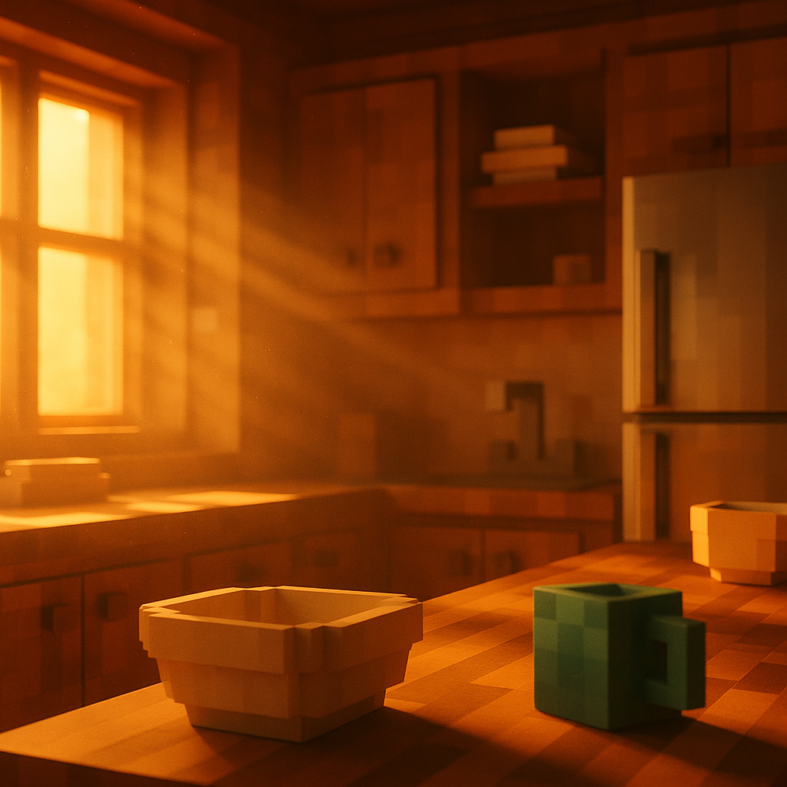
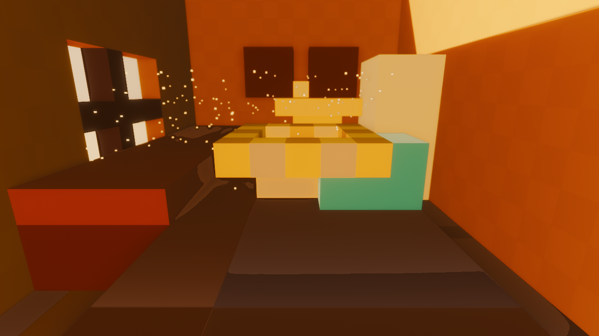

# Voxelforge — Golden Beauty-Shot Target

> **หนึ่งฉาก หนึ่งเกณฑ์รับ.** นี่คือด่านตัดสิน visual ของ **Bevy spike (Poppy)** —
> เรนเดอร์ครัวไม้ฉากนี้ใน Rust + Bevy 0.19 + wgpu ให้ผ่าน pass-list ด้านล่าง แล้ววัด FPS **บนเฟรมเดียวกัน**
> → ได้ทั้งลุคและตัวเลข apples-to-apples ในนัดเดียว. ไม่ต้องทำ spec sheet ต่อทุกฟีเจอร์ก่อน go/no-go —
> เอาฉากนี้ให้ผ่านก่อน แล้วค่อย generalize. ที่มาของลุค: [look-bible.md](look-bible.md).

## Reference frame (เป้าที่ต้องเรนเดอร์ให้ถึง)



`docs/assets/golden-beauty-shot-ref.png` — ครัวไม้ voxel, แดด golden-hour เฉียงผ่านหน้าต่างซ้าย,
god rays + dust motes, bounce อุ่นเติมร่ม (ไม่มีเงาดำสนิท), DOF ชามหน้า-คม/หลัง-ละลาย,
ตู้เย็นสแตนเลส specular, teal accent (บล็อกเขียว) 1 จุด. **นี่คือลุค ไม่ใช่ geometry ตายตัว** —
Poppy จัดบล็อกเองได้ ขอให้ครบ element + ค่าแสงตาม pass-list.

---

## Scene setup (ค่าตั้งฉาก — คงที่ทุกครั้งที่เทียบ)

| พารามิเตอร์ | ค่าเป้า |
|---|---|
| **กล้อง** | FOV ~50° · สูงตา ~1.4m · เล็งข้ามเคาน์เตอร์ไปทางหน้าต่าง · ก้มเล็กน้อย ~5° |
| **ตัวแบบ hero** | ชามไม้/เซรามิก 1 ใบวางหน้าเคาน์เตอร์ที่ระยะ ~1.5m (จุด focus ของ DOF) |
| **หน้าต่าง** | บานเลื่อนกรอบไม้ซ้ายมือ มี mullion แบ่งช่อง (ให้ god ray เป็นแท่งตามช่อง) |
| **แดด (key)** | directional, azimuth เข้าทางหน้าต่างซ้าย, elevation **15–20°** เหนือขอบฟ้า (golden hour) |
| **teal accent** | วัตถุเย็น 1 ชิ้น (บล็อกเพชร/ของเขียว) — ต้องกิน ≤15% ของเฟรม |

---

## Pass-list — ค่าที่ Poppy ต้องเรนเดอร์ให้ถึง

เรียงตาม "แกน identity ก่อน → เสน่ห์". เทียบกับ reference frame ข้างบน. เกณฑ์ผ่าน = **สังเกตเห็นได้ชัดในเฟรม** ตามคำอธิบาย.

| # | ชั้น | ค่าเป้า / สิ่งที่ต้องเห็น | ผ่านเมื่อ |
|---|---|---|---|
| 1 | **Key light (แดด)** | directional golden `#F4B860`→`#FFD98A`, elevation 15–20°, ทาบเงากรอบหน้าต่างลงพื้น/ผนัง | เห็นทิศแดดชัด + แถบแสงหน้าต่างบนพื้น |
| 2 | **Bounce / GI (แสงอ้อม)** | fill ร่มด้วย honey `#C88A4A`; **shadow floor ≥ ~10% luminance, โทนอุ่น** ห้ามดำสนิท/ห้ามฟ้า | เอา eyedrop จุดมืดสุด → ยัง "เห็นเนื้อไม้" + สีอุ่น |
| 3 | **God rays (volumetric)** | แท่งแสงตาม mullion หน้าต่าง + dust motes ลอยในลำแสง, ความหนาปานกลาง (ไม่ fog ทึบ) | เห็นลำแสงเป็นแท่งแยกช่องได้ |
| 4 | **Soft shadow + contact AO** | PCSS penumbra กว้างขึ้นตามระยะ occluder; AO เข้มที่รอยต่อบล็อก + ใต้ชาม | ขอบเงาฟุ้ง ไม่คม 1px + มีเงาเข้มจุดสัมผัส |
| 5 | **DOF** | focus ~1.5m (ชาม hero คม), ตู้/ฟริดจ์หลังละลายเป็น bokeh — feel ~f/2.8 | fg คม + bg เบลอชัด แยกระยะได้ |
| 6 | **Tone-map (ACES filmic)** | exposure คุมให้ **หน้าต่างสว่างแต่ยังไล่เกรน ไม่ขาวคลิป**, เงายังมีรายละเอียด | ซูมหน้าต่าง → ยังเห็น gradient ไม่ใช่ขาว 255 ล้วน |
| 7 | **PBR material** | ไม้ = albedo+roughness grain; ฟริดจ์ = metallic specular streak; เซรามิก = matte | 3 วัสดุตอบแสงต่างกันเห็นชัด |
| 8 | **Bloom** | ฟุ้งนุ่มเฉพาะหน้าต่าง/emissive (threshold สูง) — ไม่ฟุ้งทั้งเฟรม | เรืองที่หน้าต่างเท่านั้น ไม่ล้าง contrast |
| 9 | **Palette lock** | ~85% เฟรมโทนอุ่น (ทอง→น้ำตาล), teal accent ≤15% | histogram/สายตาเอนอุ่น, teal เป็นจุดตัด |

> **แกนห้ามพลาด (ถ้าตกข้อใดข้อหนึ่ง = FAIL ทันที):** #1 key · #2 bounce (ห้ามเงาดำ) · #4 soft shadow+AO ·
> #6 filmic (ห้ามหน้าต่างขาวคลิป) · voxel hard-edge geometry ยังอ่านออกว่าเป็นบล็อก.

---

## เกณฑ์ตัดสิน go / no-go (วัดพร้อม FPS เฟรมเดียว)

1. **Blind side-by-side:** วางเฟรมที่ spike เรนเดอร์ ข้าง `golden-beauty-shot-ref.png` → คนดูบอกได้ว่า
   "ลุคเดียวกัน" = ผ่าน visual. ถ้าดูเหมือน "Minecraft ไม่มี shader" = FAIL.
2. **วัด FPS บนเฟรม/มุมกล้องนี้เป๊ะ** พร้อมกัน:
   - **Ultra** (wgpu native): เป้า 60fps @1080p บน GPU กลาง (GTX 1660 / RX 5600 ขึ้นไป).
   - **Lite** (wgpu→WASM, WebGPU): เป้า 60fps บน integrated/mobile mid @720–1080p.
3. **ถ้าลุคผ่านแต่ FPS ตก** → ไล่ตัดชั้น "เสน่ห์" ตามลำดับใน look-bible §2/§3 (DOF → volumetric → RT GI → …)
   โดย **แกน #1/#2/#4/#6 ต้องอยู่ครบ** แล้วเรนเดอร์เทียบใหม่. ตัวเลขที่ตัดได้/ไม่ได้ = ผลลัพธ์จริงของ spike ที่ป้อนกลับ look-bible.

> จุดสำคัญ: **ลุคกับ FPS ต้องมาจากเฟรมเดียวกัน** — จะได้ตัดสิน go/no-go แบบ apples-to-apples
> ไม่ใช่ลุคจากฉากสวยแล้ว FPS จากฉากเปล่า.

---

## 🔒 GOLDEN establishing hero — TILT-DOWN (CEO-approved · framing unlocked 2026-07-27)

The tight ref at the top is the **intimate** hero. The official **golden establishing hero** —
same room, pulled back 3/4 toward the window to read the whole space (walnut/honey-wall tone),
now on the **CEO-approved TILT-DOWN camera** — is **locked with its geometry + atmosphere pass applied**:



> **Framing history:** this shot was locked on a near-level *wide-A* camera through 2026-07-27. That
> angle framed the counter bowl almost edge-on, so the bowl filled the frame without reading **as** a
> bowl (no cavity visible). CEO approved an **env-only tilt-down** (eye up, target down) on 2026-07-27;
> `client/src/hero.rs` was **not** touched, and the gate was re-measured on the new cam rather than
> carried over. A true wide establishing frame like the reference still needs the room *geometry*
> enlarged — the 16×16 box means pulling the camera back further just reveals void.

`docs/assets/wide-hero-final.png` · driver `scripts/render_wide_hero.sh` · binary `voxelforge_shot`
(env `VOXELFORGE_WIDE=1`, so the locked narrow hero stays byte-identical).

> **This frame is also the PARITY BASELINE (2026-07-29).** Every new frame — native
> re-render, web/wasm capture, regression check — is graded as a **delta against this
> file**, not against the 1:1 tight reference at the top of this document: the P0 axes
> are measured on a fixed resample with fixed fg/bg boxes, so a different camera moves
> every number (that is why this frame reads DOF 0.17 against a target of 3.0 and is
> still correct). `scripts/grade_web_parity.py` enforces it as gate **W0-D**, and
> `scripts/hero_recipe.py` re-reads `render_wide_hero.sh` so the web build's query
> string and the native control can never drift onto different recipes.
> Rules + logs: [`web-parity-checklist.md`](web-parity-checklist.md).

### Reproduce it exactly (camera / lighting / framing recipe)

Build once, then run the driver — every value below is baked into `scripts/render_wide_hero.sh`:

```bash
cargo build --release --bin voxelforge_shot     # rebuild if hero.rs changed
bash scripts/render_wide_hero.sh                # → docs/assets/wide-hero-final.png (1280×720)
```

| axis | value | why |
|---|---|---|
| **CAMERA** | `VOXELFORGE_CAM=7.6,6.4,-6.0, 7.6,2.7,8.0, 60` | eye (7.6,**6.4**,−6.0) → target (7.6,**2.7**,8.0) = **TILT-DOWN** (dy 3.7), **FOV 60°**. CEO-approved 2026-07-27, replacing the near-level wide-A cam (`9.0,6.2,-6.5, 6.8,2.6,8.0, 58`) |
| **FRAMING** | `VOXELFORGE_WIDE=1` | switches on the deepened footprint (floor/table run to z −14/−10), taller matte walls (y→14, no red-trapping ceiling), de-checkered geometry |
| **DOF** | `VOXELFORGE_DOF=8,10` | focus 8m @ f/10 — **deep** so the establishing floor stays crisp voxel geometry (G1) |
| **KEY (sun)** | `VOXELFORGE_SUN=19,196,26000` | elevation 19° / azimuth 196° / illum 26000 — golden-hour key streaming the +X window |
| **AMBIENT** | `VOXELFORGE_AMBIENT=2800` · `VOXELFORGE_AMBCOLOR=0.70,0.60,0.44` | trimmed warm fill — low enough that the sun stays the dominant key (the old 4400 was ambient-dominant → flat fire-orange) |
| **BOUNCE** | `VOXELFORGE_BOUNCE=1.0` · `VOXELFORGE_BOUNCE2=1.7` | the two warm bounce-fill lights that keep open shade off pure black (G3) |
| **EXPOSURE** | `VOXELFORGE_EXPOSURE=9.0` | seats the window p95 in the 150–185 band |
| **BLUE** | `VOXELFORGE_BLUESCALE=0.85` | pulls the residual blue leg toward ref B≈4 |
| **GRADE** | `VOXELFORGE_GRADE=0.02,1.00,1.30` | temp / sat / contrast — the raised midtone contrast is the micro-contrast half of the atmosphere pin |
| **LUT** | `VOXELFORGE_SHOULDER=0.64` | filmic highlight roll-off — seats the window p95 back in the 150..185 band (was 194 over-band without it) |
| **DUST** | `VOXELFORGE_DUST=3.0` | lit warm motes filling the window god-ray corridor — atmosphere + the hi-freq grain that lifts micro-contrast |

**Gate: the 3 machine-checked bars PASS** (`scripts/grade_gate.py`), re-measured on the TILT-DOWN
camera 2026-07-27 — G3 interior p05-L **14.3%**, darkest shade (45,22,7) R-B +38 warm · G5 brightest
(246,205,124) min(G,B)=124, 3-pt spread 43.8 · G6 sunlit wood (232,211,181) R-B +51 L=83.7.
**G1 / G2 / G4 are not measurable by the script** — it prints them as *visual check* and scores
nothing. Eyeballed on this frame they read fine (G1 crisp voxel edges via deep DOF · G2 single key
pool from the window · G4 soft floor-tile shadows + counter AO), but that is a human call on this
one frame, **not a gate pass** — don't cite G1/G2/G4 as verified.
**P0 axes 5/6 PASS: warmth 129 · blue 5.2 ·
sat 94 · micro-contrast 5.92 · p95 177.** These are the tilt-cam's own numbers — the wide-A readout is
NOT carried over. Micro-contrast **improved** on the tilt (5.52 → 5.92): looking down puts more lit
counter-top plank edges in frame, which is exactly the grain that axis rewards.
The lone miss is DOF fg:bg (intrinsic-to-wide, documented below). **Atmosphere pin (dust motes + LUT
grade, 2026-07-27):** the dust corridor + shoulder + contrast lift turned the old micro-contrast 4.9
near-miss into a clean PASS (5.52 on wide-A, 5.92 on the tilt-down cam) and pulled the window p95 back into band — no wall re-checkering.
Full measured readout + the two documented axis tradeoffs: [`note-hero-look-final-recipe.md`](note-hero-look-final-recipe.md) §WIDE.

> **Two documented, accepted axis tradeoffs (not defects):**
> - **DOF fg:bg** is intrinsically unreachable for a wide — deep focus makes fg≈bg sharpness by
>   design; that axis is tuned for the tight, shallow-DOF hero (sharp bowl / bokeh background).
> - ~~**micro-contrast 4.9 vs ≥5**~~ **RESOLVED by the atmosphere pin (2026-07-27).** The
>   de-checkered smooth walls used to cost ~2% on this grain axis; the dust-mote corridor's
>   hi-freq specks + the raised midtone contrast (GRADE 1.30) now carry that grain instead, so
>   micro-contrast reads a clean **5.92** (≥5) on the tilt-down camera **without** re-checkering
>   the walls (it was 5.52 on the earlier wide-A framing). The smooth-wall
>   look is kept; the grain comes from atmosphere, not geometry noise.

### Geometry pass — what closed the ref gap (Flamingo, 2026-07-27)

The wide already matched the ref's *light*; this pass closed the *geometry/silhouette* gap, all
**env-gated under `VOXELFORGE_WIDE` so the narrow hero is untouched** (`client/src/hero.rs`):

1. **Walls de-checkered → smooth honey plaster.** The shipped wall pair (0.06 albedo spread) read
   as a loud orange/yellow chessboard under the key-lit grade — the biggest anti-AAA tell. A
   near-identical honey pair (~0.006 spread) resolves to a calm continuous wall at distance while
   blocks still read up close via per-face lighting + AO. WIDE-only pair; narrow keeps the original.
2. **Floor de-checkered → warm honey-walnut parquet.** 4-tone plank palette (G leg lifted so it
   reads amber WOOD, not plastic-red), boards running in Z with staggered joints and per-board tone
   steps — continuous parquet, not a chessboard.
3. **Tabletop deepened + teal-glass accent.** The bright-yellow slab became a warm mid-wood so the
   cream hero bowl separates off it; the muted moss block became a saturated **teal glass tumbler**
   (faint emissive) beside the bowl — the ref's cool accent note.

Before/after vs the ref: see the geometry-pass compare (loud checker → smooth walls + warm parquet).

---

_ส่งต่อ Bevy spike (Poppy). ค่าไหน Bevy ทำไม่ไหวจริงบนเครื่องเป้าหมาย โยนกลับมา — เอกสารนี้ปรับตามผลจริง. — Flamingo (Designer)_
