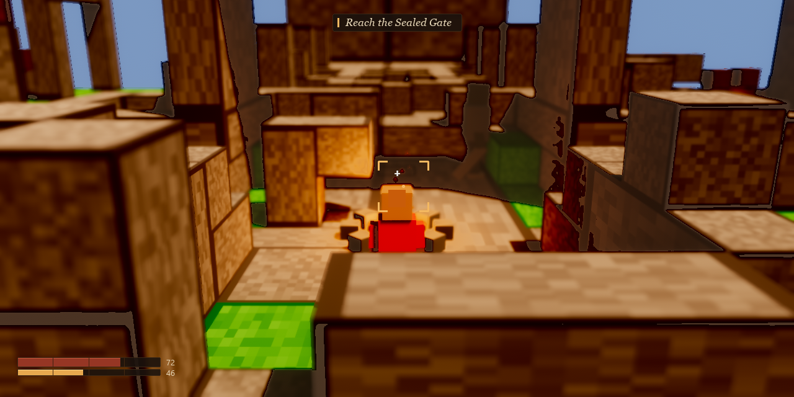
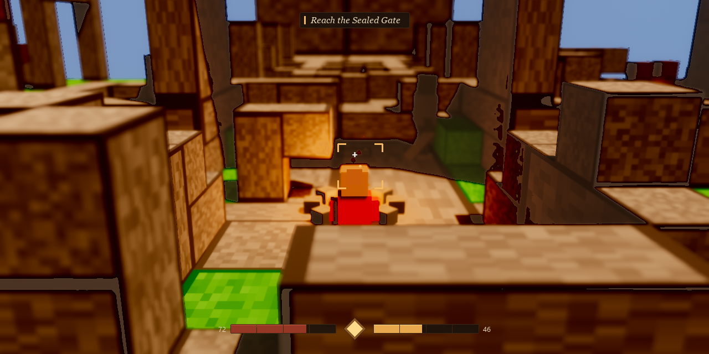

# Voxelforge — Combat HUD Design

> **Design spec + real mockups** for the HP/stamina/lock-on/quest HUD. Direction: read like Elden Ring's
> HUD — minimal, corner-anchored, present when it matters and faded the rest of the time — built from the
> same warm walnut→amber palette as the world (`docs/look-bible.md` §4) with teal held back for Shaper-marked
> things only (`docs/character-bible.md` §0), never spent on UI chrome.
>
> Owner: Monanisa (Design) · Scope: docs + mockups only. The HUD is currently spawned in
> `client/src/combat.rs` (`spawn_combat_hud`, `bar()`, `hud_bars`, `hud_numbers`), which is **Kevin's lane**
> per `docs/LANES.md` — this doc is the handoff spec for whoever implements it there; I have not touched
> that file. `client/src/settings_menu.rs` (mine) has already been re-themed to the same palette — see §5.
> Last updated: 2026-08-04.

---

## 0. The one rule this whole doc follows

Look-bible §4 + character-bible §0: **~85% warm walnut→amber, teal capped at ~10–15% of a frame and spent
only where it means "Shaper."** A HUD is not a character, but it is still on-screen 100% of a play session —
so it inherits the rule strictly: **the baseline HUD spends zero teal.** The only place teal is allowed to
show up in HUD chrome at all is a proposed, optional escalation tell for locking onto a confirmed
Shaper-marked enemy (Warden/Architect tier) — flagged as a maybe in §4, not part of the v1 ask.

Second shared rule: **fade, don't float.** Nothing in the HUD should read as "a menu pasted over the game."
Bars, reticle and quest text all sit on a translucent espresso plaque (never a flat opaque box) so the warm
lighting of the scene bleeds through, and everything but the reticle is meant to fade toward ~35% opacity
after a few seconds of no combat/stamina use, per the CEO brief's "โผล่เมื่อจำเป็น จางเมื่อไม่ใช้."

---

## 1. Two layout options

Both mockups are composited on a **real in-engine screenshot**
(`docs/assets/gate3/gate3-after-boot-nohud.png`, the golden-hour kitchen render, no HUD), not concept art —
so scale and contrast against the actual look-bible lighting are true, not guessed.

### Option A — Corner Minimal (recommended)

HP + stamina stacked bottom-left, the canonical Soulslike/Elden Ring corner. Lock-on is four corner
brackets around the target (not a filled shape sitting on top of them), and the quest line is a small
serif banner top-center that only exists while a line is live.

**Why recommended:** closest to the existing `spawn_combat_hud` structure (two absolute `Node` bars, a
reticle, two text labels) — the diff for Kevin's lane is a reposition + recolor, not a rebuild. It's also
the layout the CEO's own reference point (Elden Ring) uses, so there's no translation risk between "what we
described" and "what ships."

### Option B — Diamond Anchor

HP and stamina flank a small center emblem bottom-center, echoing Auren's ember-pouch motif
(character-bible §1) as the HUD's own "warm coal" — a deliberate visual rhyme between the hero's one
pre-reveal Shaper hint and the player's own vitals. More bespoke to build (a 3-part flanking layout instead
of two independent bars) and centers attention at the bottom-middle instead of a corner, which reads
slightly less "peripheral/minimal" than Option A.

**When to pick B instead:** if the team wants the HUD to carry a piece of story motif rather than stay pure
utility chrome. Otherwise A is the tighter fit for the "disappear when not needed" goal.

---

## 2. Design tokens (hex — 4 pulled verbatim from `docs/look-bible.md` §4 + `character-bible.md` §1, 4 new/mixed)

| Token | Hex | Used for |
|---|---|---|
| `panel-bg` | `#1A120D` @ ~88% opacity | Bar track / quest banner plaque |
| `panel-border` | `#3A2716` (espresso) | 1px border on tracks + banner |
| `hp-fill` | `#96362C` (muted ember-red — *not* a saturated "game red") | HP bar fill |
| `hp-hilite` | `#C4583A` | 1px top highlight on the HP fill (carved-inlay read, not a glossy gradient) |
| `stamina-fill` | `#E8A94E` | Stamina bar fill — same amber family as the sun key light / Auren's ember pouch |
| `stamina-hilite` | `#FFD98A` | 1px top highlight on the stamina fill |
| `text-cream` | `#E8D8B8` | Numeric readouts, quest text |
| `accent-amber` | `#F4B860` | Lock-on brackets, quest banner tick, low-HP pulse |
| segment line | `#3A2716` @ ~70% | Vertical 25/50/75% notches on each bar (a Soulslike "segmented" read, not a smooth gauge) |

`panel-border`, `stamina-hilite`, `text-cream`, and `accent-amber` are pulled verbatim from look-bible §4
(wood-dark, key-light amber-gold, fog/haze cream) and character-bible §1's ember-pouch entry. `panel-bg`,
`hp-fill`, `hp-hilite`, and `stamina-fill` are **new** — look-bible §4 has no darker-than-espresso UI panel
tone and no "danger/HP" color at all, so these four were mixed to extend the existing warm family rather
than pulled from an existing swatch: `panel-bg` is `wood-dark` (`#3A2716`) darkened further for plaque
legibility against bright scenes, `hp-fill`/`hp-hilite` are a muted ember-red kept inside the same
warm-walnut hue range (deliberately desaturated so it doesn't read as a "generic game red," per §3's
placeholder critique), and `stamina-fill` reuses the key-light amber-gold family already in the palette.

---

## 3. Spec vs. current placeholder (`client/src/combat.rs`)

The combat HUD already exists as a functional placeholder (`spawn_combat_hud`, `bar()`, lines ~927–994) —
this is a restyle + reposition, not new plumbing. Kevin's lane owns applying it.

| | Current (placeholder) | Proposed |
|---|---|---|
| Position | Top-left, `top: 34px / 50px`, `left: 10px` | Bottom-left, `bottom: 28px`, `left: 28px` (stack stamina 4px under HP) |
| Track | Flat black `rgba(0,0,0,0.55)`, no border | `panel-bg` plaque, 1px `panel-border`, 2px corner radius |
| HP fill | Saturated `rgb(0.82, 0.20, 0.18)` — a generic "game red," off-palette | `hp-fill` with `hp-hilite` top edge + segment ticks every 25% |
| Stamina fill | Saturated `rgb(0.30, 0.78, 0.36)` — generic green, reads like a different game's UI | `stamina-fill` / `stamina-hilite` (matches the ember-pouch amber, not a stock green) |
| Numbers | Plain white `"HP: 100/100"` string, always on | `text-cream`, short form (`"72"`) at the bar's end — the label context comes from the bar itself, not a repeated word |
| Lock-on | Centered Unicode `"◇"` glyph, `rgba(1.0, 0.9, 0.4, 0.95)` | Four corner brackets in `accent-amber` drawn as `Node` rects (see mockups) — reads as "targeting," not "menu icon"; same warm hue family so no new color is introduced |
| Quest text | *(not yet implemented in combat.rs — currently lives in `dialogue_ui.rs`'s box, sun's lane)* | New: a small top-center fading banner, `panel-bg` + `accent-amber` tick + `text-cream` italic serif — only for the "go here" objective line, not full dialogue |
| Idle fade | None — bars always 100% opaque | Fade all HUD elements to ~35% opacity after ~3s with no damage taken / stamina spent / lock-on active; snap back to 100% instantly on any of those three triggers |

---

## 4. States (for whoever wires the fade/pulse logic)

| State | Trigger | Visual |
|---|---|---|
| Idle | No combat input, full HP/stamina, no lock | All HUD elements at ~35% opacity |
| Active | Any damage taken, stamina spent, or lock-on engaged in the last ~3s | Full opacity |
| Low HP | HP ≤ 25% | HP bar's `hp-fill` pulses toward `accent-amber` and back over ~0.6s (a warning that stays in-palette instead of flashing an off-brand red-alert color) |
| Exhausted | Stamina at 0 (`EXHAUST_LOCK`, `combat-tuning.md` §1) | Stamina track border flashes `accent-amber` once |
| Locked on, mundane target | `LockOn.target` set, target has no Shaper marking (Husk tier) | Brackets in `accent-amber` (baseline — see §0) |
| Locked on, Shaper-marked target *(optional, not v1)* | Target is Warden/Architect tier | Brackets shift to `#4FC9D6` teal for the duration of the lock only — the one deliberate, narratively-justified teal spend in the whole HUD, mirroring the escalation ladder in character-bible §5. **Flagging as an idea, not asking for it to ship now** — needs a call from the Director/Sahara since it touches the story-telegraph budget, not just UI. |

---

## 5. Settings menu — same theme, already applied

`client/src/settings_menu.rs` (mine) now uses a `theme` module with the same tokens as §2: a warm
`window_frame()` (`panel-bg` fill, `panel-border` stroke) applied via `egui::Window::frame(...)`, and an
`apply(ui)` helper that recolors widget backgrounds/text to the walnut/amber palette **scoped to that one
`Ui`** via `ui.style_mut()` — deliberately not a context-wide `ctx.set_visuals(...)` call, because the same
`EguiPrimaryContextPass` also draws sun's dialogue box and Kevin's editor panels, and a global visuals
mutation would silently re-skin those too. Verified with `cargo check --target-dir target-monanisa`
(scoped per-lane check, not a full build, per `docs/LANES.md`'s build-lock rule).

---

## 6. Assets

- `docs/assets/hud/hud-mockup-a-corner-minimal.png` — Option A, composited on the real gate3 screenshot.
- `docs/assets/hud/hud-mockup-b-diamond-anchor.png` — Option B, same background.

---

## 7. Implementation handoff (Option A, written to the spec above)

I wrote the Option A styling as real code against `combat.rs`/`quest.rs`/`main.rs` to prove the token table
and layout numbers in §2/§3 actually work in-engine, then pulled the edits back out — those three files are
Kevin's and Sun's lanes per `docs/LANES.md`, not mine, and I don't have sign-off to land in them directly.
The diffs are saved as ready-to-apply patches instead of a self-commit:

- `docs/patches/monanisa-hud-combat.patch` — bottom-left HP/stamina bars, espresso plaque + hilite + 25/50/75%
  segment ticks, short-form numeric readouts, accent-amber reticle. Applies to Kevin's `combat.rs`.
- `docs/patches/monanisa-hud-quest.patch` — campfire prompt as a real plaque (`[E]` in accent-amber, separate
  from the cream label) instead of floating text. Applies to Sun's `quest.rs`.
- `docs/patches/monanisa-hud-mainrs.patch` — adds a `DebugOverlay` resource + F3 toggle so the FPS/chunks/quads
  debug line doesn't sit on top of the real HUD; hidden by default. Applies to Kevin's `main.rs`. Extracted by
  hand from a working tree that also had Kevin's in-progress `boom_trace`/`boom_walk_demo` diagnostic in the
  same file — this patch touches neither.

None of the three have been applied, built, or committed to their target files — that's Kevin/Sun's call.
`cargo check --target-dir target-monanisa` passed on the full combined diff before I split it back out
(scoped check, not a full build, per the build-lock rule), so the patches are known to compile together; they
have not been verified individually or re-checked after the split.

---

## 8. Still current — cross-checked 2026-08-06

Re-read against the live tree while building the title-menu/settings pass (`docs/main-menu-design.md`):
nothing here has drifted. §0's rule ("baseline HUD spends zero teal," "fade, don't float") and §2's token
table are still the palette source of truth I pulled from when giving the title-menu focus tick and the
settings-panel preset cards their amber accent. This doc did not need new content for that work — the title
menu and settings panel are two *more* surfaces reading off the same tokens, not a reason to touch this one.
One clarification worth stating explicitly now that a third surface exists: the §0 "fade, don't float"
translucency rule is scoped to elements sitting **over live, ungated gameplay** (bars, reticle, quest
banner). It does not extend to the settings panel, which is a paused modal — see
`docs/main-menu-design.md` §6 for why that panel stays near-opaque instead.

*Design: Monanisa. Palette source of truth: `docs/look-bible.md` §4, `docs/character-bible.md` §0. Numeric
combat values referenced (HP/stamina/lock-on ranges) per `docs/combat-tuning.md` — engineering source of
truth is Yamamoto/Kevin's code, this doc only borrows the numbers to make the mockup's readouts plausible.*
