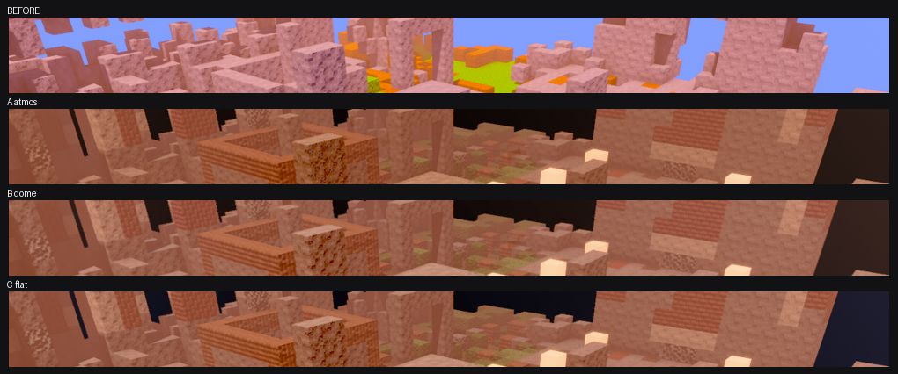

# The dark sky — retraction, and the control that actually separates the causes

**Date:** 2026-08-18 · **Branch:** `poppy/native-only` · **Lane:** look
**Supersedes:** the "Attribution" section of `README.md` as originally written.

## What I got wrong

The first report on these plates concluded:

> the sky dome is dead … likely the same failure already on the board as "a mesh
> spawned without `Visibility` is silently invisible" … worth handing to whoever
> owns `scene.rs`/sky.

**Retracted.** Three things were wrong with it.

1. **The binary's own log contradicts it.** `_run_after_outdoor-noon.log:26`
   prints `LOOK atmosphere spawned mode=lut aerial_max=72`, and
   `client/src/look.rs:3474-3484` states the rule in so many words: *"atmosphere
   on ⇒ dome off, unconditionally / Default: atmosphere on, dome off."* The dome
   is off **by design** in that build. Nothing had to die for it to be absent.
2. **The control I ran cannot speak to it.** `control-onebinary/` moves
   `VOXELFORGE_LOOK_GEN` only, which never touches the sky path. "Identical in
   both arms ⇒ not the look generation" was a valid reading of *that* lever and
   an invalid basis for naming a different subsystem.
3. **The separating lever was already inside the shot binary** —
   `VOXELFORGE_LOOK_ATMOS` and `VOXELFORGE_LOOK_SKYGRAD`, 1 occurrence each in
   `after_voxelforge.exe`. A one-binary A/B was ~30 seconds away and I handed
   off a guess instead.

## The control that does separate them

`scripts/_poppy_sky_lever_control.ps1` — one exe, one camera (verbatim the
outdoor-noon scene), three arms, gated on the levers actually being present in
the binary before any frame is shot:

| arm | env | what draws the sky |
|---|---|---|
| A `atmos` | *(none)* | Bevy atmosphere LUT, dome suppressed |
| B `dome` | `LOOK_ATMOS=off` | the gradient sky dome (`sky_grad_enabled()` flips true) |
| C `flat` | `LOOK_ATMOS=off` `LOOK_SKYGRAD=off` | flat `ClearColor` |

`control-sky/_control.log` — three distinct md5s, `asset 404s: 0` on all three.



At this camera the sky is not an upper third; it is the slivers between blocks.
Measured over the top 110 rows:

| | sky-sliver px (`max(RGB) < 40`) | their mean RGB | cool px % (frame) | luma mean |
|---|---|---|---|---|
| BEFORE plate | 0.00 % | `132, 159, 253` (luma **159.8**, taken over its blue-dominant sliver mask instead — nothing in its band is dark) | 3.44 | 131.8 |
| A `atmos` | 8.27 % | `24, 14, 10` warm | **0.00** | 94.8 |
| B `dome` | 6.04 % | `25, 14, 11` warm | **0.00** | 103.6 |
| C `flat` | 6.72 % | `13, 12, 21` **blue** | **2.29** | 102.7 |

## What that says

* **Not a dead mesh, and not `scene.rs`.** Arm B differs from arm C in exactly
  the region under investigation (warm `25,14,11` vs navy `13,12,21`), so
  something *is* being drawn in arm B that is not drawn in arm C. The dome
  renders. It renders the colour it was authored to render at this elevation —
  the horizon end of its gradient, which is pinned to the haze colour, and the
  haze under this sun is warm. Seeing warm-dark there is the dome working.
* **Turning the atmosphere off does not bring blue back** (arm B cool % is still
  0.00), so "the atmosphere is hiding a good dome" is also wrong.
* **Every sky path in this binary comes out dark** — even the flat `ClearColor`
  arm lands at luma ~13 where the before plate's sky measures **159.8**, ~12×
  brighter, on the same 110-row band and the same camera. The frame
  mean moves with it (94.8 / 103.6 / 102.7 vs 131.8 before). This is a
  **whole-frame exposure/grade** story, and it is the **look lane's own** — mine
  to fix, not a handoff.
* The earlier line *"`luma mean` falls … a black upper third"* is also wrong:
  the top 15 % band of the after plate means `133, 79, 57`, only 2.5 % near
  black. The frame is darker overall, not capped by a black band.

## Still open (not claimed either way)

* Whether the dome's **zenith** end is also crushed cannot be read from this
  camera — it sees only horizon. A sky-facing camera would settle it; that is a
  shoot, not a build, so it is cheap and it is next.
* Why the after binary's sky exposure sits ~12× below the before binary's is not
  isolated here. The two binaries differ by ten days across every lane
  (see README "Env asymmetry"), so this control cannot attribute it; the same
  three arms re-shot on the `target-poppy` world build now compiling will.

## Reproduce

```
powershell -File scripts/_poppy_sky_lever_control.ps1
python scripts/_poppy_ab_20260818_measure.py \
    sky-atmos=docs/look-ab-poppy-2026-08-18/control-sky/outdoor-noon_sky-atmos.png \
    sky-dome=docs/look-ab-poppy-2026-08-18/control-sky/outdoor-noon_sky-dome.png \
    sky-flat=docs/look-ab-poppy-2026-08-18/control-sky/outdoor-noon_sky-flat.png \
    REF=_kevin_ref_panel_mid.png
```
