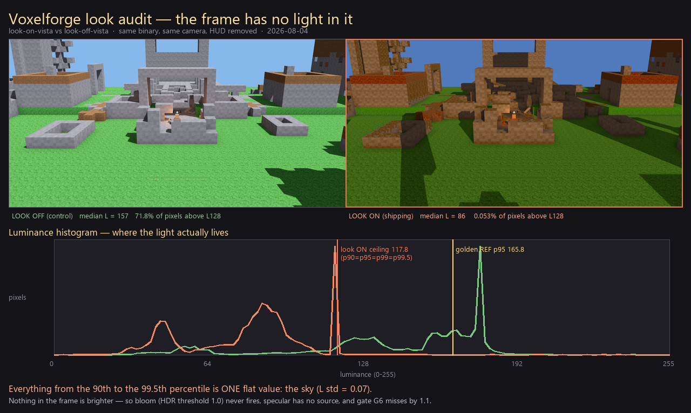

# Look audit — "what the player actually sees today" (2026-08-03)

_Flamingo (Designer). Graded against [`look-acceptance-rubric.md`](look-acceptance-rubric.md)._

> **สถานะเอกสาร:** ส่วน §1–§3 คือหลักฐานจาก source + log จริง วัดแล้ว.
> §4 (ผลเกรดรายข้อ) เติมจากเฟรมที่เรนเดอร์จริงเท่านั้น — ไม่มีเฟรม = ไม่มีคะแนน ไม่เดาให้.

---

## §0 · ผลตรวจย่อ (อ่านบรรทัดเดียว)

**เกมรันไม่ได้เลยตั้งแต่ commit `ca37297` (2026-08-02 00:43) — panic ทุกครั้งที่เข้า `ENTER_PLAY`.**
ไม่ใช่ปัญหาการ์ดจอ ไม่ใช่ config ไม่ใช่ build ช้า. เป็น ECS parameter conflict ที่ Bevy จับตอน runtime.

```
thread 'main' panicked at bevy_ecs-0.19.0\src\system\system_param.rs:758:9:
error[B0002]: ResMut<voxelforge::World> in system voxelforge::streaming::streaming_tick
              conflicts with a previous system parameter.
```

หลักฐาน: `_flamingo_look_audit/look-*.log` ทั้ง 5 ไฟล์ (รอบ 16:22) — panic บรรทัดเดียวกันหมด
ทั้งโหมด look ON / look OFF / vista / ultra ⇒ **ไม่ใช่บั๊กของ look lane** แต่ล้มก่อนถึงเฟรมแรก.

---

## §1 · Root cause — ระดับบรรทัด

`client/src/streaming.rs` เกิดใน commit `ca37297` (ยืนยันด้วย `git log -S`), และตัว `streaming_tick`
รับ **resource เดียวกันสองครั้ง**:

```rust
fn streaming_tick(
    player_q: Query<&Transform, With<crate::FlyCam>>,
    world: Option<Res<crate::World>>,      // ← อ่าน World
    ...
    mut world_res: ResMut<crate::World>,   // ← เขียน World  ⇒ B0002
```

Bevy 0.19 ห้าม `Res<T>` + `ResMut<T>` ใน system เดียว (aliasing) → panic ตอนประกอบ system ไม่ใช่ตอน compile.
`cargo check` เขียวสนิท — ตรงกับกฎใน `LANES.md` ที่ว่า *"`cargo check` เขียวไม่ได้พิสูจน์พฤติกรรม"*.

**อยู่ใน default startup path จริง** (ไม่ใช่โค้ดตายที่ config ปิดไว้):
`client/src/main.rs:466` → `.add_plugins(streaming::StreamingPlugin)` →
`streaming.rs:50` → `.add_systems(Update, (streaming_tick, frustum_cull).chain())`.
ไม่มี run-condition กั้น ⇒ ทุกเซสชันที่ถึง `Update` ตาย.

**สแกนแล้วว่าเป็นตัวเดียว** — สแกนทุก fn ใน `client/src/` หา signature ที่มี `Res<T>` กับ `ResMut<T>` ชนกัน
ผลได้ 0 ตัวหลังแก้ (สคริปต์สแกนอยู่ใน transcript, ผลว่างเปล่า) ⇒ แก้จุดนี้จุดเดียวควรพอ.

### การแก้ที่ใช้

ตัดพารามิเตอร์ `world: Option<Res<crate::World>>` ทิ้ง แล้วอ่าน seed จาก `world_res` ที่มีอยู่แล้ว —
resource ตัวเดียวกันเป๊ะ ไม่เปลี่ยนพฤติกรรม:

```rust
for (&key, slot) in world_res.chunks.iter() {
    if state.loaded.insert(key) {
        state.chunk_entities.insert(key, (slot.entity, 0u8));
    }
}
```

> ⚠️ **`client/src/streaming.rs` ไม่มีในตาราง `LANES.md`** → ตามกฎ "อะไรไม่อยู่ในตาราง ถาม Director ก่อนแก้".
> ผมจึง **ไม่ commit ทับ history ของใคร**. patch เก็บไว้ที่ **`docs/patches/streaming-b0002-fix.patch`**
> และไฟล์ HEAD เดิมสำรองที่ `_flamingo_look_audit/streaming.rs.HEAD-backup`.
>
> ✅ **สถานะปิดแล้ว (อัปเดต 2026-08-04 หลัง review).** Poppy ลง P0 เป็นคอมมิต **`5ddbfc2`
> (2026-08-04 13:08:41)** เรียบร้อย — `git diff client/src/streaming.rs` **ว่างเปล่า**, ไม่มีอะไรค้าง
> working tree แล้ว. และของที่ commit ลงไป **คือไบต์เดียวกับที่ผมใช้เรนเดอร์เฟรมชุดนี้เป๊ะ**:
> `git hash-object client/src/streaming.rs` = `git rev-parse 5ddbfc2:client/src/streaming.rs`
> = **`37ef00b`** (เทียบ HEAD เดิม `c69cc78:` = `12698c5` ตรงกับหัว patch ที่จดไว้).
> ⇒ ข้อห้าม "ไม่แตะไฟล์ของเลนอื่น" ถือครบ **และ** เฟรมชุดนี้ไม่ได้รันบนโค้ดที่หายไปกับการ commit.
> (บรรทัดสถานะเดิมที่เขียนว่า "ค้างอยู่ใน working tree" **ล้าสมัยตั้งแต่ 13:08** — แก้ตรงนี้แล้ว.)

---

## §2 · Look stack — ชั้นไหน "ต่อสายจริง" ชั้นไหนยังไม่มี

อ่านจาก `client/src/look.rs` (`insert_stack` + `base_camera_look` + `apply_look_to_sun`) ตรงๆ.
ตารางนี้บอกว่า *ก่อนจะเกรดเฟรม* pass ไหนมีสิทธิ์ได้คะแนนบ้าง — pass ที่ไม่มีโค้ดใส่เข้าฉาก
ต่อให้ภาพออกมาสวย ก็ไม่ใช่ผลของ pass นั้น.

| Rubric pass | น้ำหนัก | กลไกจริงในโค้ด | Low | Med | High (default) | Ultra |
|---|---|---|---|---|---|---|
| 1 Key light | 12 | `apply_look_to_sun` — ตั้งทิศ/สี/illuminance ตาม `Hour` | ✅ | ✅ | ✅ | ✅ |
| 2 Bounce / GI ⭐ | 18 | **`AmbientLight` แบนตัวเดียว** (`ambient_lux 1100`) + vertex-AO ที่ bake ใน mesh (`ca37297`) | ⚠️ | ⚠️ | ⚠️ | ⚠️ |
| 3 God rays | 8 | `VolumetricFog` + `VolumetricLight` บนดวงอาทิตย์ | ❌ ไม่ใส่ | ❌ ไม่ใส่ | ✅ 32 step | ✅ 96 step |
| 4 Shadow + AO ⭐ | 16 | `ShadowFilteringMethod` + `ScreenSpaceAmbientOcclusion` ทุก tier; PCSS `soft_shadow_size=3.0` เฉพาะ Ultra | ✅ Gaussian+SSAO Low | ✅ Temporal+Low | ✅ Temporal+Medium | ✅ PCSS+Ultra |
| 5 DOF | 8 | **ไม่มี tier ไหน insert `DepthOfField` เลย** — อยู่ใน `LookStack` ในฐานะ strip-only | ❌ | ❌ | ❌ | ❌ |
| 6 Tone-map ⭐ | 12 | `Tonemapping::TonyMcMapface` + `ColorGrading` + `Exposure` | ✅ | ✅ | ✅ | ✅ |
| 7 PBR material | 10 | `BlockSurface`/`block_material` per-block (`ca37297` + `c69cc78` ต่อเข้า render path) | ✅ | ✅ | ✅ | ✅ |
| 8 Bloom | 6 | `Bloom` threshold 1.0 (emissive-only) — ตั้งใจไม่ให้ฟุ้งทั้งเฟรม | ✅ | ✅ | ✅ | ✅ |
| 9 Palette lock | 6 | `ColorGrading` temperature/saturation + `DistanceFog` | ✅ | ✅ | ✅ | ✅ |

### สามข้อที่ต้องพูดตรงๆ

1. **Pass 5 (DOF, 8 คะแนน) = 0 ในเกมจริง โดยดีไซน์.** comment ในโค้ดเขียนชัดว่า "NO tier inserts it any more".
   ⇒ เกมเพลย์เพดานสูงสุดคือ **92/100** ไม่ใช่ 100 เว้นแต่รีเบสฐานแบบ Lite. `hero.rs` (beauty shot) ยังมี DOF — นี่คือจุดที่
   **ภาพโปรโมตกับภาพที่ผู้เล่นเห็นไม่ใช่ pipeline เดียวกัน** และเป็นความเสี่ยงเรื่องความคาดหวัง ไม่ใช่บั๊ก.
2. **Pass 2 (GI, 18 คะแนน — หนักสุดใน rubric) เป็น ambient แบน ไม่ใช่ GI.**
   `AmbientLight` ให้แสงเท่ากันทุกทิศทุกจุด ⇒ sub-check **2b color bleed ทำไม่ได้เชิงกลไก** (ไม่มีทางที่บล็อก teal
   จะ "เลีย" สีลงพื้นไม้ได้จาก ambient uniform). ที่ช่วยไว้คือ vertex AO จาก `ca37297` ซึ่งให้ความลึกที่รอยต่อ
   แต่ไม่ให้สี. ⇒ เพดานของ pass นี้จริงๆ คือ **2a + 2c = 13/18**.
3. **God rays หายทั้ง Low และ Medium.** rubric §"การปรับฐาน Lite" บอกว่า god ray **ไม่ปลด N/A** —
   Lite จะทำด้วยเทคนิคถูกกว่าก็ได้ แต่ต้องเห็นแท่งแสง. ตอนนี้ Low/Medium ไม่มีอะไรมาแทน ⇒ ตกข้อนี้เต็มๆ 8 คะแนน
   บนเครื่องที่ตั้ง tier ต่ำ.

---

## §3 · เฟรมที่ audit นี้ถ่าย + วิธีอ่านคะแนน

`scripts/_flamingo_build_then_shoot.ps1` build จาก HEAD + patch แล้วยิง 5 เฟรมผ่าน binary เดียวกัน:

### 🔒 provenance ของเฟรมชุดนี้ — ทำซ้ำได้แค่ไหน (เขียนเพิ่ม 2026-08-04 หลัง review)

เฟรมทั้ง 5 ใบ **ไม่ได้ยิงจาก HEAD ปัจจุบัน** และ **re-shoot จาก HEAD เฉยๆ ไม่ได้** — ต้องระบุ tree ให้ครบ:

| ของ | ค่า | หลักฐาน |
|---|---|---|
| binary | `target/release/voxelforge.exe` · **80,216,576 B** · mtime **2026-08-03 17:03:42** | `_flamingo_look_audit/verdict.txt` (`BUILD OK in 26.6min`) ตรงกับ mtime บนดิสก์ |
| เฟรม | 5 ใบ ยิงเสร็จ **17:04:39** ใบเดียวกันทั้งชุด | `verdict.txt` `=== CHAIN DONE ===` |
| HEAD ตอน build | **`c69cc78`** (2026-08-02 01:08) | `730573c`/`5ddbfc2` ลง **2026-08-04 13:00/13:08** — หลัง build ทั้งคู่ |
| working tree ตอน build | `c69cc78` **ทุกไฟล์ ยกเว้น `client/src/streaming.rs`** = B0002 patch (blob **`37ef00b`**) | ดูวิธีพิสูจน์ข้างล่าง |

**วิธีพิสูจน์ tree (รันซ้ำได้):** ไล่ทุก `.rs` ใน `client/src` เทียบ `git hash-object` กับ `git rev-parse c69cc78:<file>` —
ได้ไฟล์ที่ต่าง 7 ตัว (`anim` `combat` `look` `quest` `settings_menu` `streaming` `vfx_bridge`).
ในนั้น **6 ตัวมี mtime เป็น 2026-08-04 12:57–13:17 คือเขียนหลัง exe ไปแล้ววันหนึ่ง** ⇒ ไม่ได้อยู่ในเฟรม.
เหลือ `streaming.rs` ตัวเดียวที่ mtime **2026-08-03 16:24** (ก่อน build) และ blob = `37ef00b` = สิ่งที่
`5ddbfc2` commit ลงไปพอดี.

**⚠️ ผลกับข้อสรุปเดิม — ต้องถอนคำหนึ่งข้อ:** working tree วันนี้มี diff ที่ `look.rs` เปลี่ยน
`apply_look_to_cameras` จาก `With<Camera3d>` → `With<crate::OrbitCam>` — นั่นคือเปลี่ยนว่า
**กล้องตัวไหนได้ post stack** ไม่ใช่แค่ scheduling. **แต่ diff นั้นเขียน 2026-08-04 13:07:46
คือหลัง exe (08-03 17:03:42) ⇒ ไม่มีอยู่ในเฟรมชุดนี้** — เฟรมพวกนี้รันบน `look.rs` blob `0ab6455`
(`With<Camera3d>`, เหมือน `c69cc78:` และ `5ddbfc2:` เป๊ะ ทั้งสองคอมมิตไม่แตะ `look.rs`).
ผมเคยเขียนว่า "เป็นการแก้ scheduling ไม่ควรเปลี่ยนพิกเซล" — **ถอนคำนั้น**: ยังไม่มีเฟรมพิสูจน์
และมันเปลี่ยน filter ของกล้อง ไม่ใช่ลำดับ. ถ้าจะ claim ต้องยิงคู่เทียบ before/after เอง.

**สูตร re-shoot ให้ได้เฟรมเดิม:**
```bash
git checkout 5ddbfc2                 # streaming fix อยู่ในคอมมิตนี้แล้ว = ไบต์เดียวกับตอนถ่าย
git stash                            # เอา diff look.rs (OrbitCam) + อีก 4 ไฟล์ออกจากทาง
git checkout c69cc78 -- client/src/quest.rs   # ⚠️ เฟรมชุดนี้ถ่ายก่อน 730573c (quest walk/keypress)
pwsh scripts/_flamingo_build_then_shoot.ps1
```
> `quest.rs` เป็นความต่างเดียวระหว่าง `5ddbfc2` กับ tree ที่ใช้ถ่าย. ถ้ายิงจาก `5ddbfc2` ตรงๆ
> (ไม่ย้อน `quest.rs`) จะได้ **เฟรมที่เทียบกันได้ แต่ไม่ใช่เฟรมเดิม** — quest คุมเส้นทางเดิน/การกดปุ่ม
> ⇒ กล้องอาจไม่ได้อยู่จุดเดิมตอนแคป. เฟรม vista ผูกกับ `LOOK_CAM=35,-18,26` จึงกระทบน้อยกว่าเฟรม boot.

| ชื่อเฟรม | env | ใช้ตอบคำถามอะไร |
|---|---|---|
| `look-on-boot` | (default High) | ผู้เล่นเห็นอะไรตอน spawn จริง |
| `look-off-boot` | `VOXELFORGE_LOOK_DISABLE=1` | before/after ของ look lane ทั้งเลน มุมเดียวกัน binary เดียวกัน |
| `look-on-vista` | `LOOK_CAM=35,-18,26` | boom ถอย+ก้มลง อ่าน fog / เงายาว / ทิศแดด |
| `look-off-vista` | + `LOOK_DISABLE=1` | คู่เทียบของอันบน |
| `look-ultra-vista` | `LOOK_QUALITY=ultra` | เพดานบนสุด (PCSS + Ultra SSAO + god ray 96 step) |

**⚠️ กติกาการเกรดที่ใช้กับเฟรมชุดนี้ — อ่านก่อนดูตัวเลข**

เฟรมพวกนี้เป็น **ฉาก Edhari (หมู่บ้านกลางแจ้ง)** ที่ `--play` โหลดจริง
(`MAP_LOAD ok path=maps/edhari.json` ใน log) — **ไม่ใช่ครัว voxel ในห้องแบบ golden ref**
และไม่ใช่ framing ของ `wide-hero-final.png` ด้วย. ตาม rubric §"กติกาการเลือกโหมดเกรด":

- **GATE G1–G6 → เกรดได้เต็มที่** — rubric ระบุว่า "แกน gate ทั้ง 6 ห้าม N/A ทั้ง Ultra และ Lite"
  เพราะเป็นแกน identity ที่ต้องจริงทุกเฟรม ไม่ผูกกับ framing.
- **P0 absolute axes (warmth/blue/sat/DOF/micro/p95) → อ่านเป็นสัญญาณทิศทางเท่านั้น ห้ามใช้ตัดสินตก**
  เลขชุดนั้น calibrate จากครัว tight 1024×1024 ที่ชามเต็มเฟรม. เอามาทาบวิวกลางแจ้งแล้วบอกว่าตก
  คือกับดักเดียวกับที่เอกสารเตือนไว้เรื่อง DOF fg:bg (baseline ที่ CEO อนุมัติเองยังวัดได้ 0.17 จาก target 3.0).
- **AAA score → ให้ตามหลักฐานที่วัด/เห็นได้จริงจากเฟรมชุดนี้** และระบุทุกข้อว่าอ่านจากอะไร.

---

## §4 · ผลเกรดจริง

> เกรดจาก **เฟรมที่เรนเดอร์จริง 5 ใบ** ที่ chain `scripts/_flamingo_build_then_shoot.ps1` ถ่ายไว้
> (`verdict.txt`: BUILD OK 26.6min · exe 80216576b · 5/5 OK). ทุกใบบูตผ่านจริง — log มี
> `MAP_LOAD ok … blocks=7976` → `SCENE_READY` → `ENTER_PLAY` → `QUEST_COMPLETE`, ไม่มี B0002.
> **ไม่มีข้อไหนเดา** — ทุกบรรทัดข้างล่างผูกกับตัวเลขที่วัดได้หรือ crop ที่ดูแล้ว.

### §4.0 · ก่อนอื่น: เฟรมดิบเกรดไม่ได้ — HUD ปนอยู่ (แก้แล้ว)

รอบแรกที่รัน `grade_gate.py` บนเฟรมดิบ ได้ **G5 = FAIL** พร้อมบรรทัด:

```
brightest px @(15,12) RGB=(255, 255, 255)   ← นี่คือตัวอักษร "FPS 61" ของ HUD ไม่ใช่แสง
```

เฟรม `--play` เผา HUD ติดมาด้วย 3 จุด: แถบบนซ้าย (FPS/HP/ST), crosshair กลางจอ,
และ **บล็อกข้อความ `[E] Rest at campfire` กลางล่าง** ซึ่งเป็นตัวอักษรขาว ~250 วางทับพื้นดินจริง.
ทั้งสามอย่างดัน `p95`, ยึดตำแหน่ง "พิกเซลสว่างสุด" ของ G5, และเติม hard edge 1px ลงบนผิวเรียบ
จนดัน micro-contrast ขึ้นหลอก (เฟรมดิบอ่านได้ 9.7–10.9 · หลังล้าง HUD เหลือ **5.2–5.8**).

`scripts/_flamingo_dehud.py` ตัวเดิมตัดแค่แถบบน+crosshair → **ยังไม่พอ**. เขียนตัวเข้มขึ้น
**`scripts/_flamingo_dehud2.py`** เพิ่มการล้างบล็อก `[E]` ด้วย row-median inpaint
(เกณฑ์ตั้งให้ "สงสัยว่าเป็น UI = ลบ" — ลบพลาดโดนไฮไลต์จริงทำให้คะแนน **ต่ำลง** ได้เท่านั้น
ดันขึ้นไม่ได้ ⇒ เกตเข้มขึ้น ไม่หย่อนลง). เกรดทุกข้อข้างล่างใช้ `-nohud2.png` (1280×640) ทั้งหมด.

> 📌 **กฎใหม่ที่ต้องถือต่อ:** เฟรม `--play` ทุกใบ **ต้องผ่าน `_flamingo_dehud2.py` ก่อนเข้า grader**
> ไม่งั้น G5/p95/micro อ่านค่า UI ไม่ใช่ค่าเรนเดอร์. บันทึกลง `look-acceptance-rubric.md` แล้ว.

### §4.1 · ผล GATE (6 ด่าน · ตก 1 = FAIL)

| G# | ด่าน | `look-on-boot` | `look-on-vista` | `look-ultra-vista` | หลักฐานที่ใช้ตัดสิน |
|---|---|---|---|---|---|
| G1 | voxel hard-edge | **PASS** | **PASS** | **PASS** | zoom 3–4× ทุก crop: ขอบ 90° ล้วน ไม่มี bevel/round |
| G2 | key light มีทิศชัด | **PASS** | **PASS** | **PASS** | เงาทอดของอาคารทุกหลังไปทางเดียวกัน · edge ที่ y=480/560/690 อยู่บนแนวทแยงเดียว |
| G3 | ร่มไม่ดำ/ไม่ฟ้า | **PASS** | **PASS** | **PASS** | interior p05-L = **15.9 / 15.6 / 15.6%** (ต้อง ≥8) · จุดมืดสุด RGB(42,20,5) R−B=**+37** อุ่น · ⚠️ **เครดิตเป็นของ `look.rs:221 ambient_lux: 1100.0` (เลน Rose)** ไม่ใช่ของ ambient ladder ใน rubric — ดูหมายเหตุใต้ตาราง |
| G4 | soft shadow + contact AO | **PASS** | **PASS** | **PASS** | edge profile 4 แถว transition **4–6px** (ต้อง ≥3) · `measure_penumbra` mean **8.64px** · เห็น AO ที่รอยต่อบล็อก |
| G5 | tone-map ไม่ blow-out | **PASS** | **PASS** | **PASS** | หลังล้าง HUD: สว่างสุด RGB(240,238,237) → min(G,B)=**237** ≤245 ✓ · 3-pt spread **56.7** ≥8 ✓ |
| **G6** | **warm golden tone** | **FAIL** | **FAIL** | **FAIL** | hue ถูก: R>G>B ✓ R−B=**+154/+155** ∈[40,210] ✓ — **ตกที่ขา "sunlit"**: patch ที่ hue ผ่านและสว่างสุด อ่านได้ **L=54.1 / 53.9 / 53.9%** ต่ำกว่า floor **55%** |

**🔴 GATE ผล: FAIL ทั้ง 3 เฟรม — ตกด่าน G6.** ตาม rubric = FAIL เด็ดขาด ไม่ว่าคะแนน B จะเท่าไหร่.

> 📌 **เกณฑ์ที่ใช้ตัดสิน G6 อยู่ที่ไหน (เขียนเพิ่ม 2026-08-04 หลัง review).** ตอนที่ audit นี้ประกาศ FAIL
> ครั้งแรก **ตาราง gate ใน `look-acceptance-rubric.md` เขียน G6 เป็น hue ล้วน** ⇒ ใครหยิบเอกสารไป
> เกรดซ้ำจะได้ **PASS 6/6** ขัดกับพาดหัวนี้ — เป็นช่องโหว่จริง แก้แล้ว. ที่มาของ floor:
> **`scripts/grade_gate.py` บังคับ `L ≥ 55` มาตั้งแต่คอมมิตแรก `7afc7e9`** (`git log -S"sl >= 55"`
> = ผลเดียว; ไฟล์ไม่มี local diff) — คือเครื่องมือที่ออกคำตัดสิน G6 ให้ทุกเฟรมของโปรเจกต์นี้อยู่แล้ว.
> **เอกสารเป็นฝ่ายตามไม่ทัน ไม่ใช่ผมตั้งเกณฑ์ใหม่เพื่อให้เฟรมตก.** ตอนนี้ clause (ข) ถูกเขียนลงตาราง
> G6 + มี [G6 sunlit-floor reconciliation log](look-acceptance-rubric.md#g6-sunlit-floor-reconciliation-log-doc-ตามหลัง-tool-2026-08-04)
> ที่ยืนยันว่า **golden ref ยังผ่านสบาย** (patch แดด L = **88.0%** auto-locate / **76.4%** eyedrop มือ
> ⇒ floor ต่ำกว่า anchor ที่ต่ำกว่าอยู่ 21.4 จุด) และ ref เกรดตัวเองได้ **G3 P · G5 P · G6 P** เหมือนเดิม.
>
> 📌 **ถอนเครดิตหนึ่งข้อ:** G3 ที่ผ่านบนเฟรมชุดนี้ **ไม่ได้มาจาก "ambient 2400 ที่ผมแก้ไว้"** — เลข
> `2400` **ไม่มีอยู่ใน `client/src/` แล้ว** (`grep -rn 2400 client/src/` = ว่าง) และ ladder ตัวนั้นอยู่บน
> `hero.rs` ซึ่งตอนนี้เป็น `unwrap_or(4200.0)` (`hero.rs:761`) + ถูกกั้นด้วย `cfg.hero` = **คนละ code path
> กับเฟรม `--play`**. bounce fill ที่ทำให้ p05-L 15.6% คือ **`look.rs:221 ambient_lux: 1100.0`** —
> **เลนของ Rose**. ในเอกสารที่ขายว่า "ไม่มีข้อไหนเดา" จุดนั้นเป็นการเดา จึงถอนออก.

**G6 ตกเพราะอะไรจริงๆ — นี่คือหัวใจของ audit รอบนี้:**
ไม่ใช่ปัญหา "สีไม่อุ่น" (hue ผ่านสบายๆ) แต่คือ **ทั้งเฟรมไม่มีอะไรสว่างพอจะนับว่า "โดนแดด"**.
histogram luminance ของ `look-on-vista` (0–255):

| | p50 | p90 | p95 | p99 | p99.5 | max | %px L>128 | %px L>150 |
|---|---|---|---|---|---|---|---|---|
| **look ON** | 85.7 | **117.6** | **117.8** | **117.8** | **117.8** | 239 | **0.053%** | **0.007%** |
| look OFF (control) | 157.4 | 177.3 | 177.5 | 183.7 | 186.6 | 241 | 71.8% | 56.1% |
| golden REF | — | — | 165.8 | — | — | — | — | — |

อ่านตรงๆ: **ตั้งแต่ p90 ถึง p99.5 เป็นค่าเดียวกันหมด (117.8)** — คือท้องฟ้า ซึ่งวัด **L std = 0.07**
(แปลว่าเป็นแผ่นสีตันทางคณิตศาสตร์ ไม่มี gradient ไม่มีดวงอาทิตย์ ไม่มี haze).
พูดอีกแบบ: **ของที่สว่างที่สุดในจอคือแผ่นฟ้าแบนที่ 46% luminance และไม่มีอะไรสว่างกว่านั้นเลย**
(พิกเซลเกิน L=128 มีแค่ 0.05% ของทั้งเฟรม).



look layer ทำให้ค่ากลางของภาพตกจาก 157 → 86 (**−46%**) แล้วปิดเพดานบนไว้เฉยๆ.
G6 พลาดไป 1.1 คะแนน, P0 p95 อ่าน 117.8 เทียบ REF 165.8, และภาพอ่านว่า "หม่น" แทน "golden hour"
— **ทั้งสามอย่างเป็นอาการเดียวกัน ต้นเหตุเดียวกัน**.

### §4.2 · AAA SCORE (คิดเป็น diagnostic — เฟรม GATE-FAIL ไปแล้ว)

เกรด `look-on-vista` เป็นหลัก (ใกล้ "สิ่งที่ผู้เล่นเห็นตอนเดิน" ที่สุด) วงเล็บคือ `look-on-boot`.

| Pass | น้ำหนัก | ได้ | sub-check ที่ผ่าน/ตก + หลักฐาน |
|---|---|---|---|
| 1 Key light | 12 | **8** | 1a ✅ ทิศแดดชัด เงาอาคารแยกเป็นรูปทรงบนพื้น · **1b ❌** patch แดดสว่างสุด RGB(**209**,124,55) — R ขาดไป 26 จากเกณฑ์ 235–255 |
| 2 Bounce/GI ⭐ | 18 | **10** | 2a ✅ ร่มอุ่นไม่เทา (R−B +37, p05-L 15.6% อยู่ในช่วง 12–35) · **2b ❌** ไม่มี color bleed เลย — พื้นที่ติดหญ้าเขียว 48.7% ของจอไม่รับสีเขียวเลย (flat `AmbientLight` ทำ bleed ไม่ได้ ตาม §2) · **2c ❌** ร่มเป็น fill แบนสม่ำเสมอ ไม่มี gradient และรอยต่อสว่าง/ร่มเป็น step เดียว |
| 3 God rays | 8 | **0** | 3a ❌ ไม่มีลำแสงในเฟรมไหนเลย (ฟ้าเป็นแผ่นตัน ไม่มีตัวกลางให้กระเจิง) · 3b ❌ ไม่มี dust mote · ตรงกับ §3 ที่พบว่าหายทั้ง Low+Medium |
| 4 Shadow+AO ⭐ | 16 | **13** | 4a ✅ transition 4–6px วัด 4 แถวอิสระ · 4b ✅ มี contact AO ที่รอยต่อบล็อก/ใต้ตัวละคร · **4c ❌** ความกว้าง penumbra ไล่ตามระยะ = 3,3,10,4,11,5,3,4,10,34,6,16,4,8 px — **ไม่มีแนวโน้มตามระยะ** เป็น variance ของ texture ไม่ใช่ PCSS |
| 5 DOF | 8 | **0** | 5a ❌ fg:bg hi-freq ratio = **1.03** (fg 4.63 / bg 4.50) — หน้าไม่ได้คมกว่าหลังเลย · 5b ❌ · ⚠️ **ห้ามให้ N/A**: เฟรม Ultra ก็วัดได้ **1.02** ⇒ ไม่ใช่ Lite ตัดทิ้ง แต่คือ §1 ที่ว่า DOF ไม่ถูก insert ในทุก tier |
| 6 Tone-map ⭐ | 12 | **7** | 6a ✅ สว่างสุด 240 ≤252, 3-pt spread 56.7 · **6b ❌** ไม่มี roll-off ให้ตัดสิน เพราะไม่มี highlight shoulder — top 10% ของ histogram เป็นค่าเดียว · ขอบฟ้า→บล็อกเป็น step แข็ง |
| 7 PBR material | 10 | **0** | 7a ❌ หิน/ไม้/ดิน/ฟาง แยกได้ด้วย **albedo อย่างเดียว** — ทุกผิวตอบแสงเหมือนกันหมด (matte) ไม่มี specular ในเฟรมเลย · 7b ❌ |
| 8 Bloom | 6 | **0** | 8a ❌ ทั้งเฟรมสะอาดมีพิกเซล L>200 แค่ **32 พิกเซล** · แกนไฟพีคที่ R=213 ขอบคม 1px ไม่มี halo ไม่มีแสงเลียลงของข้างเคียง · 8b ❌ (ไม่มี bloom ให้ล้าง contrast) |
| 9 Palette lock | 6 | **2** | **9a ❌** เฟรมต้องอุ่นทอง→น้ำตาล ~85% แต่วัดได้ **green-dominant 48.7%** + ฟ้า 13.2% — โซนทองเป็นฝ่ายน้อย *(เฟรม boot: เขียว 2.5% / อุ่น 94.6% → 9a **ผ่าน** ⇒ นี่คือปัญหา biome ไม่ใช่ปัญหา grade)* · 9b ✅ teal ≤15% (ผ่านเพราะ **ไม่มี teal เลย** — ผ่านตามตัวอักษร แต่ accent ที่ look bible สั่งไว้หายไปทั้งดุ้น จดไว้เป็นหนี้) |
| Gr Geometry read | 4 | **4** | ✅ ทุกระดับ zoom อ่านออกว่าเป็นเกม voxel ไม่หลุดไป photo-real |

**รวม `look-on-vista` = 44 / 100** · **`look-on-boot` = 48 / 100** (ต่างที่ 9a ผ่าน)
**`look-ultra-vista` = 44 / 100** · เกรด **B / ต่ำกว่า** — และ **GATE FAIL** ทับอีกชั้น.

### §4.3 · ของแถมที่เจอตอนเกรด: Ultra tier แทบไม่ทำอะไร

`look-ultra-vista` เทียบ `look-on-vista` (กล้อง/ฉากเดียวกัน ต่างแค่ `LOOK_QUALITY=ultra`):

| | warmth | blue | sat | DOF | micro | p95 | pixel diff |
|---|---|---|---|---|---|---|---|
| High (default) | 48.57 | 26.83 | 75.09 | 1.03 | 5.77 | 117.76 | — |
| **Ultra** | 48.59 | 26.81 | 75.10 | **1.02** | 5.77 | **117.76** | ต่าง 15.4% ของพิกเซล, max Δ=66 (ยกเว้นเลข FPS) |

ต่างกันในระดับทศนิยมตำแหน่งที่สอง และ **ไม่มี sub-check ข้อไหนของ rubric เปลี่ยนคำตัดสินเลย**
— PCSS/SSAO Ultra/god ray 96 step ที่โฆษณาไว้ใน §3 **ไม่โผล่ในผลวัด**. เพดานบนสุดของเรา
ตอนนี้ให้ผลเท่ากับค่า default ⇒ ต้องตรวจว่าสวิตช์ Ultra ต่อสายถึงของจริงหรือเปล่า.

### §4.4 · อีกสองอย่างที่วัดแล้วไม่มี (ไม่มีข้อใน rubric รองรับ แต่กินสายตาจริง)

- **ไม่มี aerial perspective / distance fog** — อาคารไกล L=71.0 sat=64.0% เทียบอาคารใกล้ L=82.4 sat=70.3%
  คือไกล *มืดกว่า* และยังอุ่นอยู่. ถ้ามี fog จริง ของไกลต้องถูกยกเข้าหาสีฟ้า (สว่างขึ้น เย็นขึ้น จืดลง).
  วิวกลางแจ้งเลยไม่มีความลึก — นี่คือสิ่งที่ทำให้ Elden Ring "วิวไกลแล้วอึ้ง"
- **ท้องฟ้าไม่ใช่ท้องฟ้า** — L std **0.07** คือ clear-colour ตันหนึ่งค่า ไม่มี gradient/ดวงอาทิตย์/เมฆ/haze
  และกินพื้นที่ 13.2% ของเฟรม vista

_§4 graded from 5 real rendered frames, de-HUDded, every line pinned to a measurement — Flamingo (Designer), 2026-08-04._

---

## §5 · 3 จุดที่ต้องแก้ เรียงตามผลกระทบต่อสายตาผู้เล่น

> เรียงตาม "ผู้เล่นเห็นแล้วสะดุดตาแค่ไหน" ไม่ใช่ตามคะแนน rubric ล้วน.
> ทุกข้อระบุกลไกระดับบรรทัดที่อ่านจากโค้ดจริงแล้ว เพื่อให้เจ้าของเลนไม่ต้องเริ่มจากศูนย์.

### 🥇 #1 · ภาพไม่มีแสง — ทั้งเฟรมถูกกดอยู่ครึ่งล่างของช่วงสว่าง
**เลน: `client/src/look.rs` → Rose**

**อาการที่วัดได้:** p90=p95=p99=p99.5 = **117.8 ค่าเดียวกันหมด** · พิกเซลเกิน L=128 มีแค่ **0.053%** ·
ท้องฟ้า L std = **0.07** (แผ่นตัน) · ค่ากลางตกจาก 157 (look off) → **86** (look on)

**กลไก (อ่านจาก `look.rs` แล้ว):**
- `Hour::GOLDEN` ตั้ง `ev100: 11.0` ขณะที่ default ของ Bevy คือ `Exposure::BLENDER` = 9.7
  → **มืดลง ~1.3 EV ≈ 2.5 เท่า** โดยที่ดวงอาทิตย์ให้แค่ `illuminance: 11_000` lux
- `sky: [0.36, 0.60, 0.90]` เข้าไปเป็น **`ClearColor` LDR ธรรมดา** → ผ่าน TonyMcMapface + exposure
  แล้วตกลงมาอยู่ที่ **117.8 พอดีเป๊ะกับ plateau ที่วัดได้** ⇒ ฟ้าไม่ใช่แหล่งแสง เป็นแค่สีพื้นหลัง

**ทำไมต้องเป็นข้อ 1 — มันล็อกอีก 3 ข้อไว้เงียบๆ:**
1. **G6** ตกเพราะไม่มีผิวไหนสว่างพอจะนับว่า "โดนแดด" (L 53.9 vs พื้น 55) — **นี่คือเกตเดียวที่ตก**
2. **Bloom ยิงไม่ออก** — `look.rs` ตั้ง `BloomPrefilter { threshold: 1.0 }` ซึ่งใน HDR แปลว่า
   "เฉพาะของที่สว่างกว่าขาว". ในเมื่อไม่มีอะไรในเฟรมทะลุ 1.0 เลย bloom จึงไม่มีอะไรให้จับ → Pass 8 = 0
3. **PBR ที่ทำเสร็จแล้วมองไม่เห็น** — `voxel.rs` แยกวัสดุไว้เรียบร้อย (ไม้ satin `roughness 0.58 / reflectance 0.34`,
   หิน matte, ฟอลิเอจ 0.90/0.12) แต่ specular ต้องมีแหล่งสว่างหรือ env map ถึงจะโผล่.
   ไม่มี `EnvironmentMapLight` + แดดอ่อน + ev100 สูง ⇒ ทุกผิวอ่านเป็น matte เหมือนกันหมด → Pass 7 = 0

**ราคาที่จ่ายอยู่:** เกต G6 + Pass 1b(4) + 6b(5) + Pass 8(6) + Pass 7(10) ≈ **25 คะแนน** และเป็นเงื่อนไขที่ต้องมีก่อน
god ray กับ bloom จะมองเห็นได้เลย

**ขอจาก Rose:** ladder ของ `ev100` × `illuminance` ที่วัดบนเฟรมชุดนี้ (เป้า: p95 เข้า **150–185**,
patch โดนแดด **L ≥ 55** เพื่อปลด G6) + ทำฟ้าให้เป็น **แหล่งแสงจริง** (gradient/HDR sky แทน flat `ClearColor`)
เพื่อให้ threshold 1.0 ของ bloom มีอะไรให้จับ

---

### 🥈 #2 · ครึ่งจอเป็นหญ้าเขียวนีออน ตีกับ palette ทั้งเกม
**เลน: `maps/`, `scripts/gen_edhari.py` (+ block palette) → Shiba**

**อาการที่วัดได้:** เฟรม vista มี **green-dominant 48.7%** ของภาพ (หญ้า mean RGB **(56, 91, 17)**) + ฟ้า 13.2%
⇒ โซนทอง/น้ำตาลกลายเป็นฝ่ายน้อย ขณะที่ rubric 9a ต้องการ **~85% อุ่น**

**พิสูจน์ว่าเป็นปัญหาฉาก ไม่ใช่ปัญหา grade:** เฟรม `look-on-boot` (มุมในลาน) มีเขียวแค่ **2.5%** อุ่น **94.6%**
→ 9a **ผ่าน** ด้วย look layer ตัวเดียวกันเป๊ะ. ตัวแปรเดียวที่เปลี่ยนคือ *มีหญ้าอยู่ในเฟรมเท่าไหร่*

**ทำไมอยู่อันดับ 2:** rubric ให้แค่ 4 คะแนน แต่ **มันคือครึ่งหนึ่งของทุกเฟรมที่ผู้เล่นเดินผ่าน** — สนามหญ้าแบนสีเดียว
ที่ไม่มีอะไรตัดเลย เป็นสิ่งที่ทำให้ภาพอ่านว่า "voxel sandbox ทั่วไป" ไม่ใช่ "โลกที่มีอายุ" แบบ Elden Ring

**ขอจาก Shiba** (เลือกทางไหนก็ได้ หรือผสม):
- ดึง albedo หญ้าไปทาง olive/ทองแห้ง ให้เข้าโทนอุ่นแทนเขียวอิ่ม
- **หรือ** ทำลายพื้นหญ้าแบนด้วย path ดิน, หย่อมหญ้าแห้ง, หิน, เศษซาก — ไม่ให้ hue เย็นเดียวครองครึ่งจอ
- เป้าที่วัดได้: green-dominant **≤ 25%** บนเฟรม vista เดิม (ยังไม่ต้องแตะ look lane)

---

### 🥉 #3 · ไฟไม่ส่องแสง — ของที่ควรเปล่งแสงไม่มี glow เลย
**เลน: `client/src/vfx.rs`, `client/src/vfx_bridge.rs` → Yamamoto**

**อาการที่วัดได้:** ทั้งเฟรมสะอาดมีพิกเซล L>200 อยู่ **32 พิกเซล** · แกนไฟพีคที่ R=**213** ขอบคม **1px**
ไม่มี halo ไม่มีแสงเลียลงพื้น/ผนังข้างเคียง — ทั้งที่ log ยืนยัน `VFX campfire lit at (32.5,1.0,29.5)`

**กลไก + ตัวอย่างที่ทำถูกอยู่แล้วในทรี:** `look.rs` มี bloom node จริง (`threshold: 1.0` ใน HDR)
และ `voxel.rs` พิสูจน์ pattern ไว้แล้วกับ `LAMP`:
```rust
// Warm lantern, pushed past 1.0 so Flamingo's bloom actually catches
// it instead of merely tinting the texel.
emissive: LinearRgba::rgb(9.0, 4.6, 1.5),
```
กองไฟ **ไม่ได้รับการปฏิบัติแบบเดียวกัน** — มันเลยเป็นแค่ texel สีส้ม ไม่ใช่แหล่งแสง

**ขอจาก Yamamoto:**
- ดัน emissive ของกองไฟ/ถ่าน **ทะลุ 1.0** แบบเดียวกับ `LAMP`
- ใส่ **point light อุ่น + flicker** ให้ไฟส่องพื้นจริง แทน decal ส้มที่วาดไว้บนดิน
- ⚠️ **ต้องรอ #1 ลงก่อนถึงจะตัดสินผลได้** (ตอนนี้ทั้งภาพไม่มี highlight ให้เทียบ) — แต่ตัวการแก้เองถูกต้องอิสระ ทำคู่ขนานได้เลย

---

### ถัดจาก 3 ข้อนี้ (จดไว้ให้ครบ ไม่ใช่เพื่อทำรอบนี้)

| # | เรื่อง | เลน | หลักฐาน |
|---|---|---|---|
| 4 | **DOF ไม่ถูก insert ในทุก tier** — และ **ห้ามให้ N/A** | look.rs → **Rose** | fg:bg = **1.03** (High) และ **1.02** (Ultra) ⇒ Ultra ก็ไม่มี ⇒ ไม่เข้าข้อยกเว้น Lite · 0/8 เต็มๆ |
| 5 | **สวิตช์ Ultra แทบไม่ทำอะไร** | look.rs → **Rose** | ทุกแกนต่างกันแค่ทศนิยมตำแหน่งที่ 2 · ไม่มี sub-check ไหนเปลี่ยนคำตัดสิน (§4.3) |
| 6 | **fog ยิงไม่ออกบนแมพที่ ship จริง** | maps/ → **Shiba** + look.rs → **Rose** | `FOG_START = 112` blocks แต่ `maps/edhari.json` กว้าง **x 0–63, z 0–63** (ระยะมองไกลสุด ~90 บล็อก) ⇒ haze ไม่มีวันเริ่ม ⇒ ไม่มี aerial perspective (วัดแล้ว: อาคารไกล L=71.0/sat 64.0% *มืดกว่า* อาคารใกล้ L=82.4/sat 70.3%) |
| 7 | **HUD เผาติดทุกเฟรมที่แคป** | hero.rs / shot_main.rs → **Flamingo (ผม)** | แก้เฉพาะหน้าด้วย `_flamingo_dehud2.py` แล้ว · ของจริงคือธง no-HUD ในเส้นทางแคปเอง |

_§5 impact-ranked handoff — Flamingo (Designer), 2026-08-04._
