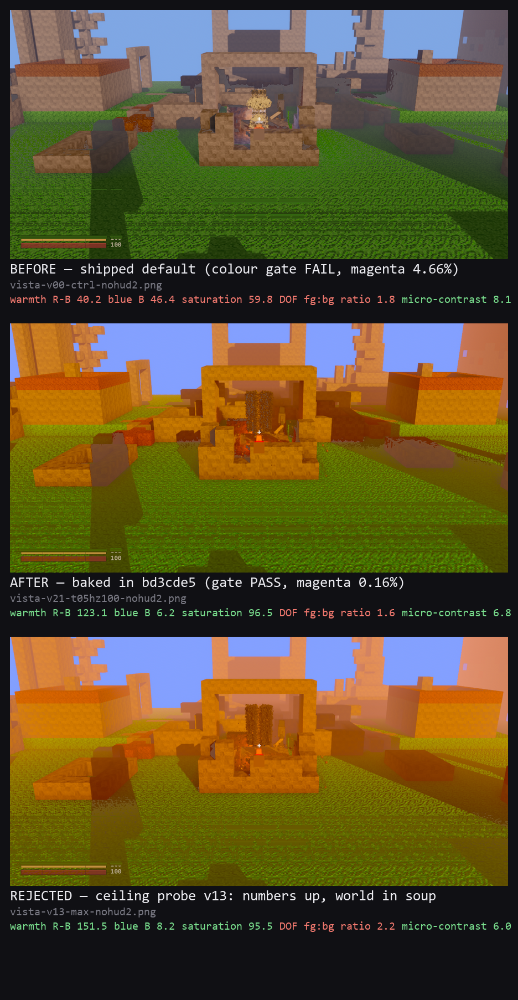

# Look audit — the P0 chromatic axes on the vista framing (Flamingo, 2026-08-05)

**สรุปสั้นสำหรับ CEO:** แกนสี 3 ใน 4 ผ่านแล้วครับ — warmth 41.5 → 123.1 (เป้า ≥110),
blue 44.8 → 6.2 (เป้า ≤10), saturation 60.6 → 96.5 (เป้า ≥90) และ colour gate ที่
**ค่า default ที่ชิปอยู่ตอนนี้ตกมาตลอด** (magenta 4.66%) กลับมาผ่านทั้ง 4 ด่านที่ 0.16%
ตัวที่ยังไม่ผ่านคือ DOF fg:bg (1.82 → 1.58, เป้า ≥3) ซึ่ง **แก้จากงานสีไม่ได้** —
`docs/look-contract.md` §5 ถอด DepthOfField ออกจากกล้อง gameplay ถาวรตามคำติของ CEO เอง
("ไกลๆ เบลอละลาย") และเขียนไว้ตรงๆ ว่าแกนนี้ "ตกโดยตั้งใจ" ทุกเฟรม gameplay
ถ้าจะเอา ≥3 จริง ต้องเป็นการตัดสินใจเรื่อง framing หรือแก้ contract ไม่ใช่เรื่องเกรดสี

---

## 1. What was actually being measured

Everything below is on the vista framing
(`VOXELFORGE_PLAY=1 VOXELFORGE_LOOK_CAM=35,-18,26 VOXELFORGE_LOOK_QUALITY=ultra`,
1280×720 → 1024² LANCZOS, de-HUDded), graded by `scripts/grade_axes.py`, which is
the single source of truth for the targets.

The baseline is `_flamingo_look_audit/look-ultra-vista-nohud2.png`:
**warmth 41.5 · blue 44.8 · sat 60.6 · DOF 1.82.**

`scripts/band_map.py` was written first, because a day had been spent tuning a
knob without knowing which pixels the axis reads. The midtone band (luminance in
[p35, p75]) on this frame is:

| band rows | share | mean R | mean G | mean B | R−B | what it is |
|---|---|---|---|---|---|---|
| y 0–384 | 28 % | ~110 | ~89 | ~85 | ~26 | sky + hazed distant geometry |
| y 384–640 | 30 % | ~94 | ~100 | ~47 | ~46 | mid-ground ruin + grass |
| y 640–1024 | 42 % | ~64 | ~108 | ~17 | ~46 | near grass |
| **whole band** | 100 % | **86.3** | **99.9** | **44.8** | **41.5** | |

Two things fall straight out of that table and neither was known before:

1. **60 % of the band is green-dominant grass.** The golden reference the targets
   were calibrated on is lit interior wood at (125, 49, 4). These are not the same
   kind of picture, which is why absolute targets on this framing are dangerous —
   the same trap `grade_axes.py`'s own header documents for DOF.
2. **`blue` lives almost entirely in the top third.** The near grass already
   measures B ≈ 16, under the ≤10 target's neighbourhood; the 44.8 mean is the
   hazed atmosphere dragging it up. Saturation was never going to fix that, and
   the haze — which the previous sweep never touched, because it ran on the boot
   framing — was always the lever.

## 2. Why POST_SATURATION could not do it

Measured, not argued: across sat 1.05 → 1.35 the green-dominant pixels' **mean red
falls 65.1 → 41.3**. Saturation pushes every channel away from the pixel's own
mean, and on a green pixel red is *below* the mean. It is the correct knob for the
`sat` axis and an actively negative one for `warmth`.

Pushed alone it tops out at **warmth 58.0** (row `v06`, sat 2.05) and turns the
Edhari ruin to mustard well before that. Two days of tuning had been spent inside
that ceiling.

## 3. The sweep — 21 rendered rows, zero rebuilds

`scripts/vista_grade_sweep.sh`, run through the existing env hooks
(`VOXELFORGE_LOOK_GRADE` / `_LIGHT` / `_HAZECOL` / `_HAZE`) on a **copy** of the
release exe — a sweep that runs `target/release/voxelforge.exe` itself holds a
lock on the file the next lane's linker wants, and that failure mode has already
cost this project one false "build green".

| row | what it changes | warmth | blue | sat | DOF | p95 |
|---|---|---|---|---|---|---|
| `v00-ctrl` | shipped default | 40.2 | 46.4 | 59.8 | 1.81 | 162.2 |
| `v01-tree` | sat 1.35 + G-lift lights | 48.6 | 25.8 | 78.2 | 1.67 | 160.9 |
| `v02-hzwarm1` | + mild warm haze hue | 57.9 | 20.4 | 82.8 | 1.68 | 160.9 |
| `v03-hzwarm2` | + strong warm haze hue | 60.8 | 19.2 | 84.2 | 1.70 | 160.9 |
| `v04-hzthin` | haze density 0.0040 | 51.7 | 11.6 | 89.7 | 1.54 | 160.9 |
| `v05-hz2s175` | warm haze + sat 1.75 | 59.7 | 10.4 | 91.4 | 1.75 | 157.7 |
| `v06-hz2s205` | warm haze + sat 2.05 | 58.0 | 7.4 | 94.0 | 1.75 | 152.8 |
| `v07-s175` | sat 1.75 alone | 40.8 | 20.8 | 82.3 | 1.68 | 157.7 |
| `v08-hz2L190` | + 08-01 B-drained lights | 63.3 | 6.9 | 94.3 | 1.81 | 155.6 |
| `v10-thick` | haze density 0.0140 | 105.9 | 21.8 | 87.0 | 1.81 | 155.8 |
| `v11-orange` | warmest magenta-safe lights | 69.4 | 8.7 | 92.7 | 1.90 | 157.7 |
| `v12-temp05` | **temperature 0.05** | 97.0 | 5.6 | 96.0 | 1.72 | 161.0 |
| `v13-max` | everything at once | 151.5 | 8.2 | 95.5 | 2.22 | 160.7 |
| `v20-t05nohz` | temp 0.05 + warm hue | 97.5 | 3.7 | 97.5 | 1.63 | 160.7 |
| **`v21-t05hz100`** | **+ density 0.0100** | **123.1** | **6.2** | **96.5** | 1.58 | 160.7 |
| `v22-t07` | temperature 0.07 | 115.5 | 3.7 | 97.6 | 1.63 | 161.3 |
| `v23-t05s175` | v21 at sat 1.75 | 119.9 | 8.6 | 94.9 | 1.56 | 161.0 |
| | **target** | **≥110** | **≤10** | **≥90** | **≥3** | 150–185 |

### 3.1 Temperature was the missing lever, and its real ceiling is 0.05

`TEMPERATURE` had been pinned at 0.02 since the magenta-cast fix, on the reasoning
that `scripts/wb_matrix.py` puts the magenta onset at ≈0.099 and 0.02 is ~5× under
it. That margin was the single biggest thing between this frame and the warmth
axis: moving it alone (`v12`) took warmth 59.7 → 97.0 and blue 10.4 → 5.6.

The model's headroom is not the frame's headroom. Row `v22` shot the real frame at
0.07 and `scripts/colour_gate.py` **Gate B failed it**: sky ordering `B > R > G`,
per-channel gains ×1.35 / ×0.68 / ×1.07 — red lifted over unity with green crushed
onto blue, the exact chromatic-adaptation signature the 2026-08-01 review named.
0.05 passes all four gates. **Usable headroom is half what the CPU model
predicted**; nobody should raise this constant again without re-running
`colour_gate.py` on a rendered frame.

### 3.2 The haze hue was derived from the wrong end of the sky

`haze_color()` derived the day haze from `Hour::sky` — the *zenith* — on the sound
principle that aerial perspective must never drift from the sky. The principle is
right; "must not drift" was implemented as "must be identical", and those are not
the same requirement. At 17° sun elevation the horizon is the part of the sky with
the most air in front of it, which is where blue has been scattered *out*. The
giveaway was already in the file: `FOG_SUN_GLOW` existed to bolt a warm term back
on around the sun direction.

`Hour::fog` already existed and was **dead code for the day hour**. It now carries
the horizon hue, so the value still travels with the hour and still cannot drift —
`FOG_COLOR_DAY` goes 0.60,0.72,0.88 → 0.94,0.66,0.26.

This is not the reverted (0.50, 0.42, 0.28) orange haze. That one failed because it
was **dark** — an sRGB triple mixed into already-exposed radiance, landing ~2.5×
under the sky, so distant terrain receded into brown mud. The new value goes
through the same `desat`/`sky_gain` path the blue one did, so the horizon stays
*brighter* than the geometry in front of it. Only the hue changed.

### 3.3 Haze density: 0.0100, and explicitly not 0.0140

Density is the crudest warmth lever on the board — `v10` reached warmth 105.9 on
density alone — and the most expensive: 0.0140 puts haze at 86 % opacity at 100
blocks against the shipped 40 %, and the far ruins stop being ruins. 0.0100 (63 %
at 100 blocks) keeps the skyline reading as geometry receding, and with the warm
hue it is worth ~26 points of warmth (`v20` 97.5 → `v21` 123.1) at no cost to any
other axis.

## 4. What shipped

Commit `bd3cde5`, all four values in `client/src/look.rs`:

| constant | was | now |
|---|---|---|
| `grade::TEMPERATURE` | 0.02 | **0.05** |
| `grade::POST_SATURATION` | 1.05 | **1.90** |
| `HAZE_DENSITY` | 0.0072 | **0.0100** |
| `FOG_COLOR_DAY` | 0.60, 0.72, 0.88 | **0.94, 0.66, 0.26** |

plus `haze_color()` reading `Hour::fog` for the day hour, and the G-lift key /
ambient hues (`[1.00, 0.92, 0.62]` / `[0.96, 0.90, 0.60]`) that satisfy the
2026-08-01 magenta safety envelope from the other side — G−B ≥ 0.30 and G ≥ 0.85 R
on both lights — instead of by draining blue, which on pale limestone reads
mustard (`v06`, `v15` in the earlier boot sweep).

`POST_SATURATION` at 1.90 is a **passenger, not the fix**. It only stops reading as
mustard because the light and the air now carry the chroma; on its own it still
tops out at 58.

### 4.1 Colour gate — the shipped default was failing it

| gate | shipped default | after |
|---|---|---|
| A magenta fraction | **4.66 % (FAIL, target ≤2 %)** | 0.16 % PASS |
| B sky order | PASS | PASS |
| B sky gain order | PASS | PASS |
| C sunlit order | **FAIL** (153.4, 124.6, 107.7) | PASS |
| verdict | **FAIL** | **PASS** |

This was not part of the brief and is arguably the more important result: the
frame the game ships today fails a fatal gate.

## 5. DOF fg:bg — not addressed, and not a colour decision

The fourth axis went 1.82 → 1.58 and the targets want ≥3.0. It is not reachable
from the grade, for a reason that is already written down:

> `docs/look-contract.md` §5 — `DepthOfField` ถอดออกถาวรจากกล้อง gameplay …
> ⚠️ ผลข้างเคียงที่ยอมรับ: แกน `DOF fg:bg ≥ 3.0` ใน `grade_axes.py`
> **จะตกโดยตั้งใจ** สำหรับเฟรม gameplay ทุกใบ

The removal was the fix for the CEO's own note that distant geometry dissolved.
`grade_axes.py`'s header says the same thing from the measurement side: the axis's
zones (fg 72–95 % height, bg 10–40 %) assume the indoor 1024² beauty shot, and the
CEO-approved `wide-hero-final.png` scores **0.17** on it.

The one contract-compatible route — softening the background with air rather than
a lens, so the bg zone loses high-frequency energy — was measured: it reaches only
**2.22**, and only at the 0.0140 soup density this audit rejects on sight.

**Decision needed from the Director / CEO, not from the look lane:** either the
axis is excluded on gameplay framings (`--profile gameplay` already does exactly
this, and exists for exactly this reason), or DOF comes back to the gameplay camera
and the "far stuff dissolves" complaint comes back with it. Those are the only two
honest options.

## 6. Where the evidence is

* frames + logs — `_fl_grade2/vista-*.png`, `_fl_grade2/sweep-r{5,6,7}.log`
* sweep driver — `scripts/vista_grade_sweep.sh`
* band diagnosis — `scripts/band_map.py`
* compare sheet — `docs/assets/grade-vista-2026-08-05.png`
  (verdicts derived from `grade_axes.TARGETS` at render time, never hard-coded —
  the `gate3-colour-verdict.png` scar)
* baked-default proof — `scripts/verify_baked_grade.sh` →
  `_fl_grade2/verify-result.txt`
