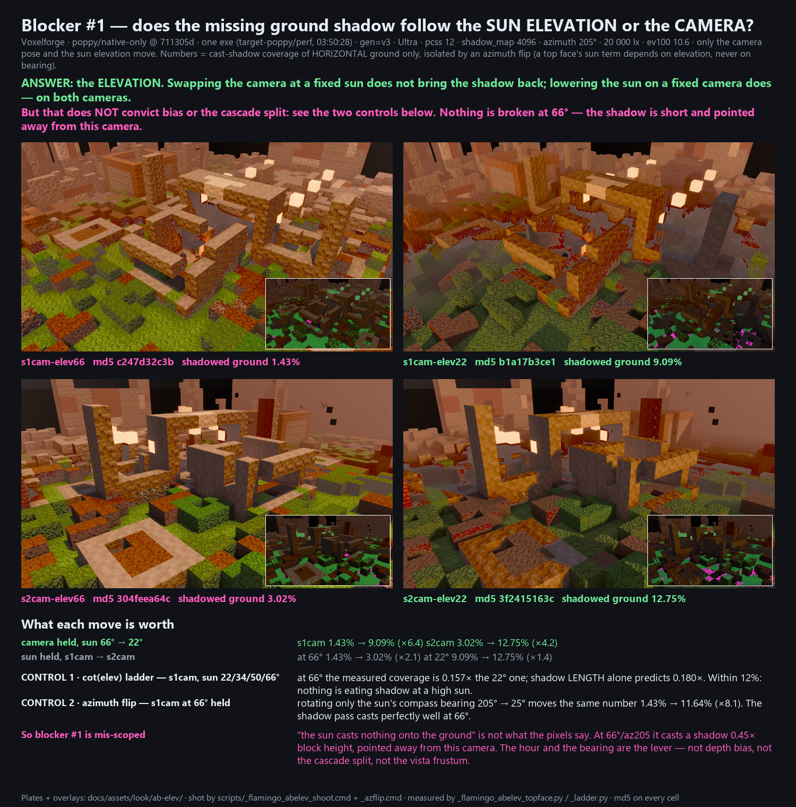

# Blocker #1 A/B — elevation or camera? (Flamingo, 2026-08-15)



`look-gap-v4-2026-08-15.md` names the shoot that settles blocker #1: *"re-shoot
the scene 1 camera at sun elevation 22°, and the scene 2 camera at 66°. If the
shadow follows the elevation it is bias/cascade; if it follows the camera it is
the vista frustum."* This is that shoot.

**Answer: it follows the ELEVATION — and neither branch of that sentence is the
cause.** The shadow pass casts correctly at 66°; what the v4 sheet read as "the
sun casts nothing onto the ground" is the hour and the sun's compass bearing,
not depth bias, not the cascade split, and not the vista frustum.

## The grid

Four plates, `docs/assets/look/ab-elev/`. One exe (`target-poppy/perf`, mtime
2026-08-15 03:50:28 — the same binary that shot the plates the v4 sheet graded),
`gen=v3`, Ultra, `pcss=12`, `shadow_map=4096`, `contact=true`, azimuth 205°,
20 000 lx, ev100 10.6, the neutral noon light rig, `CINE_START=1.0`. The engine's
own banner in `ab-elev/_shoot.log` confirms each plate got the sun it was asked
for. Only the camera pose and the sun elevation move.

Written to `ab-elev/`, not `docs/assets/look/`, which is a live path being
re-shot on a loop.

| | sun 66° | sun 22° |
|---|---|---|
| **scene 1 camera** (wide vista, `44,14,44`) | `s1cam-elev66.png` `c247d32c3b` — **1.43%** | `s1cam-elev22.png` `b1a17b3ce1` — **9.09%** |
| **scene 2 camera** (close raking, `18,9,44`) | `s2cam-elev66.png` `304feea64c` — **3.02%** | `s2cam-elev22.png` `3f2415163c` — **12.75%** |

The percentage is cast-shadow coverage of **horizontal ground only** (method
below). Reproduce with `python scripts/_flamingo_abelev_topface.py`.

- **camera held, sun 66° → 22°:** s1cam ×6.4, s2cam ×4.2
- **sun held, s1cam → s2cam:** at 66° ×2.1, at 22° ×1.4

Swapping the camera at a fixed sun does not bring the shadow back — scene 2's
camera at 66° is still at 3.02%, which is nothing. Lowering the sun on a fixed
camera does, on **both** cameras. **The vista-frustum branch is dead.**

## Why the numbers on the sheet are not the numbers I measured first

My first tool (`_flamingo_abelev_measure.py`, kept on disk, **do not quote it**)
counted "dark ground far from any non-ground pixel" and called that a cast
shadow. It reported the opposite conclusion — an interaction needing both the
vista camera *and* the high sun — and it was wrong.

A grass block's own **side face** is grass-hued, so it sits *inside* the ground
mask, tens of px from any mask boundary, and got counted as open ground. The
overlays in `ab-elev/overlay/*_overlay.png` show it plainly: the magenta lands on
the vertical front faces of grass steps, in rectangles, not in bands across
grass. Same failure C2 was retired for in the v4 sheet — a statistic that cannot
tell face shading from a shadow.

A second draft thresholded raw pixels and counted the grass **texture's** own
dark speckle (11.99% on scene 1 at 66°, scattered through the texture rather
than lying in a region — `overlay/` again). Both drafts are on disk with the
overlay that killed them.

## The method that does separate them

A horizontal face's direct sun term is `illuminance · sin(elev)` — it does not
depend on the sun's compass bearing at all. A vertical face's is
`cos(elev) · cos(Δazimuth)` — it depends on nothing else. So every cell was shot
twice, azimuth 205° and azimuth 25°, 180° apart:

- a lit **top** face is equally bright in both;
- every **side** face flips — lit in one, ambient-only in the other;
- so `TOP mask` = ground pixels reaching the top-lit level in *either* azimuth at
  66°, where a top out-reads a lit side 1/0.45 = 2.25:1.

Camera and world are identical inside a row, so the mask built at 66° is the same
set of horizontal faces at 22°, pixel for pixel. Luminance is Gaussian-blurred
4 px first (a cast shadow is a large-scale feature; grass texture is not) and
normalised by each frame's own top-lit level (p90 over the mask), so the
`sin(22)/sin(66) = 0.41` exposure drop cancels. Shadowed = below 0.55 × that.

**Only a cast shadow can darken a horizontal face.** There is no face-shading and
no exposure explanation left inside that number.

## The two controls — and why "bias/cascade" does not survive them

### Control 1 · cot(elev) ladder (`_flamingo_abelev_ladder.py`)

Scene 1's camera held, sun walked 22 / 34 / 50 / 66°. A shadow's length is
`h/tan(elev)` all by itself, so *some* of the drop is correct geometry.

| elev | md5 | shadowed % of top faces | measured / 22° | cot(elev)/cot(22°) |
|---|---|---|---|---|
| 22 | `b1a17b3ce1` | 9.09% | 1.000 | 1.000 |
| 34 | `78a0675779` | 10.25% | 1.127 | 0.599 |
| 50 | `8edf92d788` | 5.52% | 0.608 | 0.339 |
| 66 | `c247d32c3b` | 1.43% | 0.157 | 0.180 |

At 66° the measured coverage is **0.157× the 22° one against 0.180× predicted by
shadow length alone — within 12%.** Nothing is eating shadow at a high sun. If
depth bias or a coarse cascade were erasing a fixed world-length strip, 66° would
sit *far below* the geometry line, because at 66° that strip is
`1/cos(66) = 2.3×` more of an already `5.6×` shorter shadow. It does not.

(34° and 50° land ~80–90% *above* the cot line; cot is a first-order model that
ignores shadows overlapping and self-occluding, which suppresses the 22°
reference it is normalised on. The direction of the 66° result is what this
control is for.)

### Control 2 · azimuth flip

Scene 1's camera **and** 66° elevation held; only the sun's compass bearing moves
205° → 25°:

| plate | md5 | shadowed % of top faces |
|---|---|---|
| `s1cam-elev66.png` | `c247d32c3b` | 1.43% |
| `s1cam-elev66-az25.png` | `93a69285bc` | **11.64%** |

**×8.1 from the bearing alone, at the elevation that is supposed to be broken.**
A shadow pass that could not reach the ground at 66° could not do that. It casts
fine; at azimuth 205° it casts *away* from this camera and behind its own
occluders.

The same flip on the other cells, for the record: s2cam 66° 3.02% → 7.58%;
s1cam 22° 9.09% → 9.78%; s2cam 22° 12.75% → 1.54%.

## So what blocker #1 actually is

Not "the sun casts nothing onto the ground". At 66° / azimuth 205° it casts a
shadow **0.45× block height** pointed away from the scene-1 camera, and on a
voxel world of 1-block steps that is a sliver hidden behind its own caster. Both
cameras do this; scene 2 only looked healthy because it was shot at 22°, where
the same wall throws **2.5× its height**.

The lever is the **hour and the bearing** — an art call about which sun scene 1
is shot under — not depth bias, not `first_cascade_far_bound`, not the camera's
shadow frustum. Nothing in `look.rs` needs a fix to get a cast shadow into
scene 1; it needs a sun that throws one where the camera can see it.

Two things this does **not** claim:

1. That 1.43% is *enough* shadow for a noon frame. It is not — G2/G4 still fail,
   and the 28 points scene 1 loses are still lost. What changed is where to spend
   the fix.
2. That there is no bias problem anywhere. This measures the ground plane at
   these four poses. A contact-crease or character-shadow bias question is a
   different measurement.

## Things left on disk on purpose

- `probe-s1cam-near66.png` — pulled the eye to 45% of its distance to drop the
  ground inside `first_cascade_far_bound`. It framed itself into the ruin and
  came back walls, with almost no open grass left to receive a shadow.
  **Inconclusive by framing, not by physics.** Superseded by control 1.
- `probeB-lowcam-elev66.png` / `probeB-lowcam-elev22.png` — same idea framed over
  open grass (eye y 14 → 6). Kept as the eyeball version of the elevation result.
- `overlay/*_overlay.png` — the first, wrong metric, and the pixels that retired
  it.
- `overlay/*_topface.png` — what the verdict number counted, per plate.

## Reproduce

```
scripts\_flamingo_abelev_shoot.cmd          # the 2x2 grid
scripts\_flamingo_abelev_azflip.cmd         # the azimuth twins (the instrument)
python scripts/_flamingo_abelev_topface.py  # the verdict table
python scripts/_flamingo_abelev_ladder.py   # control 1
python scripts/_flamingo_abelev_sheet.py    # the comparison image
```

If your md5s differ from this file you are on a later shoot — re-measure, do not
reconcile.
