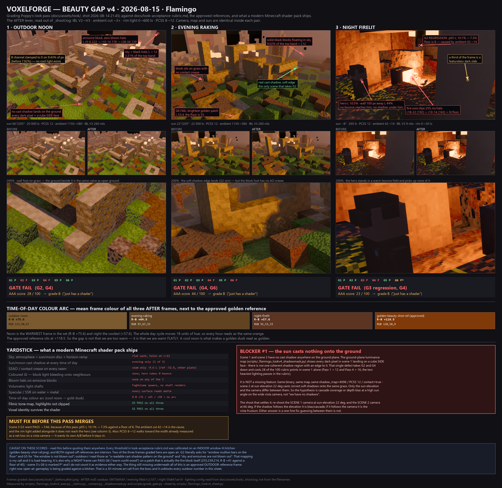

# Look gap v4 — 2026-08-15 (Flamingo)

Scorecard behind . Graded frames:
`docs/assets/look/{outdoor-noon,evening-raking,night-firelit}_{before,after}.png`, shot
2026-08-14 21:45. Rubric: [`look-acceptance-rubric.md`](look-acceptance-rubric.md), tier **Ultra**
(`LOOK tier=Ultra` in `_shoot.log`, so no Lite N/A rebasing — pass 5 counts).

The sheet is the thing to look at. This file exists so the per-pass numbers behind each total are
checkable, and so whoever picks up a pass knows exactly which sub-check it lost.

## What the "after" lever actually is

Read out of `docs/assets/look/_shoot.log`, not out of the filenames
(`scripts/_flamingo_look_v4_probe.py`):

| | before | after |
|---|---|---|
| IBL | `gen=V2 nits=off` | `gen=V3 nits=260` (night: 9) |
| ambient | 1150 (night 42) | 380 (night 14) |
| rim | 0 lx | 600 lx (night 30) |
| PCSS | 8.0 | 12.0 |
| sun / map / camera | identical inside each pair | identical |

Measured effect: a near-uniform darkening of ~2–4 L across every luminance band, plus a real but
small contrast gain once exposure is normalised out — **+2.2%** (noon), **+7.6%** (evening),
**+9.0%** (night). Saturation *fell* in evening (0.714 → 0.652) and night (0.525 → 0.485).

## Gate results (`scripts/grade_gate.py`, frames staged to `-nohud2` names)

| | G1 edge | G2 key dir | G3 shade | G4 shadow+AO | G5 no blow-out | G6 warm | verdict |
|---|---|---|---|---|---|---|---|
| outdoor-noon | P | **F** | P (p05 22.0%) | **F** | P | P (R−B +149, L 68.9) | **FAIL** |
| evening-raking | P | P | P (p05 9.9%) | **F** | P | **F** (L 53.4, floor 55) | **FAIL** |
| night-firelit | P | P | **F** (p05 7.3%, floor 8) | **F** | P | P\* | **FAIL** |

- G3 on night is a **regression caused by this pass**: 10.1% → 7.3%. The ambient cut 42→14 is the cause.
- G6 on evening was already failing before the pass (53.8 → 53.4); the pass moved it slightly further out.
- G6 on night is marked **P\*** and not counted: the patch the grader picked (255,239,214, R−B +41
  against a floor of 40) is the fire block itself. There is no sun at night, so "warm sunlit wood"
  has nothing to measure — see the caveat on the sheet.
- G2/G4 are visual checks in the rubric. The verdicts here rest on
  `scripts/_flamingo_lookv4_shadowmask.py` (ground-plane luminance, painted by quartile) and the
  200% crops on the sheet.

## AAA score per scene

| Pass (weight) | outdoor-noon | evening-raking | night-firelit |
|---|---|---|---|
| 1 · key light (12) | 0 — no light pattern on the ground | 8 — 1a only, sunlit patch R 197 < 235 | 8 — 1a only, lit wood R 190 < 235 |
| 2 · bounce / GI (18) | 13 — 2a+2c, no colour bleed | 13 — 2a+2c, no colour bleed | **0** — 2a fails, shade L 10.5% < 12% |
| 3 · god rays (8) | 0 | 0 | 0 |
| 4 · soft shadow + AO (16) | **0** — 4a fails, nothing to soften | 8 — 4a only, no contact crease | **0** |
| 5 · DOF (8) | 0 | 0 | 0 |
| 6 · tone-map (12) | 7 — 6a only, no highlight shoulder | 7 | 7 |
| 7 · PBR material (10) | 0 — every surface reads matte | 0 | 0 |
| 8 · bloom (6) | 0 | 0 | 0 |
| 9 · palette lock (6) | 4 — 9a only, no teal accent present | 4 | 4 |
| geometry read (4) | 4 | 4 | 4 |
| **total** | **28 / 100** | **44 / 100** | **23 / 100** |

All three land in **grade B — "just has a shader"**, and all three fail the gate, so under the
rubric's own rule the score is advisory: a frame that fails a gate is FAIL regardless of total.

Worth saying plainly: **night reads best to the eye and scores lowest.** Its charm comes from one
strong, well-placed light, not from the pass stack — which is exactly the thing a score is for.

## Blocker #1 — the sun casts nothing onto the ground

Scenes 1 and 3 have no cast shadow anywhere on the ground plane. In scene 1's ground-plane
luminance map every dark pixel lands on a cube **side** face; there is not one coherent shadow
region with an edge to it.

It is not a missing feature. Same binary, same map, same `shadow_map=4096` / `PCSS 12` /
`contact=true` — scene 2 at sun elevation 22° casts correct soft shadows onto the same grass. Only
the sun elevation and the camera differ. So the live hypothesis is **cascade coverage or depth bias
at a high sun angle on the wide vista camera**.

**The shoot that settles it:** re-shoot the scene 1 camera at sun elevation 22°, and the scene 2
camera at 66°. If the shadow follows the elevation it is bias/cascade; if it follows the camera it
is the vista frustum. Either answer is a small fix — guessing between them is not.

## Must fix before this pass merges

1. **Night G3 regression** (PASS → FAIL). The ambient cut went too far at 42 → 14. The rim light
   added alongside it does not reach the hero at all (hero L 10.5% against a wall at L 44% one
   hundred pixels away), so the pass paid the cost of the cut without collecting the benefit.
2. **PCSS 8 → 12** rides along in this pass with no A/B of its own. Widening PCSS was already
   measured as a net loss on a vista camera; it needs its own before/after on *this* camera before
   it stays in.

## Then, in weight order

| # | Gap | Costs | Note |
|---|---|---|---|
| 1 | cast shadow on the ground at high sun | G2 + G4, 28 pts in scene 1 | see blocker |
| 2 | contact AO / SSAO crease | 4b in all three | seam crease is only −9.6 L and gone by d=12px |
| 3 | GI onto characters + colour bleed | 18-pt pass, currently 13/13/0 | the hero takes zero bounce from a wall right beside him |
| 4 | bloom on emissives | 6 pts, and it is the most visible miss | a 255 fire block at night with no halo |
| 5 | sky | not scored, but it is what reads as "not AAA" | flat wash + solid-black blocks: 9.02% of evening's top band is below L12 |
| 6 | time-of-day colour arc | palette | R−B +75.6 / +64.5 / +57.6 — noon is the *warmest* frame in the set |

## Standing caveat

Every threshold in the rubric was calibrated on an indoor window-lit kitchen, and both signed-off
references are interiors. Two of the three frames here are open air, so the outdoor readings of G2
("a readable cast-shadow pattern on the ground") and G5 ("sky and emissives are not blown out") are
my mapping, and that mapping is load-bearing.

**Voxelforge still has no approved outdoor reference frame.** Open-air gameplay is being graded
against a kitchen. That is an art call, not an engineering task, and it unblocks every outdoor
number in this sheet.

---

Measured by `scripts/_flamingo_lookv4_axes.py`, `_claims.py`, `_contact.py`, `_shadowmask.py`,
`_look_v4_probe.py` and `scripts/grade_gate.py`. Sheet by `scripts/_flamingo_lookv4_sheet.py`;
`scripts/_flamingo_lookv4_verify.py` re-reads the shipped PNG and checks each column's panel
against the frame its caption names.
