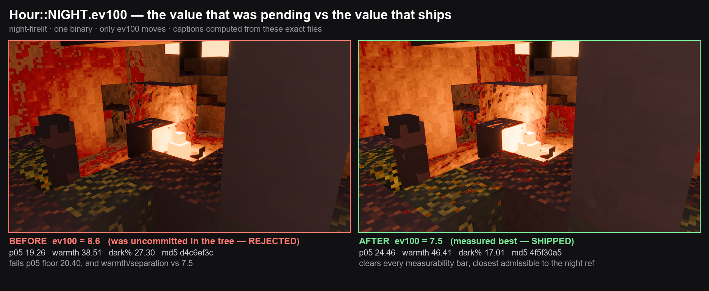
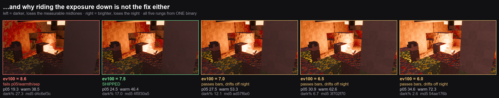

# Hour::NIGHT.ev100 — measured, and the change rejected (2026-08-16, poppy)

**Verdict: `Hour::NIGHT.ev100` stays `7.5`. The `8.6` that was sitting uncommitted
in the tree is a regression.** No pixel in the shipped game moves as a result of
this round; what lands is the measurement, the harness, and a comment block so the
next person does not re-attempt `8.6`.

Commit: `7399a2a`. Baseline: `da807dd`.

## What was pending

The working tree had `ev100: 8.6` behind a marker that read *"PENDING-MEASUREMENT
… Do not commit this marker."* The measurement had never been run. It has now.

## The pair

Single binary, single lever: `VOXELFORGE_LOOK_EXPOSURE` is applied in `look.rs`
*after* the `Hour` constant is picked, so both legs come out of one exe and only
that float moves. The no-lever leg printed `ev100=8.60` at runtime against the
lever leg's `ev100=7.50` — that is what proves the lever and the constant are the
same knob, rather than inferring it from a `strings` scan of the binary.

`8.6` fails the v7 measurability bars outright on `night-firelit`:

| | p05 | warmth | separation | band |
|---|---|---|---|---|
| 7.5 | 24.46 | 46.41 | 91.99 | 32.75 |
| 8.6 | **19.26** | **38.51** | **51.36** | 13.07 |
| bar | ≥ 20.40 | ≥ before | ≥ before | ≥ 2.00 |

## Why the obvious correction is also wrong

Raising `ev100` darkens, so the reflex is to ride it the other way. A 5-rung
ladder (all on one binary) does clear every bar all the way down to 6.0, with
p05/warmth/separation rising monotonically.

**That ladder must not be read as "6.0 wins."** `_poppy_lookv7_gate.py` says in its
own docstring that its clauses ask *"does the ESTIMATOR still have a signal to work
with"*, explicitly **not** "does it look nice". They are monotone in exposure, so
they will always nominate the bottom rung of whatever range is swept. They can
**reject** a value; they cannot **pick** one.

What picks one is the reference `look.rs` already cites — the BSL night plate,
whose property is tonal rather than per-pixel: most of the mass dark, a small
isolated bright tail. Scored as EMD between luma histograms, distance to that
reference gets *worse* the further the exposure is ridden down:

| rung | 6.0 | 6.5 | 7.0 | **7.5** | 8.6 | day control |
|---|---|---|---|---|---|---|
| mean EMD | 11.277 | 8.981 | 6.856 | **4.927** | 2.452 | 12.253 |
| dark% | 2.64 | 6.75 | 12.05 | **17.01** | 27.30 | 4.76 |

At 6.0 the night plate sits nearly as far from the night reference as a **noon**
frame does (11.277 vs 12.253), and the near-black wall faces the `Hour::NIGHT`
doc-comment asks for are gone (dark% 17.01 → 2.64).

The two metrics are opposed, so the value has to maximise night-ness **subject to**
the bars holding. Because warmth/separation are graded as "no worse than 7.5",
monotonicity excludes every darker rung, while every brighter rung buys
measurability by spending the night. **The constrained optimum inside the swept
range is the value that was already there.**

## Is the signal above the noise?

Measured rather than assumed, and measured on *this* capture path rather than
borrowed from another one: the same exe was booted twice with identical env at
ev100 7.5, and the two frames compared.

| axis | repeat-shot noise | 7.5 → 8.6 signal | ratio |
|---|---|---|---|
| p05 | 0.0000 | −5.20 | — |
| warmth | +0.0635 | −7.90 | **124×** |
| separation | −0.1190 | −40.63 | **341×** |

So the rejection is not a capture artefact. One caveat worth carrying: **18.73% of
pixels differ between two identical boots**, so a raw "% of pixels changed" number
is nearly meaningless at small magnitudes on this path — the aggregate estimators
are stable to ~0.1, the per-pixel diff is not. Read the estimators, not the %diff.

## Guards this round runs

- **Harness positive control** — `ev75` is graded against itself and must print
  `d.warm=0.00 d.sep=0.00 %diff=0.00`. It does. If it ever prints nonzero, the
  comparison is broken and no other row means anything.
- **Day negative control** — the anchor refuses to name a pick unless a noon plate
  lands farther from the night reference than every night rung. A metric that
  cannot tell noon from night reports that instead of ranking anyway.
- **Per-rung lever readback** — each rung's applied `ev100` is read back out of the
  run log and matched against its nominal value, so a rung whose env var never
  reached `look.rs` is flagged rather than silently graded.
- **Captions from pixels** — every number under every panel is recomputed from the
  file being drawn, and each panel carries its source md5. The sheet's numbers were
  produced by a second, independent implementation and agree with the gate's.

## Provenance of every input (md5, first 12)

| input | md5 | tracked in git? |
|---|---|---|
| `target-poppy/perf/voxelforge.exe` (08:57:45) | `28534360a288` | no (build artefact) |
| `_poppy_lookv2/ref/bsl-01.jpeg` | `4820a458fc7f` | **no** |
| `_poppy_lookv2/ref/bsl-02.jpeg` | `6d84c6c6659a` | **no** |
| `docs/assets/look/outdoor-noon_after.png` (day control) | `0aeffd966816` | yes |

**Caveat, stated rather than buried:** the two BSL reference plates the anchor
scores against are *not* tracked in git — they exist only in an untracked working
directory. Anyone re-running `_poppy_ev100_night_anchor.py` without those exact
two files (md5s above) will not reproduce the EMD column. The measurability half
of the argument (the table that rejects 8.6) has no such dependency and stands on
tracked inputs alone.

Each sweep plate's md5 is also printed on the sheets themselves, so any panel can
be traced back to the plate it was drawn from.

## Scope note

The decision pair and the ladder are all shot from the **one** 08:57 binary
(sha256 `773a66ae…`, md5 `28534360a288`), which is what makes them a one-variable
comparison. Frames shot after the subsequent rebuild are *not* interchangeable with
them — that rebuild also contains other lanes' landed work (`a83174c` hero G2/G4,
`c5d4886` vfx) — so the rebuild is used only to prove the committed file compiles.

That rebuild relinks `target-poppy/perf/voxelforge.exe` **in place**, so the 08:57
binary the plates came from would otherwise be destroyed by the very build that
verifies the commit. It was copied to `_poppy_ev100night_exe0857.bin` first
(101,063,680 bytes, md5 `28534360a288`, sha256 `773a66ae…` — verified equal to the
source before the relink). That copy is untracked and gitignored by design: it is a
96 MB build artefact, kept only so the plates above can be re-shot from the exact
exe that produced them. Delete it once this round is closed.

## Files

| path | role |
|---|---|
| `scripts/_poppy_ev100_night_shoot.cmd` | two-leg A/B, one binary |
| `scripts/_poppy_ev100_night_gate.py` | grades that pair; imports every bar from the v7 gate |
| `scripts/_poppy_ev100_night_sweep.cmd` | the 5-rung ladder |
| `scripts/_poppy_ev100_night_sweep.py` | grades the ladder + positive control |
| `scripts/_poppy_ev100_night_anchor.py` | reference-distance pick + day negative control |
| `scripts/_poppy_ev100_night_sheet.py` | draws both sheets, captions computed from pixels |
