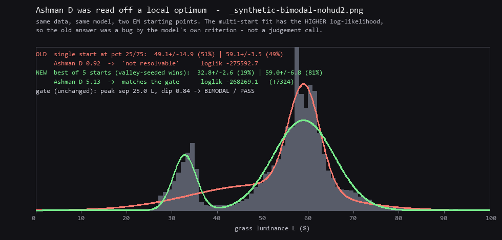
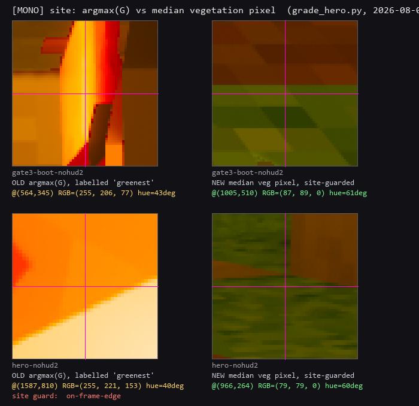

# Poppy — grass bimodality meter + `grade_hero.py` audit (2026-08-08)

> ทั้งสองงานทำโดย **ไม่แตะ cargo** เลย (เลนบิลด์เป็นของ Flamingo) — วัดจากเพลต
> `_poppy_shotset/before/` ทั้ง 8 ใบ ที่ถ่ายด้วย exe `target-flamingo/release/voxelforge.exe`
> (mtime 2026-08-07 05:38, sha256 `CC414845…`, commit `fc329c183`) ตาม `manifest.json`

---

## 1. เครื่องมือใหม่ — `scripts/grass_bimodality.py`

**คำถามที่มันตอบ:** พิกเซล *หญ้า* ในเพลต แตกเป็นสองโหนกใน histogram luminance
(สว่าง/เงา แยกกันจริง) หรือเป็นโหนกเดียว (โทนแบนโทนเดียว)

```
python scripts/grass_bimodality.py <plate>.png [more…] [--out DIR]
       [--expect bimodal|unimodal] [--no-plot] [--no-mask]
```

### ตัวชี้วัด — 4 ตัว อธิบายได้ทุกตัว ไม่ต้องใช้ scipy

| metric | อ่านว่า | ใช้ตัดสิน |
|---|---|---|
| **peak separation** | ระยะ L% ระหว่างยอดสองยอดใน histogram ที่ smooth แล้ว | ✅ ต้อง ≥ 6.0 L |
| **dip depth** | `1 − valley/min(peak)` — หุบลึกแค่ไหน (0 = ไม่มีหุบ, 1 = ไม่ต่อกันเลย) | ✅ ต้อง ≥ 0.20 |
| **valley mass** | สัดส่วนพิกเซลหญ้าที่อยู่ในหุบ (±3 L) | ประกอบ |
| **EM humps + fit dip** | ฟิต 2-gaussian แล้ว **นับโหนกของความหนาแน่นที่ฟิตได้เอง** + วัด dip ด้วยสูตรเดียวกับ gate | ประกอบ |
| **Ashman D** | `√2·|m₁−m₂| / √(s₁²+s₂²)` — ระยะห่างของ *component* (ไม่ใช่คำตัดสิน) | ประกอบ |

> **แก้ 2026-08-08 หลังรีวิว:** เส้น "D ≥ 2 = resolvable" ถูก**ถอดออกจากป้าย** เพราะมันเป็นเกณฑ์
> เฉพาะกรณี component น้ำหนักเท่ากัน+กว้างเท่ากัน — ชุดนี้วัดได้ 87/13, 75/25, 62/38
> จึงอ่าน **จำนวนโหนกของ mixture ที่ฟิตได้** แทน ซึ่งเป็นคำถามเดียวกันแบบตรงๆ
> และ **Sarle BC ถูกถอดทิ้งทั้งตัว** — มันได้ 0.485 บน positive control (ต่ำกว่าเส้น 0.555 ของตัวเอง)
> เพราะ BC สร้างจาก skew/kurtosis จึงตาบอดกับ mixture ที่น้ำหนักไม่สมดุล (control ฟิตได้ 19/81)
> **ตัวประกอบที่มองไม่เห็น positive control = ประกอบอะไรไม่ได้** ปล่อยไว้ในตารางมีแต่ให้เครดิตผิดๆ

**ไม่ใช้ Hartigan dip test จริง โดยตั้งใจ** — ต้องมี `scipy`/`diptest` ซึ่งเครื่องนี้ไม่มี
(`numpy 2.1.3` + `pillow 11.3.0` เท่านั้น) และ p-value ที่ไม่มีใครคำนวณซ้ำได้เอง
เป็นหลักฐานที่อ่อนกว่าตัวเลข 4 ตัวที่ทุกคนไล่ย้อนจาก histogram ที่เซฟไว้ได้

พล็อตออกเป็น PNG เอง (PIL ล้วน ไม่มี matplotlib) พร้อม mask overlay ให้ตรวจด้วยตา

### 🩹 มาสก์เกือบหลอกฉัน — และมันคือบั๊กตระกูลเดียวกับคบไฟของ Flamingo

รอบแรกใช้ hue band ของ `grade_g7.py:is_veg` (hue 40–150°) ตรงๆ ผลออกมา **3/8 PASS**
ดูดีเกินไป → ไปดูมาสก์จริง พบว่า:

- โหนกสว่างของทั้ง 3 เพลตกองอยู่ที่ **hue 43.4 ± 0.3°** (สีเดียว แบนสนิท) ส่วนหญ้าจริงอยู่ที่ 52–77°
- crop ออกมาดู: บน `grade-vista` พิกเซลสว่างพวกนั้นคือ **บล็อกที่ถูกไฟกองไฟส่องจนขาว** ไม่ใช่หญ้าเลย
- `s3-clash` หนักสุด — สิ่งปนเปื้อนกิน **64%** ของมาสก์

**ทางแก้ที่เลือก:** ตรวจ histogram ของ *hue* ในมาสก์ก่อน ถ้ามันแตกเป็นสองโหมด
(ห่าง ≥ 12° และ dip ≥ 0.20) = มาสก์คาบสองวัสดุ → ตัดที่หุบ hue แล้ว **เก็บโหมดที่เขียวกว่า**

- เก็บ "โหมดที่เขียวกว่า" ไม่ใช่ "โหมดที่ใหญ่กว่า" เพราะบน `s3-clash` สิ่งปนเปื้อนเป็นฝ่ายข้างมาก
  → กฎ majority จะทิ้งหญ้าแล้วไปวัดหิน
- **ไม่ใช้ hue cut ตายตัว** เพราะหญ้าจริงของ `s1-vista` อยู่ที่ 45.7° ทับกับสิ่งปนเปื้อน 43.3° พอดี —
  ค่า cut ที่ล้างเพลตหนึ่งได้ จะเชือดหญ้าของอีกเพลตหนึ่งทิ้ง (นี่คือกับดัก "จูนมากับเฟรมเดียว" อีกรอบ)

ทุกครั้งที่ตัด สคริปต์พิมพ์บรรทัด `mask : …kept greener mode, dropped X%` ออกมาเสมอ — ตัวเลขไล่ย้อนได้

### ผลจริงบนเพลต before ทั้ง 8 (เครื่องวัดใช้การได้)

```
plate                          n grass    sep    dip  humps   AshD  verdict
_synthetic-bimodal-nohud2        74052   25.0   0.84      2   5.13  PASS   <- positive control
gate3-boot-nohud2                20069    0.0   0.00      1   0.28  FAIL
gate3-combat-nohud2               2480    0.0   0.00      1   2.45  FAIL
gate3-walk-nohud2                 3008   10.0   0.02      2   2.38  FAIL
grade-vista-nohud2               13690    0.0   0.00      1   0.10  FAIL
hero-nohud2                      18811    0.0   0.00      1   1.47  FAIL
s1-vista-nohud2                  32945   10.0   0.05      2   2.80  FAIL
s3-clash-nohud2                   2912    0.0   0.00      1   0.98  FAIL
s4-raking-nohud2                 74054    0.0   0.00      1   0.28  FAIL

  fit-vs-gate disagreement (gate wins -- it reads the histogram, the fit reads
  two gaussians it imposed):
    gate3-walk-nohud2   EM 2 humps / fit dip 0.06, but the pixels' own dip is 0.02
    s1-vista-nohud2     EM 2 humps / fit dip 0.37, but the pixels' own dip is 0.05

1 PASS / 8 FAIL / 0 UNRELIABLE
```

รันซ้ำสองรอบ hash เท่ากันเป๊ะ (`Get-FileHash` บน stdout) — EM ไม่มีสุ่ม seed คงที่

**8/8 = "โหนกเดียว / FAIL"** ตามที่ต้องพิสูจน์ — 5 ใบไม่มียอดที่สองรอด smoothing เลย
อีก 3 ใบ (`gate3-walk`, `s1-vista`) มียอดที่สองแต่ dip แค่ 0.02–0.05 = ไหล่ ไม่ใช่หุบ

### และมันไม่ใช่ตรายาง — positive control

เอา `s4-raking` (FAIL, โหนกเดียว) มาทำให้หญ้าครึ่งแนวทแยงสว่างขึ้น ×1.9
(คูณ RGB → เปลี่ยนเฉพาะ value คง hue/sat ไว้ พิกเซลจึงยังอยู่ในมาสก์เดิม):

| | n grass | sep | dip | valley mass | verdict |
|---|---|---|---|---|---|
| s4-raking เดิม | 74054 | 0.0 | 0.00 | n/a | **FAIL** |
| ทำให้เป็นสองโหนก | 74052 | **25.0** | **0.84** | **1.6%** | **PASS** |

มาสก์นิ่ง (74054 → 74052 px) เปลี่ยนแค่ luminance — เครื่องวัดพลิกคำตัดสินตามที่ควร

### 🔴 แก้หลังรีวิว — Ashman D อ่านมาจาก **local optimum** (ไม่ใช่ "EM ฟิตหางยาวไม่ลง")

รอบแรกฉันเขียนแก้ตัวว่า "EM ฟิตโหนกหางยาวไม่ลง" — **ผิด** ตรวจแล้วมันคือบั๊ก init:
EM ถูก seed จุดเดียวที่ percentile 25/75 แล้วไปติดหลุมตื้น
(`49.1±14.9 / 59.1±3.5` → D 0.92, "แยกไม่ออก") และ**ไม่ขยับ**แม้ `iters=3000, tol=1e-12`
คือ converge จริง แต่ converge ผิดที่

seed ที่ค่าเฉลี่ยสองฝั่งของ **หุบที่สคริปต์หาเจอเอง** ได้ `32.8±2.6 / 59.0±6.8` → **D 5.13**
และ **log-likelihood สูงกว่า** (−268269.1 vs −275592.7, +7324) — คือฟิตที่ดีกว่า
**ตามเกณฑ์ของโมเดลเอง** ฉะนั้นมันเป็นบั๊ก ไม่ใช่ข้อจำกัดของวิธี



**ทางแก้:** `gmm2()` กลายเป็น **multi-start** — รัน 4–5 seed (percentile 25/75, 5/95, 40/60,
min/max, + valley split เมื่อมีหุบ) แล้วเก็บตัวที่ loglik สูงสุด ไม่มีสุ่ม → รันซ้ำได้ค่าเดิม

**ผลต่อชุดหลักฐาน:** ก่อนแก้ ใบที่ FAIL ได้ D 2.38/2.80 (เกินเส้น "≥2 = resolvable" ที่ docstring
เขียนเอง) ส่วนใบ PASS ได้ 0.92 — **สวนทางกันหมด** หลังแก้ control ขึ้นเป็น **5.13 = สูงสุดในชุด**
ลำดับถูกต้องแล้ว และเส้น "≥2" ถูกถอดจากป้ายพร้อมเพิ่มคอลัมน์ `humps` ที่ตอบคำถามตรงๆ

**สมมติฐานที่ใช้:** ตีความโจทย์ว่า *สองโหนก = ผ่าน* (แสง/เงาบนหญ้าแยกกันจริง),
*โหนกเดียว = ตก* ถ้าเลนต้องการทางกลับกัน สั่ง `--expect unimodal` ได้ทันที ไม่ต้องแก้โค้ด

---

## 2. `grade_hero.py` — สมมติฐาน "eyedrop พิกัดตายตัว" : **ตกไป แต่เจอบั๊กพันธุ์เดียวกัน 2 ตัว**

### ฟันธง: กรอบตายตัว **ถูกลบไปแล้วจริง**

commit `fa05c84` (2026-08-07) เอา search box ของ G5 (`x∈[0.01W,0.30W]`) ออกหมดแล้ว
และเติม floor `L ≥ 55` ให้ G6 ตาม rubric §G6 clause (ข). อ่านโค้ดปัจจุบัน + รันจริงทั้ง 8 เพลตแล้ว
— **ไม่มีพิกัด hard-code เหลืออยู่** สมมติฐานเดิม (จาก `note-poppy-regrade-results-2026-08-07.md`) **ปิดได้**

แต่ "ค้นทั้งเฟรม" ไม่ได้แปลว่าปลอดภัย — มันแค่ย้ายจาก *จิ้มผิดที่ตายตัว* ไปเป็น
*จิ้มของสว่างที่ผิดชิ้น* ซึ่งเจอ 2 ตัว:

### 🔴 บั๊ก 1 — G6 ให้ PASS กับ **แสงเรืองรอบตัวละคร** (แฝดของบั๊กคบไฟ)

`gate3-boot`: G6 เลือก patch @(564,360) L=60.8% → **PASS** ไม่มี flag ใดๆ
crop ออกมาดูแล้วมันคือ **ขอบเรืองแสงของแคปซูลผู้เล่นสีแดง** ไม่ใช่พื้นผิวที่โดนแดด

**ตัวแยกที่วัดได้:** เฟซในเรนเดอร์นี้เป็น flat-shaded → patch ของพื้นผิวจริงต้องเรียบ
ส่วน bloom halo เป็น gradient ต่อเนื่อง วัด std-dev ของ luminance *ภายใน* patch:

| | sd ภายใน patch |
|---|---|
| ผู้ชนะ G6 ของ `gate3-boot` (แสงเรือง) | **24.1 L** |
| candidate top-4 ที่เหลือ **ทั้ง 8 เพลต** | ≤ 5.8 L |

ช่องว่างกว้าง → ตั้ง `PATCH_SD_MAX = 10.0` แล้วเพิ่ม flag `not-a-flat-surface(sd=…)`
เข้า `site_flags()` (ตามดีไซน์เดิมของไฟล์: flag ที่ site → รายงาน `UNRELIABLE` ไม่ใช่เดาต่อ)

ตรวจ site ที่ PASS ที่เหลือด้วยตาแล้ว — `gate3-combat` @(492,594), `grade-vista` @(918,324),
`s3-clash` @(150,759) ทั้งสามอยู่บน **หน้าบล็อกด้านบนที่โดนแดดจริง** ไม่โดน flag ผิด

### 🔴 บั๊ก 2 — `[MONO]` ใช้ `g >= r` รายงาน **0.00% บนเฟรมที่ครึ่งล่างเป็นหญ้าทั้งแผง**

`s1-vista` เป็นเพลตที่หญ้าเยอะที่สุดใบหนึ่ง แต่ MONO เดิมรายงาน `green-dominant share = 0.00%`
= "material identity ยุบเป็นโมโนโครม" ทั้งที่ไม่ได้ยุบเลย

รากปัญหาเขียนไว้อยู่แล้วใน `scripts/grade_g7.py:is_veg` — หญ้าที่โดนแดดในลุคนี้เป็น
เหลืองมะกอกอุ่น คือ **R > G** มาสก์ green-dominant จึงหาไม่เจอบนเฟรมที่ *แสงถูก*
เปลี่ยนไปใช้ hue band 40–150° แบบเดียวกับ `grade_g7.py`:

| plate | เดิม `g>=r` | ใหม่ hue band |
|---|---|---|
| s1-vista | **0.00%** | **10.14%** |
| s4-raking | 5.62% | 22.66% |
| gate3-boot | 7.33% | 12.25% |

หัวข้อที่พิมพ์เปลี่ยนเป็น `vegetation share` / `veg share` ให้ตรงกับสิ่งที่วัดจริง
(`regrade.py:_parse_hero` อ่านแค่ G3/G5/G6 — ไม่กระทบ ตรวจแล้ว)

### 🔴 บั๊ก 2b (เจอตอนรีวิว) — `[MONO]` **แก้ตัวเลขแล้วแต่ลืม site** — และ site คือหัวเดิมของบั๊กเดียวกัน

รอบแรกฉันแก้แค่ *share* แล้วสรุปว่า "MONO ✅ ใช้ได้แล้ว" — **เกินจริงไปหนึ่งขั้น**
เพราะพิกัดที่พิมพ์ข้างๆ ยังเป็น `argmax(G)` แล้วติดป้ายว่า *"greenest"* ซึ่งจริงๆ คือ
**พิกเซลที่สว่าง/ไหม้ที่สุดในมาสก์** — extremum ที่ไม่ผ่าน `site_flags()` เลยสักตัว
ทั้งที่ docstring ที่ฉันเพิ่งเขียนเองบอกว่า "การค้นทั้งเฟรมจะเจอของสว่างที่ผิดชิ้นเสมอ
ถ้าไม่ sanity-check site"

รันของจริงเพื่อยืนยัน (ตัวเลขตรงกับที่รีวิวเวอร์ชี้ทุกหลัก):

| plate | เดิม `argmax(G)` "greenest" | ใหม่ median veg (guarded) |
|---|---|---|
| gate3-boot | @(564,345) RGB=(255,206,77) hue **43.5°** | @(1005,510) RGB=(87,89,0) hue **61.3°** |
| hero | @(1587,810) RGB=(255,221,153) hue 40.0° **[on-frame-edge]** | @(966,264) RGB=(79,79,0) hue 60.0° |

- `gate3-boot` เดิมห่างจาก bloom halo @(564,360) ที่ G6 เพิ่ง flag ไปแค่ **15 px** = ของชิ้นเดียวกัน
  และ hue 43.5° ก็คือ**สิ่งปนเปื้อนตัวเดียวกัน**กับที่ `grass_bimodality.py` ต้องสร้าง hue-split guard มาตัดทิ้ง (43.4°)
- `hero` เดิมคือมุมเฟรมที่ G6 ติด flag `on-frame-edge` พอดี

**ทางแก้:** เลิกใช้ extremum — พิมพ์ **พิกเซลหญ้าที่ median ทั้ง hue และ luminance**
(เลือกจากตัวที่ผ่าน guard ก่อน; ถ้าไม่มีเลยก็พิมพ์ median พร้อม flag ให้เห็นว่าอย่าเชื่อ)
แล้วส่งผ่าน `site_flags()` + `patch_sd()` เหมือนทุก gate ในไฟล์ พร้อมพิมพ์ว่า
`N/M samples pass the site guards`

เหตุผลที่ใช้ median ไม่ใช่ extremum: คำถามของ MONO คือ "material identity รอดไหม" —
พิกเซลหญ้าทั่วๆ ไปตอบคำถามนี้ ส่วน outlier ไม่เคยตอบ



ตรวจทั้ง 4 เพลตหลังแก้: site ใหม่ hue 46–61°, R>G, B=0 (เหลืองมะกอก = หญ้าจริง),
อยู่กลางเฟรม, **ไม่ติด flag สักใบ**

### 🟡 บั๊ก 3 (เล็ก) — ป้าย threshold ของ G3 ไม่ตรงโค้ด

พิมพ์ว่า `(job floor >=10)` แต่โค้ดทดสอบ `p05 >= 8`. ของ **ถูกคือ 8** — rubric §G3 +
calibration log 2026-07-25 เปลี่ยนจาก "พิกเซลมืดสุด ≥ 10%" มาเป็น "interior p05-L ≥ 8%"
แล้ว และ `grade_gate.py:55` ก็ใช้ 8. เป็นป้ายค้าง ไม่ใช่ threshold ผิด — แก้ข้อความให้ตรง
(p05 จริงของชุดนี้อยู่ 14–29 จึงไม่เคยเปลี่ยนคำตัดสินใบไหน)

### ผลหลังแก้ — ต่างจากเดิมใบเดียว

| plate | G3 | G5 | G6 (เดิม → ใหม่) | veg share (เดิม → ใหม่) |
|---|---|---|---|---|
| gate3-boot | PASS | UNRELIABLE | **PASS → UNRELIABLE** (not-a-flat-surface sd=24.1L) | 7.33 → 12.25% |
| gate3-combat | PASS | UNRELIABLE | PASS | 0.75 → 1.93% |
| gate3-walk | PASS | UNRELIABLE | FAIL | 1.30 → 1.46% |
| grade-vista | PASS | PASS | PASS | 4.52 → 8.10% |
| hero | PASS | UNRELIABLE | UNRELIABLE (on-frame-edge) | 5.37 → 10.71% |
| s1-vista | PASS | UNRELIABLE | FAIL | **0.00 → 10.14%** |
| s3-clash | PASS | UNRELIABLE | PASS | 0.53 → 2.50% |
| s4-raking | PASS | UNRELIABLE | FAIL | 5.62 → 22.66% |

### เชื่อ `grade_hero.py` ได้แค่ไหน (สรุป)

- ✅ **G3** — เชื่อได้ วิธีเดียวกับ `grade_gate.py` (interior p05 ตัดขอบ 8%) ผลตรงกัน
- ⚠️ **G6** — เชื่อได้ *ก็ต่อเมื่อ* verdict ไม่ติด flag; ตอนนี้ดัก edge / sky / sky-hue / ไม่แบน แล้ว
  แต่มันยังเป็น "max ทั้งเฟรม" อยู่ → ควรอ่านคู่กับพิกัด site ที่มันพิมพ์เสมอ
- ⛔ **G5** — บนเพลต Edhari กลางแจ้ง **ไม่มีของให้วัด** 7/8 ใบรายงาน UNRELIABLE ตามที่ควร
  อย่าเอาไปนับคะแนน
- ✅ **[MONO]** — *share* เชื่อได้หลังเปลี่ยนเป็น hue band; *site* เชื่อได้หลังเปลี่ยนเป็น
  median + ผ่าน `site_flags()` (รอบแรกฉันเคลมว่า "MONO ✅" ทั้งที่ site ยังพัง — เกินจริง)
- 🔻 ยังเป็น **ADVISORY** — `grade_gate.py` เป็นผู้ตัดสิน G3/G5/G6 ตาม rubric ไม่เปลี่ยน

---

## ไฟล์ที่แตะ

| ไฟล์ | สถานะ |
|---|---|
| `scripts/grass_bimodality.py` | ใหม่ + **แก้หลังรีวิว** (EM multi-start · `mix_shape()` humps+fit dip · ถอด Sarle BC · แถว fit-vs-gate disagreement) |
| `scripts/grade_hero.py` | แก้ 4 จุด (G6 flatness guard · MONO hue band · **MONO site median+guarded** · ป้าย G3) |
| `docs/assets/poppy-ashman-localopt-before-after-2026-08-08.png` | ใหม่ (หลักฐาน local optimum) |
| `docs/assets/poppy-mono-site-before-after-2026-08-08.png` | ใหม่ (หลักฐาน site เดิม vs ใหม่) |
| `docs/note-poppy-grass-meter-and-grade-hero-audit-2026-08-08.md` | ใหม่ (ไฟล์นี้) |

artifacts (histogram + mask ทุกใบ) อยู่ที่ `_poppy_grass/` — โดน `.gitignore` กฎ `_*/`
เหมือนของเลนอื่น ไม่ commit; สร้างใหม่ได้ด้วยคำสั่งเดียวจากสคริปต์

## ฝากเจ้าของ `scripts/grade_sunsplit.py` (คนละเลน ไม่ได้แตะให้)

`grade_sunsplit.py:159` มีบรรทัด `bc = (skew**2 + 1.0) / max(kurt, 1e-9)` พิมพ์เป็น
`[xref] bimodality coeff (>0.555 suggests bimodal)` — ตัวเดียวกับที่ฉันเพิ่งถอดออกจาก
`grass_bimodality.py` วันนี้ เพราะมันได้ **0.485 บนเพลตที่ใส่สองโหนกให้ชัดๆ**
(sep 25 L, dip 0.84) คือมองไม่เห็น positive control ของตัวเอง — BC ตาบอดกับ mixture
ที่น้ำหนักไม่สมดุล (control ฟิตได้ 19/81) ถ้าจะเก็บไว้ ควรวัดกับ control ก่อนว่าเห็นไหม
เพลตควบคุมอยู่ที่ `_poppy_grass/_synthetic-bimodal-nohud2.png` หยิบไปใช้ได้เลย

## ค้างรอ

รอ Flamingo แจ้งบิลด์เสร็จ → ถ่าย 8 เพลตชุดใหม่ด้วย `_poppy_shotset` → รัน
`grass_bimodality.py` กับ after + ทำชีต before/after เทียบกัน
(ยังไม่แตะ cargo — เช็คแล้วไม่มี `cargo.exe`/`rustc.exe` เดินอยู่ และ exe ล่าสุดยังเป็นตัว 08-07 05:38)
