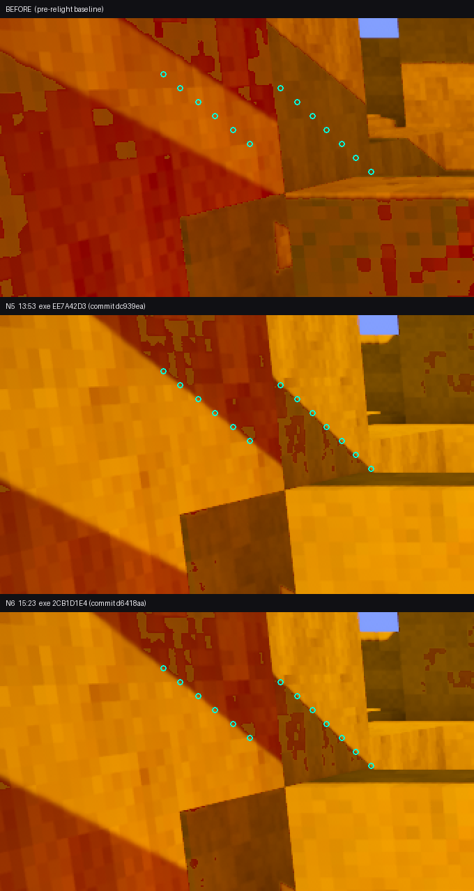

# N6 regrade — the ratio fix was already in N5, and the numbers say so

2026-08-08, Poppy. Measurement only: python over saved PNGs. No cargo, no engine run.

## The premise of this round is wrong, and it is provable

The brief was "N5 (13:53) is BEFORE the ratio fix; commit 8303db5 landed at 14:54; N6
(15:23) is AFTER — measure what the fix bought." The commit timestamp is real. The
inference from it is not: **the look.rs edit was on disk and compiled into the 13:53
binary; the 14:54 commit only recorded it.**

Three independent checks, none of which needs the engine:

**1. The two binaries are the same program.** Both shotsets keep their own `vfprobe.exe`
and both match their manifest sha256.

| | N5 | N6 |
|---|---|---|
| exe mtime | 13:52:02 | 15:22:20 |
| manifest `commit` (= git HEAD at shoot time) | `dc939eaa1` | `d6418aaab` |
| sha256 | `EE7A42D3…F021EB` | `2CB1D1E4…50A841` |
| size | 80,680,960 B | 80,680,960 B |

Byte-for-byte the two files differ in **30 bytes out of 80,680,960 (0.00004 %)**, in six
clusters, every one of them a link stamp:

```
0x00000100   2B   PE COFF TimeDateStamp
0x002C30C1   2B   \
0x002C3113   2B    > embedded build timestamps
0x002C3160   2B   /
0x041D8E94  58B   debug directory (same timestamp repeated)
0x041D8FE8  16B   PDB build GUID
```

**Zero code or rodata bytes differ.** N6 is a relink of N5's exact program.

**2. The 13:52 binary already carries the new constants.** Scanning both images for the
f32 little-endian bit patterns and for string literals that commit 8303db5 introduced:

| marker | N5 exe | N6 exe |
|---|---|---|
| `22000.0f32` (`00e0ab46`) — the NEW illuminance | 2 | 2 |
| `11000.0f32` (`00e02b46`) — the OLD illuminance | **0** | **0** |
| `VOXELFORGE_LOOK_CONTACT` (new in 8303db5) | 1 | 1 |
| `ContactShadows` | 28 | 28 |
| `contact_shadow` | 49 | 49 |

The pre-commit binary contains the post-commit illuminance and contains no trace of the
old one, plus every string the contact-shadow layer introduced.

**3. The plates agree.** Per-plate mean |Δ| between the N5 and N6 after-frames:

| plate | mean abs Δ (0-255) | % px moved >2 |
|---|---|---|
| s4-raking | 0.114 | 0.49 % |
| hero | 0.175 | 1.19 % |
| s1-vista | 0.264 | 2.86 % |
| gate3-boot | 0.364 | 3.00 % |
| grade-vista | 0.482 | 4.46 % |
| gate3-combat | 2.236 | 30.84 % |
| s3-clash | 2.347 | 11.50 % |
| gate3-walk | 23.677 | 95.85 % |

17°/11 k → 22°/22 k is a **2.57× change in ground irradiance**. It cannot render as
0.36/255. The three plates that do move are the ones with a moving actor
(`gate3-walk` = play-demo mid-stride, `gate3-combat`, `s3-clash`) — animation phase, not light.

**So N5 and N6 are the same lighting, and the 4/8 + 7/8 measured at 13:53 were already
the post-fix condition.** The ratio fix is real and it is banked — it just banked an
hour earlier than the commit clock says.

## The three columns

`before` = `_pixel_shotset_N6/before/` (identical to N5's, mtime 08-07 02:35).
`N5` and `N6` are as shot. Every number below re-measured today from the PNGs.

### grass_bimodality.py — separation (L) / dip / verdict

| plate | before | N5 | N6 |
|---|---|---|---|
| gate3-boot | 0.0 / 0.00 **FAIL** | 18.0 / 0.69 **PASS** | 18.0 / 0.68 **PASS** |
| gate3-combat | 0.0 / 0.00 FAIL | 0.0 / 0.00 FAIL | 0.0 / 0.00 FAIL |
| gate3-walk | 10.0 / 0.02 FAIL | 29.0 / 0.50 **PASS** | 28.0 / 0.43 **PASS** |
| grade-vista | 0.0 / 0.00 FAIL | 25.0 / 0.56 **PASS** | 25.0 / 0.57 **PASS** |
| hero | 0.0 / 0.00 FAIL | 0.0 / 0.00 FAIL | 0.0 / 0.00 FAIL |
| s1-vista | 10.0 / 0.05 FAIL | 25.0 / 0.56 **PASS** | 25.0 / 0.56 **PASS** |
| s3-clash | 0.0 / 0.00 FAIL | 0.0 / 0.00 FAIL | 0.0 / 0.00 FAIL |
| s4-raking | 0.0 / 0.00 FAIL | 0.0 / 0.00 FAIL | 0.0 / 0.00 FAIL |
| **total** | **0/8** | **4/8** | **4/8** |

### grade_sunsplit.py — separation (L) / dip / balance

| plate | before | N5 | N6 |
|---|---|---|---|
| gate3-boot | 9.99 / 0.000 / 0.412 FAIL | 23.39 / 0.811 / 0.440 **PASS** | 23.40 / 0.812 / 0.438 **PASS** |
| gate3-combat | N/A (grass <1 %) | 28.06 / 0.762 / 0.189 **PASS** | 28.02 / 0.802 / 0.187 **PASS** |
| gate3-walk | 13.79 / 0.323 / 0.331 **PASS** | 26.03 / 0.524 / 0.350 **PASS** | 26.08 / 0.512 / 0.294 **PASS** |
| grade-vista | 10.22 / 0.000 / 0.419 FAIL | 24.40 / 0.669 / 0.423 **PASS** | 24.39 / 0.670 / 0.423 **PASS** |
| hero | 5.26 / 0.000 / 0.333 FAIL | 22.94 / 0.000 / 0.071 FAIL | 22.90 / 0.000 / 0.071 FAIL |
| s1-vista | N/A | 20.14 / 0.627 / 0.298 **PASS** | 19.86 / 0.607 / 0.300 **PASS** |
| s3-clash | N/A | N/A | N/A |
| s4-raking | 6.97 / 0.000 / 0.417 FAIL | 11.01 / 0.000 / 0.068 FAIL | 11.01 / 0.000 / 0.068 FAIL |
| **total** | **1/5 gradeable** | **5/7** | **5/7** |

### grade_gate.py — G3 / G5 / G6

| plate | before | N5 | N6 |
|---|---|---|---|
| gate3-boot | P P P | P P P | P P P |
| gate3-combat | P **F** P | P P P | P P P |
| gate3-walk | P **F** **F** | P P P | P P P |
| grade-vista | P P P | P P P | P P P |
| hero | P P P | P **F** P | P **F** P |
| s1-vista | P **F** **F** | P **F** P | P **F** P |
| s3-clash | P P P | P P P | P P P |
| s4-raking | P P **F** | P P **F** | P P **F** |
| **G6 total** | **5/8** | **7/8** | **7/8** |

G3 is 8/8 in all three columns — the relight did not spend the shade floor.
G5 fails on `hero` and `s1-vista` in both after-columns (it passed on `before`): the
brightest near-neutral pixel is now clipped, which is the cost of the brighter key.

## The question that matters: is there a cast shadow ON THE GRASS yet?

`--albedo-check`, same camera, against the pre-light plate. Percentage = share of the
"in shade now" grass blobs (≥500 px) that were **already** the dark half before the light
changed. >80 % ⇒ the split is painted into the texture.

| plate | N5 overlap (base rate) | N6 overlap (base rate) | verdict |
|---|---|---|---|
| gate3-boot | 94.2 % (56.4 %) | **93.3 %** (56.5 %) | ALBEDO |
| grade-vista | 89.3 % (54.1 %) | **90.6 %** (54.1 %) | ALBEDO |
| s1-vista | 91.5 % (67.7 %) | **91.5 %** (67.5 %) | ALBEDO |
| gate3-walk | 58.2 % (40.4 %) | **21.1 %** (36.6 %) | not albedo-locked — but see below |
| gate3-combat, hero, s3-clash, s4-raking | grass reads one hump — no shade population to test | same | untestable |

**Answer: no. Still 89–94 %, unchanged from N5.** On the three plates where the question
is answerable and the framing is static, the dark grass is still the grass texture's own
dark checker, brought out by the higher key — not a shadow cast onto it.

`gate3-walk` is the one that reads "real", and I do not trust it as evidence: it is the
plate whose pixels moved 95.85 % between two runs of *identical code*, and its own
overlap swung 58.2 % → 21.1 % across those two runs. A number that moves 37 points at
fixed code is measuring the animation phase, not the light.

## Wall shadow edge, gate3-boot

There **is** a genuine cast shadow in this frame — a sunbeam band across the upper-left
terracotta wall, bounded by two parallel ~40°-off-axis edges. I could not recover the
exact `--at` coordinates behind the 13:53 "median 3.49 px" line (they were never written
to disk), so I re-derived 14 sites, locking them on the **N5** plate by snapping to the
local gradient ridge, then measured the identical pixel coordinates on all three columns.

| | before | N5 | N6 |
|---|---|---|---|
| sites yielding a gradeable ramp | **1 / 14** | 14 / 14 | 14 / 14 |
| pooled median at those sites | 17.32 px (n=1) | **2.62 px** | **2.63 px** |
| CONTROL sky silhouette median | 1.77 px | 1.82 px | 1.82 px |
| ratio | — | **1.44×** | **1.45×** |
| sites scoring SOFT (≥1.5× control) | — | 6 / 14 | 6 / 14 |

Per-site N5 → N6: 2.28→2.29, 2.96→2.97, 3.52→3.49, 3.94→3.90, 3.39→3.39, 4.82→5.29,
1.88→1.86, 9.58→9.62, 8.59→8.68, 1.58→1.56, 1.52→1.50, 1.71→1.79, 1.52→1.66, 1.71→1.72.
No movement outside repeat-shot noise.

**13 of 14 sites have no gradeable ramp at all in the `before` plate** — the edge those
sites sit on did not exist before the relight. That is the cleanest single statement of
what the ratio fix bought: it did not soften an edge, it created one.



## What N6 does NOT contain

`40cf97e` (15:27:13) raises `PCSS_WIDTH` 4.0 → 16.0. The N6 exe was linked at 15:22:20,
five minutes earlier, and is byte-identical in code to the 13:52 build. **Every penumbra
number above was measured with the 4.0 penumbra that 40cf97e's own commit message shows
is inside the capture noise floor.** The PCSS change is unshot. If the point of this
round was to move the edge width, that shot still has to be taken.

## What is not measurable from here

- Whether the sunbeam edge is soft *because of* PCSS or because of AA/TAA: at 1.44×
  control with 8/14 sites sitting at the AA floor, the tool cannot separate them, and
  it says so rather than averaging them into a "soft" verdict.
- The albedo question on gate3-combat / hero / s3-clash / s4-raking: their grass is one
  hump, so there is no shade population to test the overlap of. Not a pass, not a fail.
- s4-raking is pinned to `VOXELFORGE_LOOK_SUN=6,140,9000` by `_poppy_shotset.ps1`, so it
  never sees `Hour::GOLDEN` at all. It cannot show the ratio fix and it does not.
