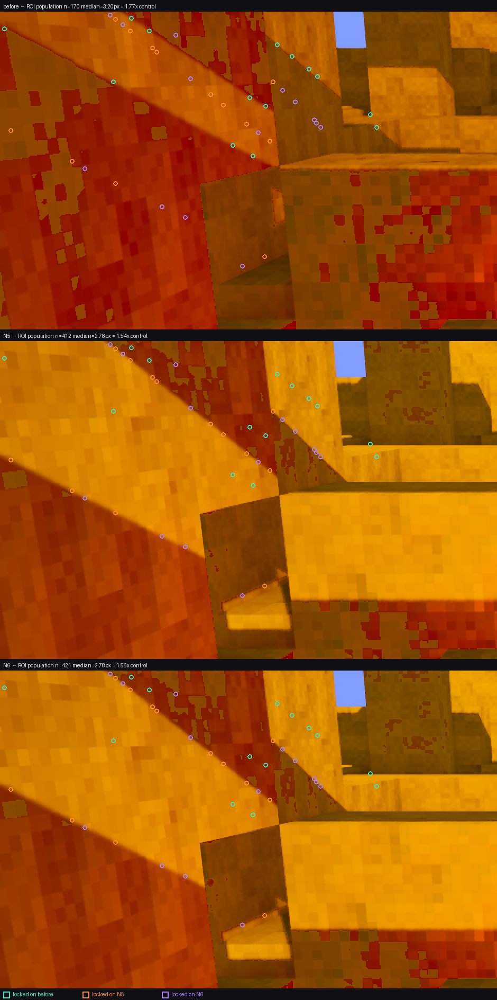

# N6 regrade — the ratio fix was already in N5, and the numbers say so

2026-08-08, Poppy. Measurement only: python over saved PNGs. No cargo, no engine run.

## The premise of this round is wrong, and it is provable

The brief was "N5 (13:53) is BEFORE the ratio fix; commit 8303db5 landed at 14:54; N6
(15:23) is AFTER — measure what the fix bought." The commit timestamp is real. The
inference from it is not: **the look.rs edit was on disk and compiled into the 13:53
binary; the 14:54 commit only recorded it.**

Three independent checks, none of which needs the engine:

**1. The two binaries are the same program.** Both shotsets keep their own `vfprobe.exe`
and both match their manifest sha256.

| | N5 | N6 |
|---|---|---|
| exe mtime | 13:52:02 | 15:22:20 |
| manifest `commit` (= git HEAD at shoot time) | `dc939eaa1` | `d6418aaab` |
| sha256 | `EE7A42D3…F021EB` | `2CB1D1E4…50A841` |
| size | 80,680,960 B | 80,680,960 B |

Byte-for-byte the two files differ in **30 bytes out of 80,680,960 (0.00004 %)**, in six
clusters, every one of them a link stamp:

```
0x00000100   2B   PE COFF TimeDateStamp
0x002C30C1   2B   \
0x002C3113   2B    > embedded build timestamps
0x002C3160   2B   /
0x041D8E94  58B   debug directory (same timestamp repeated)
0x041D8FE8  16B   PDB build GUID
```

**Zero code or rodata bytes differ.** N6 is a relink of N5's exact program.

**2. The 13:52 binary already carries the new constants.** Scanning both images for the
f32 little-endian bit patterns and for string literals that commit 8303db5 introduced:

| marker | N5 exe | N6 exe |
|---|---|---|
| `22000.0f32` (`00e0ab46`) — the NEW illuminance | 2 | 2 |
| `11000.0f32` (`00e02b46`) — the OLD illuminance | **0** | **0** |
| `VOXELFORGE_LOOK_CONTACT` (new in 8303db5) | 1 | 1 |
| `ContactShadows` | 28 | 28 |
| `contact_shadow` | 49 | 49 |

The pre-commit binary contains the post-commit illuminance and contains no trace of the
old one, plus every string the contact-shadow layer introduced.

**3. The plates agree.** Per-plate mean |Δ| between the N5 and N6 after-frames:

| plate | mean abs Δ (0-255) | % px moved >2 |
|---|---|---|
| s4-raking | 0.114 | 0.49 % |
| hero | 0.175 | 1.19 % |
| s1-vista | 0.264 | 2.86 % |
| gate3-boot | 0.364 | 3.00 % |
| grade-vista | 0.482 | 4.46 % |
| gate3-combat | 2.236 | 30.84 % |
| s3-clash | 2.347 | 11.50 % |
| gate3-walk | 23.677 | 95.85 % |

17°/11 k → 22°/22 k is a **2.57× change in ground irradiance**. It cannot render as
0.36/255. The three plates that do move are the ones with a moving actor
(`gate3-walk` = play-demo mid-stride, `gate3-combat`, `s3-clash`) — animation phase, not light.

**So N5 and N6 are the same lighting, and the 4/8 + 7/8 measured at 13:53 were already
the post-fix condition.** The ratio fix is real and it is banked — it just banked an
hour earlier than the commit clock says.

## The three columns

`before` = `_pixel_shotset_N6/before/` (identical to N5's, mtime 08-07 02:35).
`N5` and `N6` are as shot. Every number below re-measured today from the PNGs.

### grass_bimodality.py — separation (L) / dip / verdict

| plate | before | N5 | N6 |
|---|---|---|---|
| gate3-boot | 0.0 / 0.00 **FAIL** | 18.0 / 0.69 **PASS** | 18.0 / 0.68 **PASS** |
| gate3-combat | 0.0 / 0.00 FAIL | 0.0 / 0.00 FAIL | 0.0 / 0.00 FAIL |
| gate3-walk | 10.0 / 0.02 FAIL | 29.0 / 0.50 **PASS** | 28.0 / 0.43 **PASS** |
| grade-vista | 0.0 / 0.00 FAIL | 25.0 / 0.56 **PASS** | 25.0 / 0.57 **PASS** |
| hero | 0.0 / 0.00 FAIL | 0.0 / 0.00 FAIL | 0.0 / 0.00 FAIL |
| s1-vista | 10.0 / 0.05 FAIL | 25.0 / 0.56 **PASS** | 25.0 / 0.56 **PASS** |
| s3-clash | 0.0 / 0.00 FAIL | 0.0 / 0.00 FAIL | 0.0 / 0.00 FAIL |
| s4-raking | 0.0 / 0.00 FAIL | 0.0 / 0.00 FAIL | 0.0 / 0.00 FAIL |
| **total** | **0/8** | **4/8** | **4/8** |

### grade_sunsplit.py — separation (L) / dip / balance

| plate | before | N5 | N6 |
|---|---|---|---|
| gate3-boot | 9.99 / 0.000 / 0.412 FAIL | 23.39 / 0.811 / 0.440 **PASS** | 23.40 / 0.812 / 0.438 **PASS** |
| gate3-combat | N/A (grass <1 %) | 28.06 / 0.762 / 0.189 **PASS** | 28.02 / 0.802 / 0.187 **PASS** |
| gate3-walk | 13.79 / 0.323 / 0.331 **PASS** | 26.03 / 0.524 / 0.350 **PASS** | 26.08 / 0.512 / 0.294 **PASS** |
| grade-vista | 10.22 / 0.000 / 0.419 FAIL | 24.40 / 0.669 / 0.423 **PASS** | 24.39 / 0.670 / 0.423 **PASS** |
| hero | 5.26 / 0.000 / 0.333 FAIL | 22.94 / 0.000 / 0.071 FAIL | 22.90 / 0.000 / 0.071 FAIL |
| s1-vista | N/A | 20.14 / 0.627 / 0.298 **PASS** | 19.86 / 0.607 / 0.300 **PASS** |
| s3-clash | N/A | N/A | N/A |
| s4-raking | 6.97 / 0.000 / 0.417 FAIL | 11.01 / 0.000 / 0.068 FAIL | 11.01 / 0.000 / 0.068 FAIL |
| **total** | **1/5 gradeable** | **5/7** | **5/7** |

### grade_gate.py — G3 / G5 / G6

| plate | before | N5 | N6 |
|---|---|---|---|
| gate3-boot | P P P | P P P | P P P |
| gate3-combat | P **F** P | P P P | P P P |
| gate3-walk | P **F** **F** | P P P | P P P |
| grade-vista | P P P | P P P | P P P |
| hero | P P P | P **F** P | P **F** P |
| s1-vista | P **F** **F** | P **F** P | P **F** P |
| s3-clash | P P P | P P P | P P P |
| s4-raking | P P **F** | P P **F** | P P **F** |
| **G6 total** | **5/8** | **7/8** | **7/8** |

G3 is 8/8 in all three columns — the relight did not spend the shade floor.
G5 fails on `hero` and `s1-vista` in both after-columns (it passed on `before`): the
brightest near-neutral pixel is now clipped, which is the cost of the brighter key.

## The question that matters: is there a cast shadow ON THE GRASS yet?

`--albedo-check`, same camera, against the pre-light plate. Percentage = share of the
"in shade now" grass blobs (≥500 px) that were **already** the dark half before the light
changed. >80 % ⇒ the split is painted into the texture.

| plate | N5 overlap (base rate) | N6 overlap (base rate) | verdict |
|---|---|---|---|
| gate3-boot | 94.2 % (56.4 %) | **93.3 %** (56.5 %) | ALBEDO |
| grade-vista | 89.3 % (54.1 %) | **90.6 %** (54.1 %) | ALBEDO |
| s1-vista | 91.5 % (67.7 %) | **91.5 %** (67.5 %) | ALBEDO |
| gate3-walk | 58.2 % (40.4 %) | **21.1 %** (36.6 %) | not albedo-locked — but see below |
| gate3-combat, hero, s3-clash, s4-raking | grass reads one hump — no shade population to test | same | untestable |

**Answer: no. Still 89–94 %, unchanged from N5.** On the three plates where the question
is answerable and the framing is static, the dark grass is still the grass texture's own
dark checker, brought out by the higher key — not a shadow cast onto it.

`gate3-walk` is the one that reads "real", and I do not trust it as evidence: it is the
plate whose pixels moved 95.85 % between two runs of *identical code*, and its own
overlap swung 58.2 % → 21.1 % across those two runs. A number that moves 37 points at
fixed code is measuring the animation phase, not the light.

## Wall shadow edge, gate3-boot — RETRACTED AND REDONE

**The first version of this section was wrong and it is withdrawn.** It read:

> 13 of 14 sites have no gradeable ramp at all in the `before` plate — the edge those
> sites sit on did not exist before the relight. […] it did not soften an edge, it
> created one.

Two defects, both mine, both the ones I have written up as other people's before:

1. **The sites were locked on N5 and read off `before`.** A site is kept only if it is
   gradeable on the lock plate, so the lock plate scores 14/14 by construction. And
   `8303db5` moves `Hour::GOLDEN` `elev_deg 17 -> 22`, which *slides the cast shadow
   across its receiver* — so "no ramp at (x,y) in before" cannot be told apart from "the
   ramp is at (x+d,y) in before". This is also backwards from the standard I set in
   `40cf97e` ("sites whose x was LOCKED on the PCSS-off reference first").
2. **The 14 coordinates were never written to disk** — the same defect I complained about
   one round earlier when I could not recover the 13:53 `--at` list. Nothing in that
   table was re-checkable.

Both are fixed in `scripts/shadow_edge_sites.py`, which locks on **every** plate in turn
and prints the whole square, tracks a site's edge along its own normal out to ±24 px
before calling it absent, and dumps its site list to JSON on every run. Derivation is a
pure function of `(plate, roi, orient, n)` — no seed, no clicking; re-running gives a
byte-identical table (checked).

```
python scripts/shadow_edge_sites.py --roi 0,0,470,300 --n 14 --orient 30,46 --track 24 \
  --out docs/assets/shadow-sites-gate3-boot.json \
  before=_pixel_shotset_N6/before/gate3-boot-nohud2.png \
  N5=_pixel_shotset_N5/after/gate3-boot-nohud2.png \
  N6=_pixel_shotset_N6/after/gate3-boot-nohud2.png
```

Console + the 3×14 coordinates: `docs/assets/shadow-sites-gate3-boot.{txt,json}`.
The `--at` lists, in the note so they survive the directory:

| locked on | `--at` |
|---|---|
| before | `124,6;4,16;141,18;262,31;276,42;292,54;300,61;107,66;236,81;251,89;350,97;356,109;220,126;239,136` |
| N5 | `109,7;123,18;144,34;148,38;258,66;199,78;279,85;211,88;233,106;10,112;255,122;68,141;109,162;250,231` |
| N6 | `104,3;116,12;166,22;180,63;267,74;279,85;297,102;299,105;303,109;244,114;80,148;153,184;175,194;229,240` |

### The square — sites yielding a ramp / pooled median / ratio to that plate's own control

| lock ↓ measured → | before | N5 | N6 |
|---|---|---|---|
| **before** | 14/14 · 2.56 px · **1.44×** | 1/14 · 1.32 px · 0.72× | 1/14 · 1.31 px · 0.72× |
| **N5** | 1/14 · 10.06 px · 5.68× | 14/14 · 3.43 px · **1.89×** | 14/14 · 3.42 px · 1.88× |
| **N6** | 0/14 — but the edge is **6 px away** on 5/14 normals | 13/14 · 2.30 px · 1.26× | 14/14 · 2.35 px · **1.29×** |

The diagonal is the only comparable set of cells; every off-diagonal cell is the lock
plate beating the others by construction. Lock on `before` and it is **N5** that comes
back 1/14 — the exact mirror of the sentence I retracted. The `--track` row makes the
mechanism explicit: on the `before` plate the N6-locked sites do not sit on nothing, they
sit 6 px off an edge that is still there.

### The number that does not need registration

Every gradeable edge in the ROI in the 30–46° band — no site picking at all, so the edge
is free to move:

| | before | N5 | N6 |
|---|---|---|---|
| edges found | 170 | 412 | 421 |
| median width | **3.20 px** | 2.78 px | 2.78 px |
| p25 / p75 | 2.02 / 7.08 | 2.01 / 3.69 | 2.04 / 3.79 |
| same-orientation control | 1.81 px | 1.81 px | 1.79 px |
| ratio | **1.77×** | **1.54×** | **1.56×** |

Frame-wide, `cast_shadow_penumbra.py` with no ROI at all says the same thing:
before `n=112 median=2.69px`, N5 `n=138 median=2.21px`, N6 `n=141 median=2.14px`.

**So the corrected finding is the opposite of the retracted one.** The relight did not
create the edge and did not soften it — relative to its own control the ROI's edges came
out *slightly narrower* (1.77× → 1.54×), and `before`'s long tail (p75 7.08 px) is wide
low-contrast ramps that the higher key resolved into cleaner steps. What the relight
actually bought here is **contrast, not softness**: 170 → 412 edges clear `MIN_STEP=10 L`
and become measurable at all, which is the same thing `grass_bimodality` (0/8 → 4/8),
`grade_sunsplit` (1/5 → 5/7) and G6 (5/8 → 7/8) are reporting in their own units. That
part of the round stands unchanged; only the penumbra sentence was wrong.

Consistent with `40cf97e`: at `PCSS_WIDTH = 4.0` the penumbra term is inside the capture
noise floor, so a relight that did not touch it should not move edge width — and it did
not.

Each lock's sites drawn on all three plates (teal = locked on before, orange = N5,
purple = N6) — three parallel dotted lines, not one line and two absences:



The superseded single-lock sheet is kept for the record:
`assets/shadow-before-N5-N6-gate3-boot.png`.

## What N6 does NOT contain

`40cf97e` (15:27:13) raises `PCSS_WIDTH` 4.0 → 16.0. The N6 exe was linked at 15:22:20,
five minutes earlier, and is byte-identical in code to the 13:52 build. **Every penumbra
number above was measured with the 4.0 penumbra that 40cf97e's own commit message shows
is inside the capture noise floor.** The PCSS change is unshot. If the point of this
round was to move the edge width, that shot still has to be taken.

## What is not measurable from here

- Whether the sunbeam edge is soft *because of* PCSS or because of AA/TAA: the ROI
  population sits at 1.5–1.8× control in every column including `before`, i.e. the
  softness that is there was there before the relight too. With `PCSS_WIDTH = 4.0` shot
  in all three columns, nothing here can attribute it, and the tool says so rather than
  averaging it into a "soft" verdict.
- Whether any of this changes at `PCSS_WIDTH = 16.0`: unshot (see below). The ROI
  population is the row to re-run first when that binary exists — it needs no site list
  and no registration, so it survives the shadow moving again.
- The albedo question on gate3-combat / hero / s3-clash / s4-raking: their grass is one
  hump, so there is no shade population to test the overlap of. Not a pass, not a fail.
- s4-raking is pinned to `VOXELFORGE_LOOK_SUN=6,140,9000` by `_poppy_shotset.ps1`, so it
  never sees `Hour::GOLDEN` at all. It cannot show the ratio fix and it does not.
