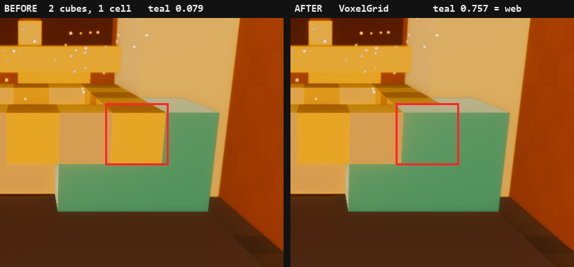

# รูใน voxel — ปิดเคส `DUST_INSTANCE_DROP`

**Flamingo · 2026-07-31 · ปิดเคสที่เปิดค้างจาก sign-off รอบ v3 (2026-07-29)**
เคสเดิมอยู่ที่ [`archive/web-parity-checklist.md` §2.8](archive/web-parity-checklist.md)
ในชื่อ `DUST_INSTANCE_DROP` และ BLOCKER-N1 ของเลน native — **ชื่อนั้นผิด** สาเหตุไม่ใช่ dust.
เอกสารนี้คือคำตัดสินสุดท้าย

> เลน web/wasm ถูก archive ไปแล้วตอน native-only pivot (`65b1d12`) แต่เฟรม web
> `docs/assets/wasm-hero-v3.png` ยังเก็บไว้ **ในฐานะหลักฐาน** — มันคือเฟรมที่วาดถูก
> และเป็นตัวเทียบที่ทำให้พิสูจน์ได้ว่า native หลังแก้ตรงกับของถูกจริง

**โค้ดที่แก้อยู่ใน:** `f49ceb9` (VoxelGrid) · `f864dab` (gate + probe)

---

## 1. อาการ

voxel **หนึ่งลูก** ของ teal accent tumbler (ชั้นบน) ไม่ถูกวาดในเฟรม native
`docs/assets/wide-hero-final.png` — มองทะลุไปเห็น counter สีเหลืองข้างหลัง
ส่วนเฟรม web `docs/assets/wasm-hero-v3.png` ที่รัน recipe เดียวกัน **วาดครบ**

* บนจอ: กล่อง **x 752–843 · y 293–382** @1280×720 (91×89 px ≈ 0.88% ของเฟรม)
* grader ทุกแกนให้ PASS เพราะทุกแกนเป็นสถิติ *ทั้งภาพ* — **axis delta ผ่าน ≠ เฟรมเหมือนกัน**



*กรอบแดง = world cell `(5,4,2)` ที่ฉายผ่านกล้อง wide ตัวล็อก (คำนวณ ไม่ได้วาดด้วยตา)
ซ้าย = ก่อนแก้ (บิ่นไปหนึ่งลูก) · ขวา = หลังแก้ (เต็ม) · องค์ประกอบภาพเหมือนเดิมทุกอย่าง*

---

## 2. วิธี repro (คำสั่งจริง รันซ้ำได้)

```bash
# 1) พิสูจน์จาก source ล้วน ไม่ต้องบิลด์ ไม่ต้องมี GPU — 1 วินาที
python scripts/voxel_hole_proof.py --rev HEAD    # โค้ดก่อนแก้ -> FAIL (exit 1)
python scripts/voxel_hole_proof.py               # โค้ดหลังแก้ -> PASS (exit 0)

# 2) พิสูจน์จากภาพจริง (ต้องมี target/release/voxelforge_shot.exe)
bash scripts/render_wide_hero.sh                 # -> docs/assets/wide-hero-final.png
grep VOXEL_OVERLAPS logs_wide_hero.txt           # gate ตอน runtime

# 3) self-test ของ gate เอง — ต้องเห็นมันแดงได้ ไม่ใช่เขียวตลอด
VOXELFORGE_DUPPROBE=1 bash scripts/render_wide_hero.sh
grep VOXEL_OVERLAPS logs_wide_hero.txt           # ต้องได้ 1 ไม่ใช่ 0

# 4) สร้างภาพคู่ before/after ใหม่
python scripts/make_voxel_hole_pair.py
```

---

## 3. Root cause

> **สองคิวบ์ทึบแสงจองเซลล์เดียวกัน แล้วให้ renderer เป็นคนเลือกว่าใครชนะ**

`client/src/hero.rs`:

| ที่ | โค้ด | เซลล์ที่จอง |
|---|---|---|
| [`hero.rs:355`](../client/src/hero.rs#L355) | `bowl(… &ceramic, Some(&ceramic_sh), 7, 3, 4)` | rim ring กลวง 5×5 ที่ `y = base_y+1 = 4` กิน `x 5..9 · z 2..6` เฉพาะขอบ → **รวม `(5,4,2)`** |
| [`hero.rs:~464`](../client/src/hero.rs) §4 WIDE dressing | tumbler `(gx, gz) = (4, 2)` ชั้นบน `y=4` เว้น notch ที่ `(gx+1, gz+1)` | `(4,4,2) · (4,4,3) · `**`(5,4,2)`** |

ตัดกันได้ **เซลล์เดียวพอดี: `(5,4,2)`** — ตรงกับ world cube ที่เคสเดิมระบุไว้เป๊ะ

โค้ดเดิม `fill()` ยิง `commands.spawn` ทุกลูกตรงๆ → **มีคิวบ์ 2 ลูกซ้อนที่ transform เดียวกัน**
หน้าประกบกันสนิท = z-fight ที่ตัดสินด้วย **draw order** ซึ่ง Bevy จัดกลุ่มตาม (mesh, material)
แล้วส่งเข้า GPU preprocessing — **ไม่ใช่คุณสมบัติของไฟล์ `hero.rs`**
ผลคือลูกนี้ **ติดบน web · หายบน native** และหลุดออกจาก golden ที่ล็อกไว้แล้ว
โดยที่ไม่มีใครแก้โค้ดสักบรรทัด

### พิสูจน์ว่าเซลล์นั้นคือรูนั้นจริง

ฉาย 8 มุมของ cell `(5,4,2)` ผ่านกล้อง wide ที่ CEO ล็อก
(`VOXELFORGE_CAM=7.6,6.4,-6.0,7.6,2.7,8.0,60` @1280×720, fov แนวตั้ง):

```
cell (5,4,2) -> screen  x 747–840  y 295–381
รูที่วัดจาก golden      x 752–843  y 293–382      IoU = 0.89
```

เลขคำนวณกับเลขที่วัดจากพิกเซลจริง **ทับกัน 0.89** — ไม่ใช่เรื่องบังเอิญ

---

## 4. ❌ ไม่ใช่ dust — แก้ข้อสรุปเดิมของเคส

เคสเดิมสรุปว่า `DUST>0` ทำให้ voxel หาย (native `DUST=0` = ครบ). **วัดใหม่แล้วไม่จริง**

หลักฐาน (`er-tmp/hole/`, exe เดียว recipe เดียว):

| วัด | ผล |
|---|---|
| sweep `DUST` 0.02 → 3.0 (7 ค่า) วัด teal fraction ในกล่องรู | **0.079 ทุกค่า — เส้นตรงแบน** |
| golden ก่อนแก้ (`DUST=3`) | 0.079 |
| หลังแก้ `DUST=3` / `DUST=0` | **0.757 เท่ากันทั้งคู่** |
| diff `d_0.02` ↔ `d_3.0` ทั้งเฟรม | ต่างเฉพาะ **จุดขาวกระจาย (motes)** · silhouette ทุกเส้น **ไม่ขยับ** |
| `dust_off` ↔ `dust_on` ในกล่องรู | motes 402 px จาก 8,280 · **ขอบบล็อกเท่าเดิม** |
| render ซ้ำ 5 รอบ (on/off) | ภาพ **ไม่ bit-identical** — motes กระพริบระหว่างรอบ ขนาดไฟล์คงที่ 858k vs 846k |

> `DUST` เติม **mesh+material ชุดที่สอง** เข้าฉาก ซึ่งเปลี่ยน **การจัด batch** ได้ →
> พอ batch เปลี่ยน ผู้ชนะของ z-fight ก็พลิก. dust จึงเป็นแค่ **สิ่งที่บังเอิญไปพลิกเหรียญ**
> ในบิลด์วันนั้น **ไม่ใช่สาเหตุ** — บิลด์วันนี้ voxel หายทั้งเปิดและปิด dust
> **บทเรียน: "ปิด X แล้วหาย" ไม่ได้แปลว่า X คือ root cause ถ้า X แค่ไปแตะลำดับการวาด**

---

## 5. การแก้

**ไม่ขยับ geometry สักลูก · ไม่แตะกล้อง · องค์ประกอบภาพที่ CEO อนุมัติไม่เปลี่ยน**
สิ่งที่แก้คือ *ใครเป็นคนตัดสิน*:

**`VoxelGrid`** ([`hero.rs`](../client/src/hero.rs) — `put` / `fill` / `flush`)
คิวบ์ทุกลูกใน `setup_hero` เขียนลง **cell map เดียว** (`HashMap<(i32,i32,i32), Material>`)
แล้ว `flush()` spawn ครั้งเดียวตอนจบ **เรียงคีย์แล้ว**:

* หนึ่งเซลล์ = หนึ่งคิวบ์เสมอ → **z-fight หายไปทั้งคลาส** ไม่ใช่แค่เคสนี้
* เขียนทีหลังชนะ **แน่นอน** → tumbler เขียนหลัง `bowl()` ⇒ `(5,4,2)` เป็น teal เสมอ
  = ตรงกับเฟรม web ที่ถือเป็นฝั่งถูก
* `flush()` เรียงคีย์ก่อน spawn เพราะ iteration order ของ `HashMap` ถูกสุ่มต่อรอบโดยตั้งใจ —
  ถ้าไม่เรียง เราจะเปลี่ยนบั๊กเดิมเป็นบั๊กใหม่ที่หนักกว่า
* ผลพลอยได้: เจอ overlap อีกจุด — book stack `x 7..9` ทับ cabinet ที่ `(8,6,13)`
  แก้เป็น `x 7..8` (ช่องว่างระหว่าง cabinet สองแถวกว้าง 1 คอลัมน์อยู่แล้ว)

---

## 6. Gate ที่กันไม่ให้กลับมา

| gate | อยู่ที่ | จับอะไร | self-test |
|---|---|---|---|
| `scripts/voxel_hole_proof.py` | static · ไม่ต้องบิลด์ | ① คิวบ์ที่ spawn นอก `VoxelGrid` ② เซลล์ที่สองวัตถุจองร่วมกัน**โดยไม่ประกาศ** | `--rev HEAD` ต้อง **FAIL** |
| `hero::report_voxel_overlaps` | runtime · พิมพ์ `VOXEL_OVERLAPS=<n>` | transform ที่มีคิวบ์ซ้อนจริงตอนรัน (รวมของที่ไม่ผ่าน grid) | `VOXELFORGE_DUPPROBE=1` ต้องได้ **1** |

`(5,4,2)` ถูกขึ้นทะเบียนใน `EXPECTED_OVERWRITES` **พร้อมเหตุผล** —
ใต้ `VoxelGrid` การจองซ้ำไม่ใช่ z-fight แล้ว แต่เป็น **การทับแบบเงียบๆ**
ซึ่งเป็นบั๊กคนละแบบที่อันตรายพอกัน จึงต้องเขียนไว้ว่าตั้งใจ ไม่ใช่ปล่อยผ่าน

### ผลรันจริงหลังแก้ (build `target-hole/release/voxelforge_shot.exe` · 2026-07-31 16:08)

| รัน | `VOXEL_OVERLAPS` | teal ในกล่องรู |
|---|---|---|
| `DUST=3.0` (recipe) ×4 | **0** ทุกรอบ | **0.757** ทุกรอบ |
| `DUST=0` control | **0** | **0.757** |
| `VOXELFORGE_DUPPROBE=1` (negative control) | **1** — `OVERLAP at (6.500, 3.500, 3.500) 2 distinct materials` | — |
| โค้ดเดิม (build 15:44 ก่อน `VoxelGrid`) | 233 | 0.079 |

**ตัวเลขปิดเคส** — green-mask XOR ในกล่องรู เทียบกับเฟรม web ที่ถือว่าถูก:

| คู่ | px ที่ต่างกัน (จาก 8,280) |
|---|---|
| web ↔ golden ก่อนแก้ | **5,614** |
| web ↔ native หลังแก้ | **1** |

native กับ web ตรงกันเหลือ 1 พิกเซล = ระดับ AA noise · เท่ากันทุกรอบ · ไม่ขึ้นกับ dust

---

## 7. ค้างอยู่ (ต้องให้เจ้าของตัดสิน)

* `docs/assets/wide-hero-final.png` **ยังเป็นเฟรมก่อนแก้ — ตั้งใจไม่ทับ** เพราะเป็น artifact
  ที่ CEO เซ็นรับไว้แล้ว การ re-bake golden ไม่ใช่สิทธิ์ของเลนนี้
  เฟรมหลังแก้อยู่ที่ `docs/assets/voxelfix/after-fix.png` (recipe เดียวกันเป๊ะ) —
  **รอเจ้าของสั่งค่อย re-bake**. ต่างจากตัวเดิมแค่ voxel teal ที่กลับมา 1 ลูก
  (green-mask XOR ทั้งเฟรมกับ golden เดิม = **5,614 px** และ **5,613 px อยู่ในกล่องรู**
  `x 752–843 · y 293–382` — เหลือ 1 px เดียวที่หลุดกล่อง ⇒ ไม่มีอะไรอื่นในเฟรมขยับ)
* **BLOCKER-N1 ปิดได้** — เอกสารนี้คือคำตัดสิน. ชื่อเดิม `DUST_INSTANCE_DROP` ชี้ผิดตัว
  ชื่อที่ถูกคือ **`VOXEL_CELL_COLLISION`**; ตัวเช็กลิสต์เองอยู่ใน `docs/archive/` แล้ว
  จึงไม่ไปแก้ย้อนหลัง — อ้างเอกสารนี้แทน
